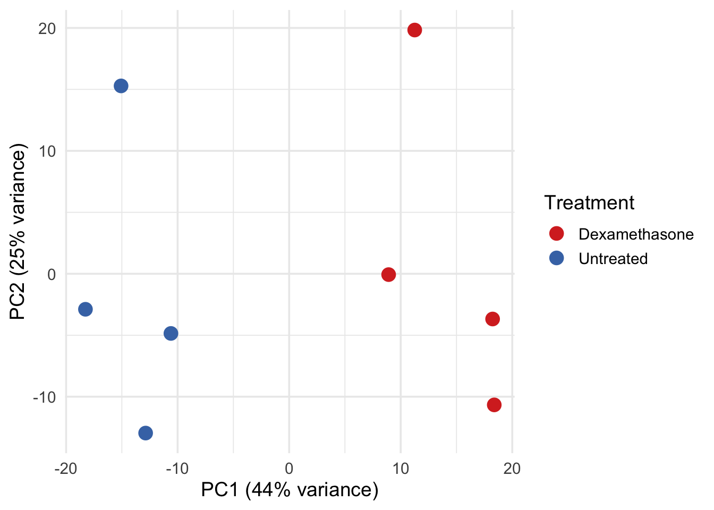
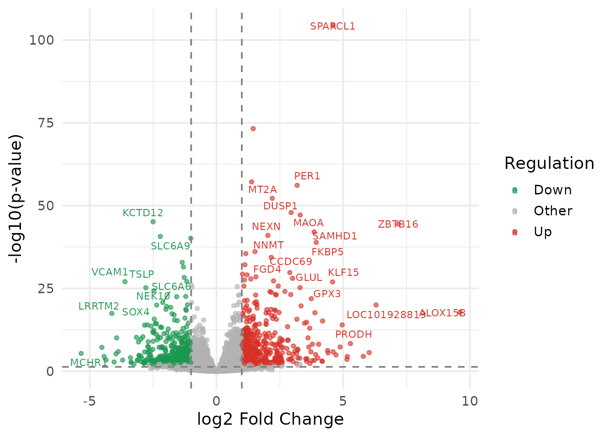
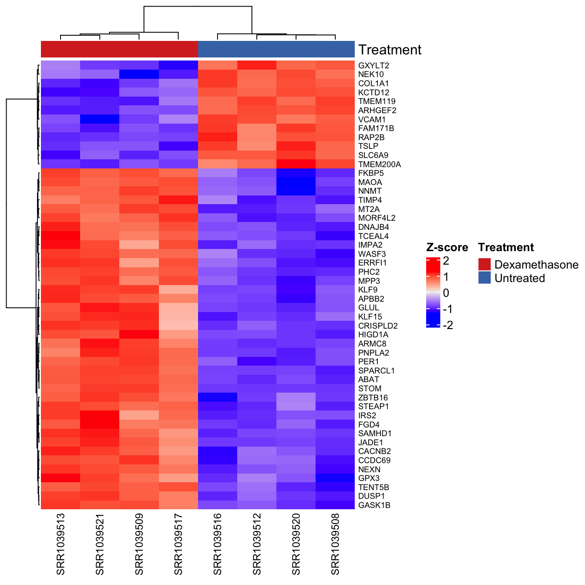
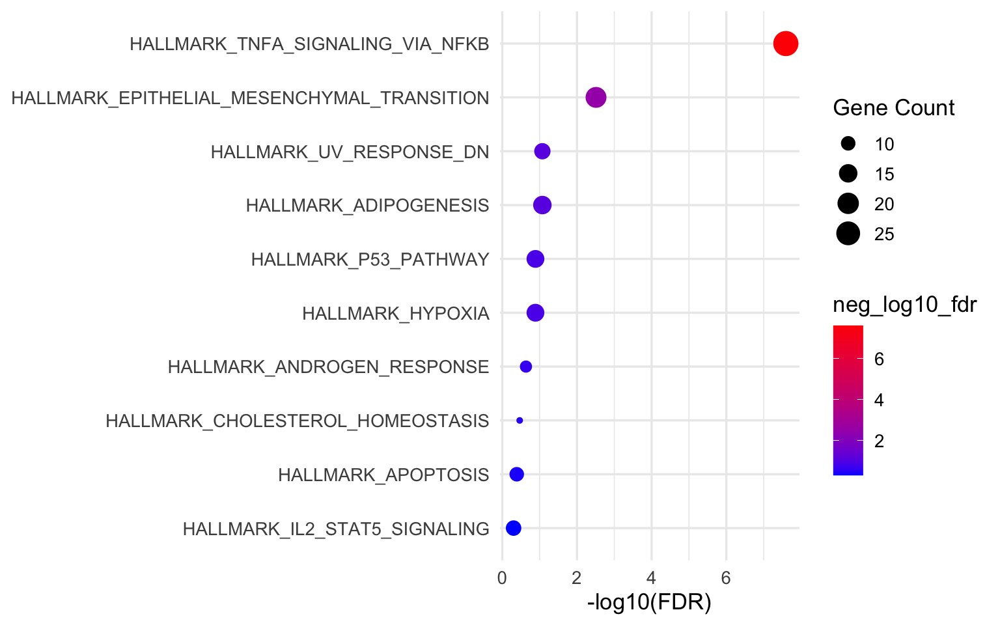
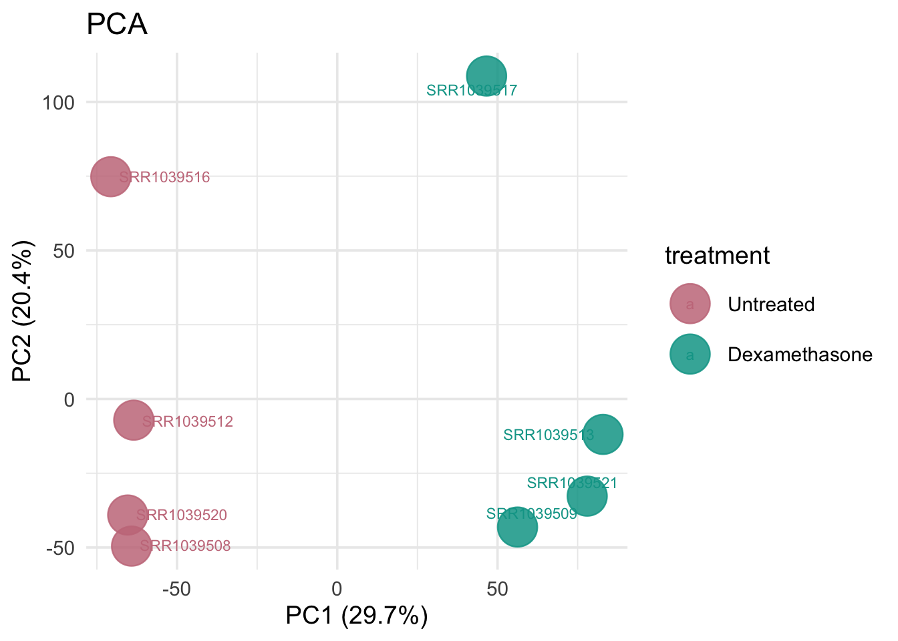
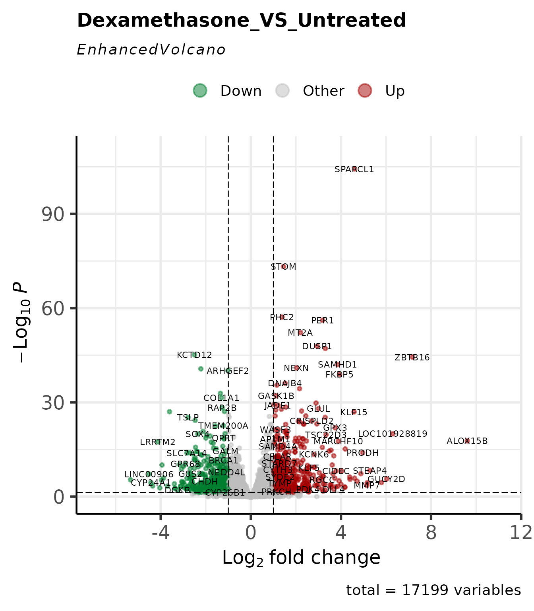
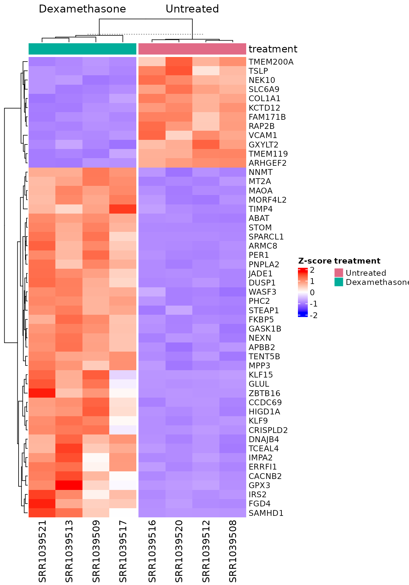
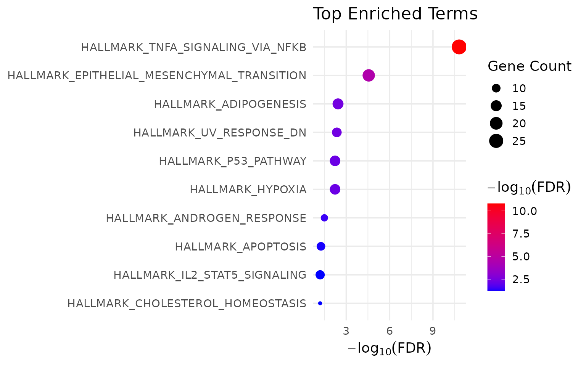
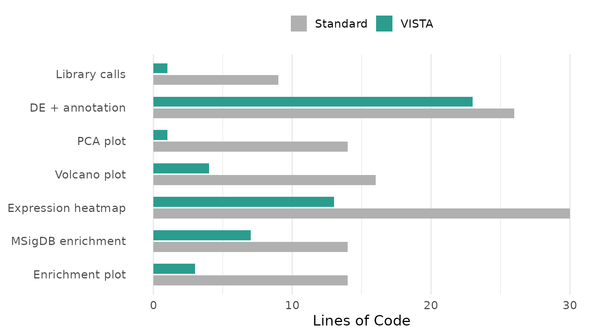

# Code Economy: VISTA vs. Standard R Workflows

## Motivation

A standard RNA-seq differential expression analysis – from raw counts to
publication-ready figures and enrichment results – requires assembling
6–10 packages, each with its own data structures, naming conventions,
and implicit assumptions. The user is responsible for:

- **Data plumbing**: converting between `DESeqDataSet`, `DGEList`, data
  frames, matrices, and tibbles at every interface boundary
- **Identifier management**: gene IDs must be stripped, mapped, and
  re-mapped at each stage (DE, annotation, enrichment, visualisation)
- **State tracking**: cutoffs, method settings, comparison names, and
  color schemes are scattered across script variables with no structured
  persistence
- **Visual consistency**: colours, axis labels, and themes must be
  manually coordinated across dozens of ggplot2 calls

None of these steps involve scientific reasoning. They are engineering
overhead. VISTA eliminates them.

This vignette makes that claim concrete: we perform the **same
analysis** twice on the **same data** – once with standard packages,
once with VISTA – and measure the difference.

## Data

We use the airway dataset (Himes et al. 2014): 8 samples of human airway
smooth muscle cells, 4 treated with dexamethasone, 4 untreated.

``` r
library(airway)
library(org.Hs.eg.db)

data("airway", package = "airway")

counts_matrix <- SummarizedExperiment::assay(airway, "counts")
sample_meta   <- as.data.frame(SummarizedExperiment::colData(airway))
sample_meta$treatment <- ifelse(sample_meta$dex == "trt", "Dexamethasone", "Untreated")
```

## Workflow A: Standard Packages

The code below uses **only** established Bioconductor and CRAN packages
– DESeq2, ggplot2, ComplexHeatmap, clusterProfiler, msigdbr, and
AnnotationDbi. This is representative of real analysis scripts found in
published supplementary materials.

``` r
library(DESeq2)
library(ggplot2)
library(ggrepel)
library(dplyr)
library(tibble)
library(clusterProfiler)
library(msigdbr)
library(AnnotationDbi)
library(org.Hs.eg.db)
```

**9 library calls** before a single line of analysis.

### Step 1: Differential Expression (Standard)

``` r
# Build DESeqDataSet
dds <- DESeqDataSetFromMatrix(
  countData = counts_matrix,
  colData   = sample_meta,
  design    = ~ treatment
)

# Filter low-count genes
keep <- rowSums(counts(dds) >= 10) >= 2
dds  <- dds[keep, ]

# Run DE pipeline
dds <- DESeq(dds)

# Extract results
res <- results(dds, contrast = c("treatment", "Dexamethasone", "Untreated"))
res_df <- as.data.frame(res) %>%
  rownames_to_column("gene_id") %>%
  mutate(
    regulation = case_when(
      log2FoldChange >=  1 & padj < 0.05 ~ "Up",
      log2FoldChange <= -1 & padj < 0.05 ~ "Down",
      TRUE ~ "Other"
    )
  )

# Get normalized counts for downstream plots
norm_mat <- counts(dds, normalized = TRUE)
```

**18 lines.** The user must know: `DESeqDataSetFromMatrix`, formula
syntax, manual filtering logic,
[`results()`](https://rdrr.io/pkg/DESeq2/man/results.html) contrast
specification, fold-change and p-value cutoff application, and
regulation classification.

### Step 2: Gene Annotation (Standard)

``` r
# Map Ensembl IDs to gene symbols
gene_symbols <- mapIds(
  org.Hs.eg.db,
  keys    = res_df$gene_id,
  keytype = "ENSEMBL",
  column  = "SYMBOL",
  multiVals = "first"
)

res_df$SYMBOL <- gene_symbols[res_df$gene_id]
```

**8 lines.** The user must handle
[`mapIds()`](https://rdrr.io/pkg/AnnotationDbi/man/AnnotationDb-class.html),
know the correct keytype, and deal with multi-mapping.

### Step 3: PCA Plot (Standard)

``` r
# Variance-stabilising transform
vsd <- vst(dds, blind = FALSE)

# Extract PCA data
pca_data <- plotPCA(vsd, intgroup = "treatment", returnData = TRUE)
pct_var  <- round(100 * attr(pca_data, "percentVar"))

# Build ggplot manually
ggplot(pca_data, aes(x = PC1, y = PC2, color = treatment)) +
  geom_point(size = 4) +
  labs(
    x = paste0("PC1 (", pct_var[1], "% variance)"),
    y = paste0("PC2 (", pct_var[2], "% variance)"),
    color = "Treatment"
  ) +
  scale_color_manual(values = c("Untreated" = "#4575B4", "Dexamethasone" = "#D73027")) +
  theme_minimal(base_size = 14)
```



**14 lines.** The user must know:
[`vst()`](https://rdrr.io/pkg/DESeq2/man/vst.html),
[`plotPCA()`](https://rdrr.io/pkg/BiocGenerics/man/plotPCA.html) with
`returnData`, how to extract percent variance from attributes, manual
ggplot2 construction, and hardcoded colour assignment.

### Step 4: Volcano Plot (Standard)

``` r
volcano_df <- res_df %>%
  mutate(
    neg_log10_p = -log10(pvalue),
    label = ifelse(
      abs(log2FoldChange) > 2 & padj < 0.01 & !is.na(SYMBOL),
      SYMBOL, ""
    )
  )

ggplot(volcano_df, aes(x = log2FoldChange, y = neg_log10_p, color = regulation)) +
  geom_point(alpha = 0.6, size = 1.2) +
  geom_text_repel(aes(label = label), size = 3, max.overlaps = 15) +
  geom_vline(xintercept = c(-1, 1), linetype = "dashed", color = "grey50") +
  geom_hline(yintercept = -log10(0.05), linetype = "dashed", color = "grey50") +
  scale_color_manual(values = c(Up = "#D73027", Down = "#1A9850", Other = "grey70")) +
  labs(x = "log2 Fold Change", y = "-log10(p-value)", color = "Regulation") +
  theme_minimal(base_size = 14)
```



**16 lines.** Manual data preparation, manual label logic, manual
threshold lines, manual colour mapping.

### Step 5: Expression Heatmap (Standard)

``` r
if (requireNamespace("ComplexHeatmap", quietly = TRUE)) {
  library(ComplexHeatmap)
  library(circlize)

  # Select top DE genes
  top_genes <- res_df %>%
    filter(regulation != "Other") %>%
    arrange(padj) %>%
    head(50) %>%
    pull(gene_id)

  # Z-score transform
  mat <- norm_mat[top_genes, ]
  mat_z <- t(scale(t(log2(mat + 1))))

  # Column annotation
  col_ann <- HeatmapAnnotation(
    Treatment = sample_meta$treatment,
    col = list(Treatment = c("Untreated" = "#4575B4", "Dexamethasone" = "#D73027"))
  )

  # Map gene symbols for labels
  row_labels <- ifelse(
    !is.na(gene_symbols[top_genes]),
    gene_symbols[top_genes],
    top_genes
  )

  Heatmap(
    mat_z,
    name = "Z-score",
    top_annotation = col_ann,
    row_labels = row_labels,
    show_row_names = TRUE,
    row_names_gp = gpar(fontsize = 7),
    column_names_gp = gpar(fontsize = 9),
    clustering_distance_rows = "euclidean",
    clustering_method_rows = "ward.D2"
  )
}
```



**30 lines.** The user must: load 2 more packages, manually select top
genes, compute z-scores, construct `HeatmapAnnotation` with manually
repeated colours, map gene symbols for row labels, and configure
[`Heatmap()`](https://rdrr.io/pkg/ComplexHeatmap/man/Heatmap.html) with
8 parameters.

### Step 6: MSigDB Enrichment (Standard)

``` r
# Get upregulated gene symbols
up_genes <- res_df %>%
  filter(regulation == "Up", !is.na(SYMBOL)) %>%
  pull(SYMBOL) %>%
  unique()

# Fetch Hallmark gene sets
hallmark_sets <- msigdbr(species = "Homo sapiens", category = "H")
hallmark_t2g  <- hallmark_sets[, c("gs_name", "gene_symbol")]

# Run enrichment
enrich_result <- enricher(
  gene     = up_genes,
  TERM2GENE = hallmark_t2g,
  pvalueCutoff = 0.05,
  qvalueCutoff = 0.2
)
```

**14 lines.** The user must: filter and extract gene symbols manually,
know the msigdbr column names, construct the TERM2GENE data frame, and
call
[`enricher()`](https://rdrr.io/pkg/clusterProfiler/man/enricher.html)
with correct parameters.

### Step 7: Enrichment Plot (Standard)

``` r
if (!is.null(enrich_result) && nrow(enrich_result@result) > 0) {
  enrich_df <- enrich_result@result %>%
    arrange(p.adjust) %>%
    head(10) %>%
    mutate(
      Description = forcats::fct_reorder(Description, -log10(p.adjust)),
      neg_log10_fdr = -log10(p.adjust)
    )

  ggplot(enrich_df, aes(x = neg_log10_fdr, y = Description)) +
    geom_point(aes(size = Count, color = neg_log10_fdr)) +
    scale_color_gradient(low = "blue", high = "red") +
    labs(x = "-log10(FDR)", y = NULL, size = "Gene Count") +
    theme_minimal(base_size = 13)
}
```



**14 lines.** Manual slot extraction, manual factor reordering, manual
ggplot2 construction.

### Standard Workflow: Summary

``` r
knitr::kable(
  standard_counts[, c("Step", "Lines", "Packages")],
  caption = paste0("Standard workflow: ", total_std, " lines, ", total_pkg, " packages"),
  align = c("l", "r", "r")
)
```

| Step                    | Lines | Packages |
|:------------------------|------:|---------:|
| Library calls           |     9 |        9 |
| Differential expression |    18 |        0 |
| Gene annotation         |     8 |        0 |
| PCA plot                |    14 |        0 |
| Volcano plot            |    16 |        0 |
| Expression heatmap      |    30 |        2 |
| MSigDB enrichment       |    14 |        0 |
| Enrichment plot         |    14 |        0 |

Standard workflow: 123 lines, 11 packages

**Total: 123 lines of code, 11 packages loaded.**

Additional cognitive costs not captured in line count:

- **5 data structure conversions** (matrix -\> DESeqDataSet -\> results
  -\> data.frame -\> filtered subset)
- **2 manual ID mappings** (Ensembl -\> Symbol for annotation and
  enrichment)
- **3 hardcoded color vectors** (one per plot type, manually kept
  consistent)
- **0 structured persistence** (all state lives in script variables)

------------------------------------------------------------------------

## Workflow B: VISTA

The same analysis, same data, same outputs.

``` r
library(VISTA)
```

**1 library call.**

### Steps 1–2: Differential Expression + Annotation

``` r
# Prepare inputs (same as standard workflow)
count_data <- as.data.frame(counts_matrix) %>%
  tibble::as_tibble() %>%
  mutate(gene_id = rownames(counts_matrix)) %>%
  select(gene_id, everything())

sample_info <- sample_meta %>%
  tibble::as_tibble() %>%
  rename(sample_names = Run) %>%
  mutate(sample_names = as.character(sample_names))

# One call: DE + filtering + normalization + regulation classification
vista <- create_vista(
  counts            = count_data,
  sample_info       = sample_info,
  column_geneid     = "gene_id",
  group_column      = "treatment",
  group_numerator   = "Dexamethasone",
  group_denominator = "Untreated",
  method            = "deseq2",
  min_counts        = 10,
  min_replicates    = 2,
  log2fc_cutoff     = 1.0,
  pval_cutoff       = 0.05,
  p_value_type      = "padj"
)

# One call: gene annotation
vista <- set_rowdata(
  vista,
  orgdb   = org.Hs.eg.db,
  columns = c("SYMBOL", "GENENAME", "ENTREZID"),
  keytype = "ENSEMBL"
)
```

**23 lines** (including data preparation shared with both workflows).

[`create_vista()`](../reference/create_vista.md) performed: count
filtering, DESeq2 pipeline execution, normalized count extraction,
fold-change/p-value thresholding, regulation classification, colour
palette assignment, and metadata persistence – in one call.
[`set_rowdata()`](../reference/set_rowdata.md) handled all ID mapping.

### Step 3: PCA Plot

``` r
get_pca_plot(vista, label_replicates = TRUE)
```



**1 line.** Colors are inherited from the VISTA object. Axis labels with
variance percentages are generated automatically.

### Step 4: Volcano Plot

``` r
get_volcano_plot(
  vista,
  sample_comparison = names(comparisons(vista))[1],
  display_id = "SYMBOL"
)
```



**4 lines.** Threshold lines, gene labels, and colour scheme are derived
from the stored cutoffs and palette.

### Step 5: Expression Heatmap

``` r
# Select top 50 DE genes using VISTA accessor
comp_name <- names(comparisons(vista))[1]
de_tbl    <- comparisons(vista)[[comp_name]]
top_genes <- head(de_tbl$gene_id[de_tbl$regulation != "Other"][
  order(de_tbl$padj[de_tbl$regulation != "Other"])
], 50)

get_expression_heatmap(
  vista_obj        = vista,
  samples          = c("Untreated", "Dexamethasone"),
  genes            = top_genes,
  value_transform  = "zscore",
  display_id       = "SYMBOL",
  annotate_columns = TRUE,
  show_row_names   = TRUE,
  summarise_replicates  = F  
)
```



**13 lines.** Z-score transformation, column annotation with consistent
colours, and symbol mapping are handled internally.

### Step 6: MSigDB Enrichment

``` r
msig_up <- get_msigdb_enrichment(
  vista,
  sample_comparison = names(comparisons(vista))[1],
  regulation  = "Up",
  msigdb_category = "H",
  species     = "Homo sapiens",
  from_type   = "ENSEMBL"
)
```

**7 lines.** Gene extraction, ID conversion, TERM2GENE construction, and
enrichment execution are handled internally.

### Step 7: Enrichment Plot

``` r
if (!is.null(msig_up$enrich) && nrow(msig_up$enrich@result) > 0) {
  get_enrichment_plot(msig_up$enrich, top_n = 10)
}
```



**3 lines.**

### VISTA Workflow: Summary

``` r
knitr::kable(
  vista_counts[, c("Step", "Lines")],
  caption = paste0("VISTA workflow: ", total_vista, " lines, ", total_pkg_vista, " package"),
  align = c("l", "r")
)
```

| Step               | Lines |
|:-------------------|------:|
| Library calls      |     1 |
| DE + annotation    |    23 |
| PCA plot           |     1 |
| Volcano plot       |     4 |
| Expression heatmap |    13 |
| MSigDB enrichment  |     7 |
| Enrichment plot    |     3 |

VISTA workflow: 52 lines, 1 package

**Total: 52 lines of code, 1 package loaded.**

------------------------------------------------------------------------

## Side-by-Side Comparison

| Step               | Standard (lines) | VISTA (lines) | Reduction |
|:-------------------|-----------------:|--------------:|----------:|
| Library calls      |                9 |             1 |       89% |
| DE + annotation    |               26 |            23 |       12% |
| PCA plot           |               14 |             1 |       93% |
| Volcano plot       |               16 |             4 |       75% |
| Expression heatmap |               30 |            13 |       57% |
| MSigDB enrichment  |               14 |             7 |       50% |
| Enrichment plot    |               14 |             3 |       79% |

Lines of code: Standard (123) vs. VISTA (52)



## Beyond Line Count

Line count is a proxy. The deeper value is in what the user **does not
have to think about**:

### Data structure conversions eliminated

| Standard workflow                     | VISTA                                                                         |
|---------------------------------------|-------------------------------------------------------------------------------|
| matrix -\> `DESeqDataSet`             | Handled internally                                                            |
| `DESeqResults` -\> data.frame         | Stored in metadata                                                            |
| data.frame -\> filtered tibble        | Accessor: [`comparisons()`](../reference/VISTA-accessors.md)                  |
| matrix -\> z-score matrix             | `value_transform = "zscore"`                                                  |
| tibble -\> gene vector for enrichment | Handled by [`get_msigdb_enrichment()`](../reference/get_msigdb_enrichment.md) |

**5 manual conversions -\> 0.**

### Identifier mappings eliminated

| Standard workflow                                 | VISTA                                    |
|---------------------------------------------------|------------------------------------------|
| `mapIds(org.Hs.eg.db, keys, "ENSEMBL", "SYMBOL")` | `set_rowdata(orgdb, keytype)` (once)     |
| Manual symbol extraction for enrichment           | `from_type = "ENSEMBL"` (auto-converted) |
| Manual symbol lookup for plot labels              | `display_id = "SYMBOL"` (every plot)     |

**3 manual ID operations -\> 1 setup call + a parameter.**

### Color consistency: guaranteed vs. manual

In the standard workflow, the user defines colours in each plot:

``` r
# PCA: manually set
scale_color_manual(values = c("Untreated" = "#4575B4", "Dexamethasone" = "#D73027"))

# Heatmap: manually set (must match PCA)
col = list(Treatment = c("Untreated" = "#4575B4", "Dexamethasone" = "#D73027"))

# Volcano: different variable, different palette entirely
scale_color_manual(values = c(Up = "#D73027", Down = "#1A9850", Other = "grey70"))
```

If any of these diverge, figures become inconsistent. In VISTA, group
colours are set once at object creation and propagated to every
downstream plot automatically.

### State persistence: object vs. variables

``` r
# Standard: state is scattered
dds            # DESeqDataSet
res            # DESeqResults
res_df         # data.frame with regulation column
norm_mat       # normalized counts matrix
gene_symbols   # named character vector
vsd            # variance-stabilised transform
```

Six separate variables. If the script is interrupted and restarted, the
user must re-run everything from the top.

``` r
# VISTA: state is in one object
vista          # everything
```

One object. `saveRDS(vista, "analysis.rds")` preserves the full analysis
state. Any plot or enrichment can be reproduced from this object alone.

## Summary

| Metric                      |  Standard   |   VISTA   |
|:----------------------------|:-----------:|:---------:|
| Total lines of code         |     123     |    52     |
| Packages loaded             |     11      |     1     |
| Data structure conversions  |      5      |     0     |
| Manual ID mappings          |      3      | 1 (setup) |
| Hardcoded color definitions |      3      |     0     |
| Persistent analysis objects | 0 (scripts) |  1 (S4)   |

Workflow complexity comparison

VISTA does not introduce new statistical methods. DESeq2 and edgeR
perform the same computations inside
[`create_vista()`](../reference/create_vista.md) as they do standalone.
What VISTA eliminates is the engineering overhead between these
computations: the data reshaping, identifier juggling, colour
coordination, and state management that consume the majority of analysis
scripting time without contributing to scientific reasoning.

## Session Information

``` r
sessionInfo()
#> R version 4.5.2 (2025-10-31)
#> Platform: x86_64-pc-linux-gnu
#> Running under: Ubuntu 24.04.3 LTS
#> 
#> Matrix products: default
#> BLAS:   /usr/lib/x86_64-linux-gnu/openblas-pthread/libblas.so.3 
#> LAPACK: /usr/lib/x86_64-linux-gnu/openblas-pthread/libopenblasp-r0.3.26.so;  LAPACK version 3.12.0
#> 
#> locale:
#>  [1] LC_CTYPE=C.UTF-8       LC_NUMERIC=C           LC_TIME=C.UTF-8       
#>  [4] LC_COLLATE=C.UTF-8     LC_MONETARY=C.UTF-8    LC_MESSAGES=C.UTF-8   
#>  [7] LC_PAPER=C.UTF-8       LC_NAME=C              LC_ADDRESS=C          
#> [10] LC_TELEPHONE=C         LC_MEASUREMENT=C.UTF-8 LC_IDENTIFICATION=C   
#> 
#> time zone: UTC
#> tzcode source: system (glibc)
#> 
#> attached base packages:
#> [1] grid      stats4    stats     graphics  grDevices datasets  utils    
#> [8] methods   base     
#> 
#> other attached packages:
#>  [1] VISTA_0.99.0                circlize_0.4.17            
#>  [3] ComplexHeatmap_2.26.1       msigdbr_25.1.1             
#>  [5] clusterProfiler_4.18.4      tibble_3.3.1               
#>  [7] dplyr_1.2.0                 ggrepel_0.9.6              
#>  [9] ggplot2_4.0.2               DESeq2_1.50.2              
#> [11] org.Hs.eg.db_3.22.0         AnnotationDbi_1.72.0       
#> [13] airway_1.30.0               SummarizedExperiment_1.40.0
#> [15] Biobase_2.70.0              GenomicRanges_1.62.1       
#> [17] Seqinfo_1.0.0               IRanges_2.44.0             
#> [19] S4Vectors_0.48.0            BiocGenerics_0.56.0        
#> [21] generics_0.1.4              MatrixGenerics_1.22.0      
#> [23] matrixStats_1.5.0           BiocStyle_2.38.0           
#> 
#> loaded via a namespace (and not attached):
#>   [1] splines_4.5.2           ggplotify_0.1.3         R.oo_1.27.1            
#>   [4] polyclip_1.10-7         lifecycle_1.0.5         rstatix_0.7.3          
#>   [7] edgeR_4.8.2             doParallel_1.0.17       lattice_0.22-7         
#>  [10] MASS_7.3-65             backports_1.5.0         magrittr_2.0.4         
#>  [13] limma_3.66.0            sass_0.4.10             rmarkdown_2.30         
#>  [16] jquerylib_0.1.4         yaml_2.3.12             otel_0.2.0             
#>  [19] ggtangle_0.1.1          EnhancedVolcano_1.28.2  cowplot_1.2.0          
#>  [22] DBI_1.2.3               RColorBrewer_1.1-3      abind_1.4-8            
#>  [25] purrr_1.2.1             R.utils_2.13.0          yulab.utils_0.2.4      
#>  [28] tweenr_2.0.3            rappdirs_0.3.4          gdtools_0.5.0          
#>  [31] enrichplot_1.30.4       tidytree_0.4.7          pkgdown_2.2.0          
#>  [34] codetools_0.2-20        DelayedArray_0.36.0     DOSE_4.4.0             
#>  [37] ggforce_0.5.0           tidyselect_1.2.1        shape_1.4.6.1          
#>  [40] aplot_0.2.9             farver_2.1.2            jsonlite_2.0.0         
#>  [43] GetoptLong_1.1.0        Formula_1.2-5           iterators_1.0.14       
#>  [46] systemfonts_1.3.1       foreach_1.5.2           tools_4.5.2            
#>  [49] ggnewscale_0.5.2        treeio_1.34.0           ragg_1.5.0             
#>  [52] Rcpp_1.1.1              glue_1.8.0              SparseArray_1.10.8     
#>  [55] xfun_0.56               qvalue_2.42.0           withr_3.0.2            
#>  [58] BiocManager_1.30.27     fastmap_1.2.0           GGally_2.4.0           
#>  [61] digest_0.6.39           R6_2.6.1                gridGraphics_0.5-1     
#>  [64] textshaping_1.0.4       colorspace_2.1-2        GO.db_3.22.0           
#>  [67] RSQLite_2.4.6           R.methodsS3_1.8.2       tidyr_1.3.2            
#>  [70] fontLiberation_0.1.0    renv_1.1.4              data.table_1.18.2.1    
#>  [73] httr_1.4.8              htmlwidgets_1.6.4       S4Arrays_1.10.1        
#>  [76] scatterpie_0.2.6        ggstats_0.12.0          pkgconfig_2.0.3        
#>  [79] gtable_0.3.6            blob_1.3.0              S7_0.2.1               
#>  [82] XVector_0.50.0          htmltools_0.5.9         fontBitstreamVera_0.1.1
#>  [85] carData_3.0-6           bookdown_0.46           fgsea_1.36.2           
#>  [88] clue_0.3-67             scales_1.4.0            png_0.1-8              
#>  [91] ggfun_0.2.0             knitr_1.51              reshape2_1.4.5         
#>  [94] rjson_0.2.23            nlme_3.1-168            curl_7.0.0             
#>  [97] cachem_1.1.0            GlobalOptions_0.1.3     stringr_1.6.0          
#> [100] parallel_4.5.2          desc_1.4.3              pillar_1.11.1          
#> [103] vctrs_0.7.1             ggpubr_0.6.3            car_3.1-5              
#> [106] tidydr_0.0.6            cluster_2.1.8.1         evaluate_1.0.5         
#> [109] cli_3.6.5               locfit_1.5-9.12         compiler_4.5.2         
#> [112] rlang_1.1.7             crayon_1.5.3            ggsignif_0.6.4         
#> [115] labeling_0.4.3          forcats_1.0.1           plyr_1.8.9             
#> [118] fs_1.6.6                ggiraph_0.9.6           stringi_1.8.7          
#> [121] BiocParallel_1.44.0     assertthat_0.2.1        babelgene_22.9         
#> [124] Biostrings_2.78.0       lazyeval_0.2.2          GOSemSim_2.36.0        
#> [127] fontquiver_0.2.1        Matrix_1.7-4            patchwork_1.3.2        
#> [130] bit64_4.6.0-1           KEGGREST_1.50.0         statmod_1.5.1          
#> [133] igraph_2.2.2            broom_1.0.12            memoise_2.0.1          
#> [136] bslib_0.10.0            ggtree_4.0.4            fastmatch_1.1-8        
#> [139] bit_4.6.0               ape_5.8-1               gson_0.1.0
```

## References

- Himes BE et al. (2014). “RNA-Seq transcriptome profiling identifies
  CRISPLD2 as a glucocorticoid responsive gene that modulates cytokine
  function in airway smooth muscle cells.” *PLoS One* 9(6): e99625.
- Love MI, Huber W, Anders S (2014). “Moderated estimation of fold
  change and dispersion for RNA-seq data with DESeq2.” *Genome Biology*
  15:550.
- Gu Z et al. (2016). “Complex heatmaps reveal patterns and correlations
  in multidimensional genomic data.” *Bioinformatics* 32(18):2847–2849.
- Wu T et al. (2021). “clusterProfiler 4.0: A universal enrichment tool
  for interpreting omics data.” *The Innovation* 2(3):100141.
