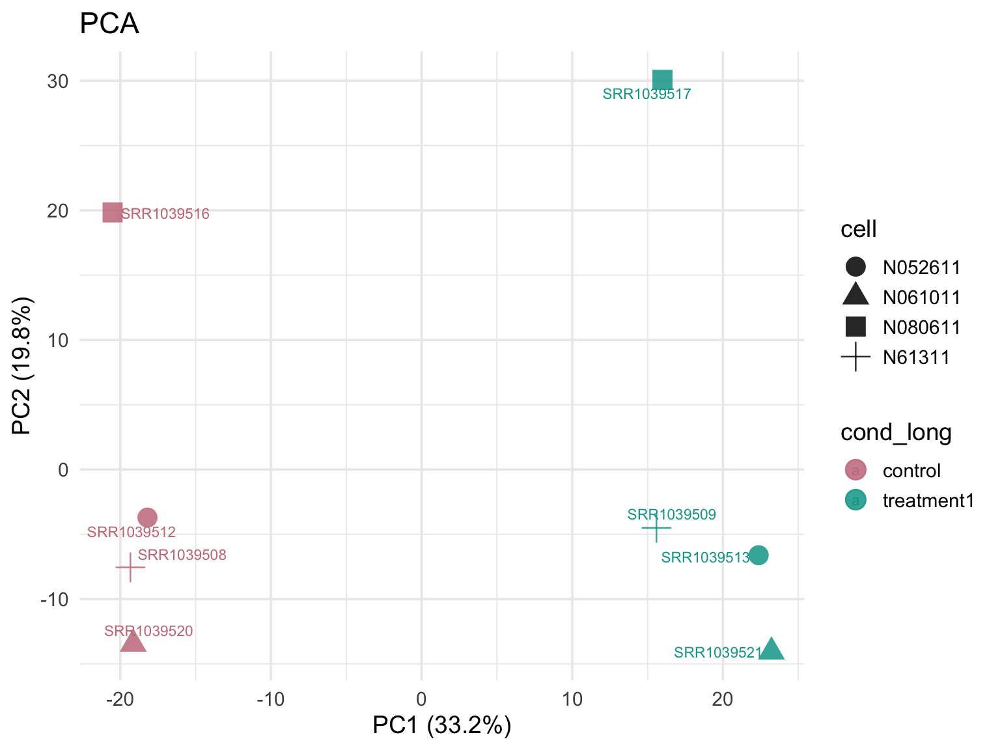
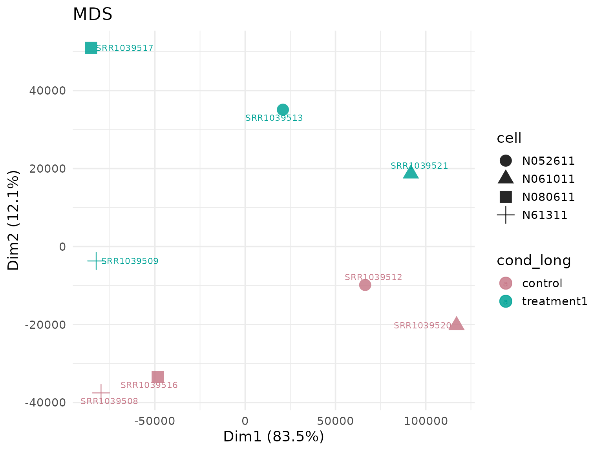
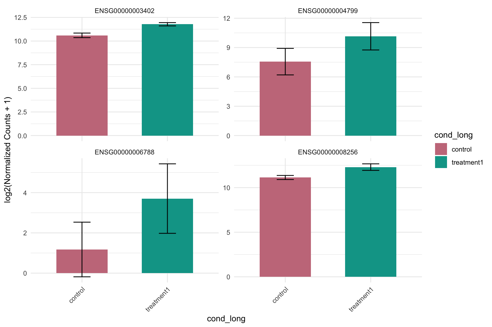
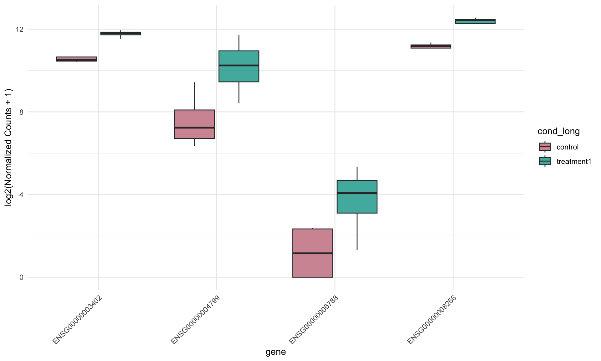
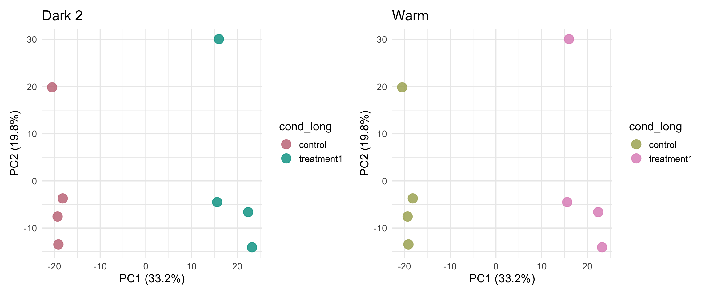
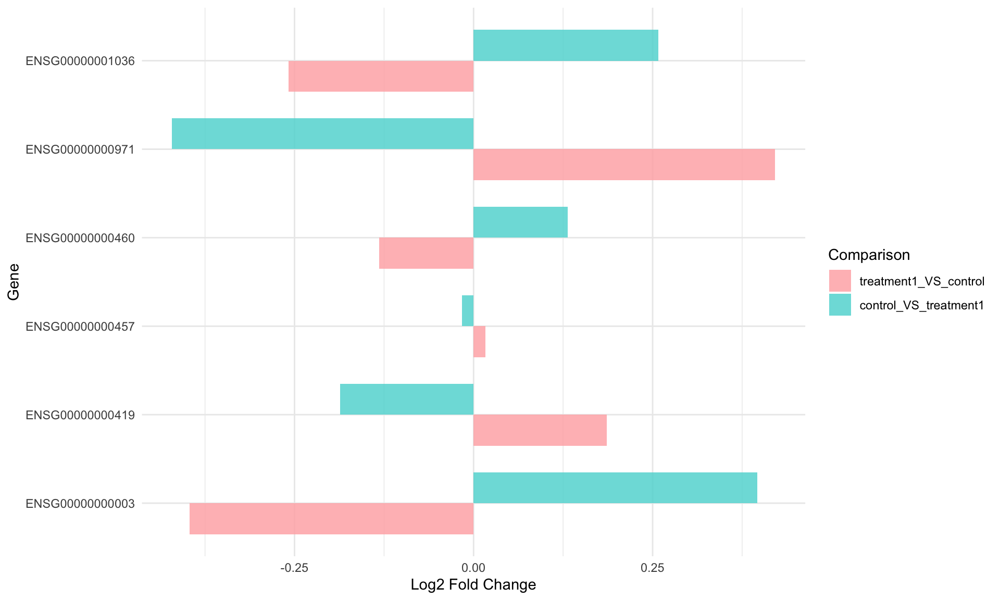

# Color and Palette Design with VISTA

## Overview

A common challenge in RNA-seq analysis is visual consistency: the same
biological group should keep the same color across PCA, MDS, expression,
and summary plots. When this is not controlled, interpretation becomes
harder and figure legends can become confusing.

This vignette focuses on VISTA’s color system and shows how to:

1.  Discover all built-in palette options.
2.  Keep colors consistent across different plot families.
3.  Change global color style in one place.
4.  Apply manual group/comparison color maps when required.

The floating table of contents on the side provides a quick-scroll panel
for navigating sections.

## Load Packages and Data

``` r
library(VISTA)
library(ggplot2)
library(dplyr)
library(tibble)
library(colorspace)

data("count_data", package = "VISTA")
data("sample_metadata", package = "VISTA")

# Keep vignette runtime moderate while preserving signal
count_small <- count_data[1:1500, ]

# Use all available samples
table(sample_metadata$cond_long)
#> 
#>    control treatment1 
#>          4          4
```

## Build a Baseline VISTA Object

``` r
vista_dark <- create_vista(
  counts = count_small,
  sample_info = sample_metadata,
  column_geneid = "gene_id",
  group_column = "cond_long",
  group_numerator = "treatment1",
  group_denominator = "control",
  group_palette = "Dark 2",
  comparison_palette = "Dark 3",
  min_counts = 5,
  min_replicates = 1
)

vista_dark
#> class: VISTA 
#> dim: 1305 8 
#> metadata(12): de_results de_summary ... design comparison
#> assays(1): norm_counts
#> rownames(1305): ENSG00000000003 ENSG00000000419 ... ENSG00000080007
#>   ENSG00000080031
#> rowData names(1): baseMean
#> colnames(8): SRR1039508 SRR1039509 ... SRR1039520 SRR1039521
#> colData names(14): SampleName cell ... sizeFactor sample_names
```

Inspect the stored palette metadata:

``` r
group_palette(vista_dark)
#> [1] "Dark 2"
group_colors(vista_dark)
#>    control treatment1 
#>  "#C87A8A"  "#00A396"
```

## Built-In Palette Choices

VISTA group palettes are based on colorspace qualitative HCL palettes.

``` r
palette_table <- colorspace::hcl_palettes(type = "qualitative") |>
  as.data.frame() |>
  tibble::rownames_to_column("palette") |>
  dplyr::select(palette)

n_palettes <- nrow(palette_table)

cat("Number of built-in qualitative palettes available in VISTA:", n_palettes, "\n\n")
#> Number of built-in qualitative palettes available in VISTA: 9
palette_table
#>    palette
#> 1 Pastel 1
#> 2   Dark 2
#> 3   Dark 3
#> 4    Set 2
#> 5    Set 3
#> 6     Warm
#> 7     Cold
#> 8 Harmonic
#> 9  Dynamic
```

Create a visual palette atlas:

``` r
palette_grid <- do.call(
  rbind,
  lapply(palette_table$palette, function(pal) {
    cols <- colorspace::qualitative_hcl(8, palette = pal)
    data.frame(
      palette = pal,
      idx = seq_along(cols),
      col = cols,
      stringsAsFactors = FALSE
    )
  })
)

palette_grid$palette <- factor(palette_grid$palette, levels = rev(palette_table$palette))

ggplot(palette_grid, aes(x = idx, y = palette, fill = col)) +
  geom_tile(color = "white", linewidth = 0.3) +
  scale_fill_identity() +
  scale_x_continuous(breaks = 1:8) +
  labs(
    x = "Color index within palette",
    y = NULL,
    title = "VISTA Palette Atlas (Qualitative HCL)"
  ) +
  theme_minimal(base_size = 12) +
  theme(panel.grid = element_blank())
```


## Consistency Across Plot Families

Use the same `VISTA` object and verify that group colors are preserved
across multiple visualization types.

``` r
comp_name <- names(comparisons(vista_dark))[1]
up_genes <- get_genes_by_regulation(
  vista_dark,
  sample_comparisons = comp_name,
  regulation = "Up"
)[[comp_name]]

if (length(up_genes) < 6) {
  genes_demo <- head(rownames(vista_dark), 6)
} else {
  genes_demo <- head(up_genes, 6)
}

genes_demo
#> [1] "ENSG00000003402" "ENSG00000004799" "ENSG00000006788" "ENSG00000008256"
#> [5] "ENSG00000008311" "ENSG00000009413"
```

### PCA (group colors from object metadata)

``` r
get_pca_plot(
  vista_dark,
  label_replicates = TRUE,
  shape_by = "cell",
  circle_size = 5
)
```



### MDS (same group colors)

``` r
get_mds_plot(
  vista_dark,
  label_replicates = TRUE,
  shape_by = "cell",
  circle_size = 5
)
```



### Expression barplot (same group colors)

``` r
get_expression_barplot(
  vista_dark,
  genes = genes_demo[1:4],
  log_transform = TRUE
)
```



### Expression boxplot (same group colors)

``` r
get_expression_boxplot(
  vista_dark,
  genes = genes_demo[1:4],
  log_transform = TRUE,
  pool_genes = FALSE,
  x_by = "gene",
  facet_by = "none",
  fill_by = "group"
)
```



## Switching Global Style in One Argument

Rebuild with a different global palette. No plot-specific color edits
are needed.

``` r
vista_warm <- create_vista(
  counts = count_small,
  sample_info = sample_metadata,
  column_geneid = "gene_id",
  group_column = "cond_long",
  group_numerator = "treatment1",
  group_denominator = "control",
  group_palette = "Warm",
  comparison_palette = "Set 3",
  min_counts = 5,
  min_replicates = 1
)

group_palette(vista_warm)
#> [1] "Warm"
group_colors(vista_warm)
#>    control treatment1 
#>  "#ABB065"  "#E093C3"
```

``` r
p_dark <- get_pca_plot(vista_dark, label_replicates = FALSE, circle_size = 5) +
  ggtitle("Dark 2")

p_warm <- get_pca_plot(vista_warm, label_replicates = FALSE, circle_size = 5) +
  ggtitle("Warm")

if (requireNamespace("patchwork", quietly = TRUE)) {
  patchwork::wrap_plots(p_dark, p_warm, ncol = 2)
} else {
  p_dark
  p_warm
}
```



## Comparison-Level Colors

For multi-comparison workflows, VISTA also stores comparison colors.

``` r
# Build two directed comparisons to demonstrate comparison color mapping
vista_multi <- create_vista(
  counts = count_small,
  sample_info = sample_metadata,
  column_geneid = "gene_id",
  group_column = "cond_long",
  group_numerator = c("treatment1", "control"),
  group_denominator = c("control", "treatment1"),
  group_palette = "Dark 2",
  comparison_palette = "Set 3",
  min_counts = 5,
  min_replicates = 1
)

S4Vectors::metadata(vista_multi)$comparison$colors
#> treatment1_VS_control control_VS_treatment1 
#>             "#FFB3B5"             "#61D8D6"
```

``` r
get_foldchange_barplot(
  vista_multi,
  genes = head(rownames(vista_multi), 6),
  facet = FALSE
)
```



## Manual Color Maps (Advanced)

If your lab or journal has fixed brand colors, you can set explicit
named vectors using built-in VISTA setters.

Available manual setters:

- `set_vista_group_colors(vista, color_map)`
- `set_vista_comparison_colors(vista, color_map)`

``` r
custom_group_cols <- c(
  control = "#264653",
  treatment1 = "#E76F51"
)

custom_comp_cols <- c(
  treatment1_VS_control = "#6C5CE7",
  control_VS_treatment1 = "#00A896"
)

vista_custom <- set_vista_group_colors(vista_dark, custom_group_cols)
vista_multi_custom <- set_vista_comparison_colors(vista_multi, custom_comp_cols)

group_colors(vista_custom)
#>    control treatment1 
#>  "#264653"  "#E76F51"
S4Vectors::metadata(vista_multi_custom)$comparison$colors
#> treatment1_VS_control control_VS_treatment1 
#>             "#6C5CE7"             "#00A896"
```

``` r
p_custom_group <- get_pca_plot(
  vista_custom,
  label_replicates = FALSE,
  circle_size = 5
) + ggtitle("Custom group colors")

p_custom_comp <- get_foldchange_barplot(
  vista_multi_custom,
  genes = head(rownames(vista_multi_custom), 6),
  facet = FALSE
) + ggtitle("Custom comparison colors")

if (requireNamespace("patchwork", quietly = TRUE)) {
  patchwork::wrap_plots(p_custom_group, p_custom_comp, ncol = 2)
} else {
  p_custom_group
  p_custom_comp
}
```


## Practical Guidance

- Use `group_palette` and `comparison_palette` in
  [`create_vista()`](../reference/create_vista.md) for fast, global
  styling.
- Use `group_colors(vista)` to audit mapping before generating
  publication panels.
- Keep one palette per manuscript/project to preserve interpretation
  consistency.
- Switch to manual named vectors only when you need strict journal or
  brand colors.

## Session Information

``` r
sessionInfo()
#> R version 4.5.2 (2025-10-31)
#> Platform: x86_64-pc-linux-gnu
#> Running under: Ubuntu 24.04.3 LTS
#> 
#> Matrix products: default
#> BLAS:   /usr/lib/x86_64-linux-gnu/openblas-pthread/libblas.so.3 
#> LAPACK: /usr/lib/x86_64-linux-gnu/openblas-pthread/libopenblasp-r0.3.26.so;  LAPACK version 3.12.0
#> 
#> locale:
#>  [1] LC_CTYPE=C.UTF-8       LC_NUMERIC=C           LC_TIME=C.UTF-8       
#>  [4] LC_COLLATE=C.UTF-8     LC_MONETARY=C.UTF-8    LC_MESSAGES=C.UTF-8   
#>  [7] LC_PAPER=C.UTF-8       LC_NAME=C              LC_ADDRESS=C          
#> [10] LC_TELEPHONE=C         LC_MEASUREMENT=C.UTF-8 LC_IDENTIFICATION=C   
#> 
#> time zone: UTC
#> tzcode source: system (glibc)
#> 
#> attached base packages:
#> [1] stats     graphics  grDevices datasets  utils     methods   base     
#> 
#> other attached packages:
#> [1] colorspace_2.1-2 tibble_3.3.1     dplyr_1.2.0      ggplot2_4.0.2   
#> [5] VISTA_0.99.0     BiocStyle_2.38.0
#> 
#> loaded via a namespace (and not attached):
#>   [1] RColorBrewer_1.1-3          jsonlite_2.0.0             
#>   [3] tidydr_0.0.6                magrittr_2.0.4             
#>   [5] ggtangle_0.1.1              farver_2.1.2               
#>   [7] rmarkdown_2.30              fs_1.6.6                   
#>   [9] ragg_1.5.0                  vctrs_0.7.1                
#>  [11] memoise_2.0.1               ggtree_4.0.4               
#>  [13] rstatix_0.7.3               htmltools_0.5.9            
#>  [15] S4Arrays_1.10.1             curl_7.0.0                 
#>  [17] broom_1.0.12                Formula_1.2-5              
#>  [19] SparseArray_1.10.8          gridGraphics_0.5-1         
#>  [21] sass_0.4.10                 bslib_0.10.0               
#>  [23] htmlwidgets_1.6.4           desc_1.4.3                 
#>  [25] plyr_1.8.9                  cachem_1.1.0               
#>  [27] igraph_2.2.2                lifecycle_1.0.5            
#>  [29] pkgconfig_2.0.3             gson_0.1.0                 
#>  [31] Matrix_1.7-4                R6_2.6.1                   
#>  [33] fastmap_1.2.0               MatrixGenerics_1.22.0      
#>  [35] digest_0.6.39               aplot_0.2.9                
#>  [37] enrichplot_1.30.5           ggnewscale_0.5.2           
#>  [39] GGally_2.4.0                patchwork_1.3.2            
#>  [41] AnnotationDbi_1.72.0        S4Vectors_0.48.0           
#>  [43] DESeq2_1.50.2               textshaping_1.0.4          
#>  [45] GenomicRanges_1.62.1        RSQLite_2.4.6              
#>  [47] ggpubr_0.6.3                labeling_0.4.3             
#>  [49] polyclip_1.10-7             httr_1.4.8                 
#>  [51] abind_1.4-8                 compiler_4.5.2             
#>  [53] withr_3.0.2                 bit64_4.6.0-1              
#>  [55] fontquiver_0.2.1            backports_1.5.0            
#>  [57] S7_0.2.1                    BiocParallel_1.44.0        
#>  [59] carData_3.0-6               DBI_1.3.0                  
#>  [61] ggstats_0.12.0              ggforce_0.5.0              
#>  [63] R.utils_2.13.0              ggsignif_0.6.4             
#>  [65] MASS_7.3-65                 rappdirs_0.3.4             
#>  [67] DelayedArray_0.36.0         tools_4.5.2                
#>  [69] otel_0.2.0                  scatterpie_0.2.6           
#>  [71] ape_5.8-1                   msigdbr_25.1.1             
#>  [73] R.oo_1.27.1                 glue_1.8.0                 
#>  [75] nlme_3.1-168                GOSemSim_2.36.0            
#>  [77] grid_4.5.2                  cluster_2.1.8.1            
#>  [79] reshape2_1.4.5              fgsea_1.36.2               
#>  [81] generics_0.1.4              gtable_0.3.6               
#>  [83] R.methodsS3_1.8.2           tidyr_1.3.2                
#>  [85] data.table_1.18.2.1         car_3.1-5                  
#>  [87] XVector_0.50.0              BiocGenerics_0.56.0        
#>  [89] ggrepel_0.9.7               pillar_1.11.1              
#>  [91] stringr_1.6.0               limma_3.66.0               
#>  [93] yulab.utils_0.2.4           babelgene_22.9             
#>  [95] splines_4.5.2               tweenr_2.0.3               
#>  [97] treeio_1.34.0               lattice_0.22-7             
#>  [99] renv_1.1.4                  bit_4.6.0                  
#> [101] tidyselect_1.2.1            fontLiberation_0.1.0       
#> [103] GO.db_3.22.0                locfit_1.5-9.12            
#> [105] Biostrings_2.78.0           knitr_1.51                 
#> [107] fontBitstreamVera_0.1.1     bookdown_0.46              
#> [109] IRanges_2.44.0              Seqinfo_1.0.0              
#> [111] edgeR_4.8.2                 SummarizedExperiment_1.40.0
#> [113] stats4_4.5.2                xfun_0.56                  
#> [115] Biobase_2.70.0              statmod_1.5.1              
#> [117] matrixStats_1.5.0           stringi_1.8.7              
#> [119] lazyeval_0.2.2              ggfun_0.2.0                
#> [121] yaml_2.3.12                 evaluate_1.0.5             
#> [123] codetools_0.2-20            gdtools_0.5.0              
#> [125] qvalue_2.42.0               BiocManager_1.30.27        
#> [127] ggplotify_0.1.3             cli_3.6.5                  
#> [129] systemfonts_1.3.1           jquerylib_0.1.4            
#> [131] Rcpp_1.1.1                  png_0.1-8                  
#> [133] parallel_4.5.2              pkgdown_2.2.0              
#> [135] assertthat_0.2.1            blob_1.3.0                 
#> [137] clusterProfiler_4.18.4      DOSE_4.4.0                 
#> [139] tidytree_0.4.7              ggiraph_0.9.6              
#> [141] scales_1.4.0                purrr_1.2.1                
#> [143] crayon_1.5.3                rlang_1.1.7                
#> [145] cowplot_1.2.0               fastmatch_1.1-8            
#> [147] KEGGREST_1.50.0
```
