# Comparing DESeq2 and edgeR with VISTA

## Introduction

DESeq2 and edgeR are the two most widely used tools for differential
expression (DE) analysis of RNA-seq data. Both use negative binomial
models but differ in normalization, dispersion estimation, and
statistical testing, which can lead to different sets of differentially
expressed genes (DEGs).

This vignette demonstrates how to use **VISTA** to run both methods on
the same dataset and systematically compare their results using built-in
visualization functions.

### What you will learn

- How to create VISTA objects with DESeq2 and edgeR backends
- How to compare DEG counts, fold-change estimates, and significance
  calls
- How to identify concordant and discordant genes between methods
- How to visualize method agreement with volcano plots, scatter plots,
  Venn diagrams, and heatmaps

## Setup

``` r
library(VISTA)
library(ggplot2)
library(dplyr)
library(patchwork)

# Set a global theme with larger fonts for all ggplot2 plots
theme_set(theme_minimal(base_size = 16))
```

## Data

We use the built-in VISTA example data derived from the **airway**
dataset (Himes et al. 2014), which contains RNA-seq counts from human
airway smooth muscle cells treated with dexamethasone.

``` r
data("count_data", package = "VISTA")
data("sample_metadata", package = "VISTA")

dim(count_data)
#> [1] 63677     9
head(sample_metadata[, c("sample_names", "cond_long")])
#> # A tibble: 6 × 2
#>   sample_names cond_long 
#>   <chr>        <chr>     
#> 1 SRR1039508   control   
#> 2 SRR1039509   treatment1
#> 3 SRR1039512   control   
#> 4 SRR1039513   treatment1
#> 5 SRR1039516   control   
#> 6 SRR1039517   treatment1
```

## Create VISTA Objects

We create two VISTA objects from the same data — one using DESeq2 and
one using edgeR — with identical cutoffs so that any differences in
results are attributable to the method.

``` r
vista_deseq <- create_vista(
  counts        = count_data,
  sample_info   = sample_metadata,
  column_geneid = "gene_id",
  group_column  = "dex",
  group_numerator   = "trt",
  group_denominator = "untrt",
  method        = "deseq2",
  log2fc_cutoff = 1,
  pval_cutoff   = 0.05,
  min_counts    = 10,
  min_replicates = 1
)
vista_deseq
#> class: VISTA 
#> dim: 18086 8 
#> metadata(11): de_results de_summary ... design comparison
#> assays(1): norm_counts
#> rownames(18086): ENSG00000000003 ENSG00000000419 ... ENSG00000273487
#>   ENSG00000273488
#> rowData names(1): baseMean
#> colnames(8): SRR1039508 SRR1039509 ... SRR1039520 SRR1039521
#> colData names(14): SampleName cell ... sizeFactor sample_names
```

``` r
vista_edger <- create_vista(
  counts        = count_data,
  sample_info   = sample_metadata,
  column_geneid = "gene_id",
  group_column  = "dex",
  group_numerator   = "trt",
  group_denominator = "untrt",
  method        = "edger",
  log2fc_cutoff = 1,
  pval_cutoff   = 0.05,
  min_counts    = 10,
  min_replicates = 1
)
vista_edger
#> class: VISTA 
#> dim: 15557 8 
#> metadata(11): de_results de_summary ... design comparison
#> assays(1): norm_counts
#> rownames(15557): ENSG00000000003 ENSG00000000419 ... ENSG00000273382
#>   ENSG00000273486
#> rowData names(1): baseMean
#> colnames(8): SRR1039508 SRR1039509 ... SRR1039520 SRR1039521
#> colData names(13): SampleName cell ... groups sample_names
```

Both objects contain the same comparison (treated vs untreated):

``` r
names(comparisons(vista_deseq))
#> [1] "trt_VS_untrt"
names(comparisons(vista_edger))
#> [1] "trt_VS_untrt"
```

## DEG Summary Comparison

### DEG counts per method

A quick way to compare the methods is to count the number of up- and
down-regulated genes detected by each.

``` r
p_deseq <- get_deg_count_barplot(vista_deseq) +
  ggtitle("DESeq2") +
  theme(plot.title = element_text(hjust = 0.5, face = "bold"))

p_edger <- get_deg_count_barplot(vista_edger) +
  ggtitle("edgeR") +
  theme(plot.title = element_text(hjust = 0.5, face = "bold"))

p_deseq + p_edger +
  plot_annotation(title = "Number of DEGs by Method")
```

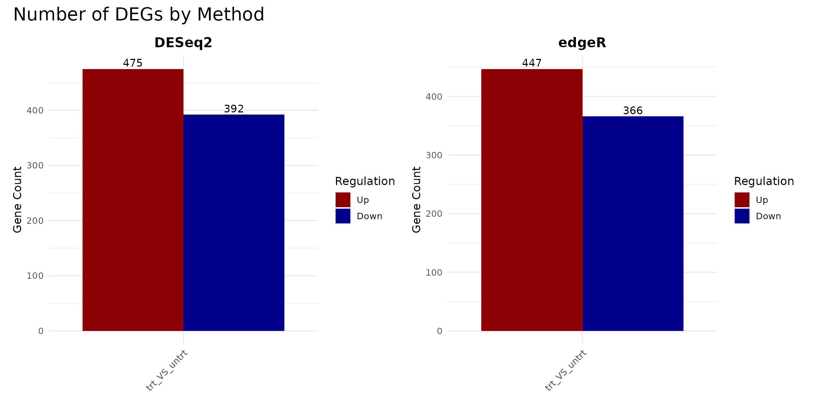

### DEG composition (pie and donut)

``` r
pie_deseq <- get_deg_count_pieplot(vista_deseq, facet_by = "none") +
  ggtitle("DESeq2 (Pie)") +
  theme(plot.title = element_text(hjust = 0.5, face = "bold"))

pie_edger <- get_deg_count_pieplot(vista_edger, facet_by = "none") +
  ggtitle("edgeR (Pie)") +
  theme(plot.title = element_text(hjust = 0.5, face = "bold"))

donut_deseq <- get_deg_count_donutplot(vista_deseq, facet_by = "none") +
  ggtitle("DESeq2 (Donut)") +
  theme(plot.title = element_text(hjust = 0.5, face = "bold"))

donut_edger <- get_deg_count_donutplot(vista_edger, facet_by = "none") +
  ggtitle("edgeR (Donut)") +
  theme(plot.title = element_text(hjust = 0.5, face = "bold"))

(pie_deseq + pie_edger) / (donut_deseq + donut_edger)
```

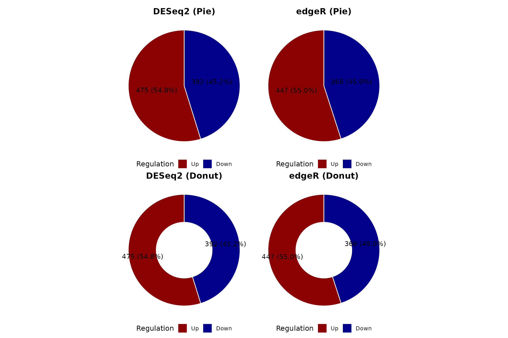

### Tabular summary

``` r
summarise_degs <- function(vista, method_name) {
  comps <- comparisons(vista)
  do.call(rbind, lapply(names(comps), function(comp) {
    de <- as.data.frame(comps[[comp]])
    n_up   <- sum(de$regulation == "Up", na.rm = TRUE)
    n_down <- sum(de$regulation == "Down", na.rm = TRUE)
    data.frame(
      Method     = method_name,
      Comparison = comp,
      Up         = n_up,
      Down       = n_down,
      Total_DEG  = n_up + n_down,
      Tested     = nrow(de)
    )
  }))
}

deg_summary_table <- rbind(
  summarise_degs(vista_deseq, "DESeq2"),
  summarise_degs(vista_edger, "edgeR")
)

knitr::kable(deg_summary_table, row.names = FALSE,
             caption = "DEG counts by method and comparison")
```

| Method | Comparison   |  Up | Down | Total_DEG | Tested |
|:-------|:-------------|----:|-----:|----------:|-------:|
| DESeq2 | trt_VS_untrt | 475 |  392 |       867 |  18086 |
| edgeR  | trt_VS_untrt | 447 |  366 |       813 |  15557 |

DEG counts by method and comparison

## Volcano Plots

Volcano plots show the relationship between fold-change magnitude and
statistical significance. Comparing them side-by-side reveals
differences in how each method distributes p-values and fold-change
estimates.

``` r
comp1 <- names(comparisons(vista_deseq))[1]

v_deseq <- get_volcano_plot(vista_deseq, sample_comparison = comp1) +
  ggtitle(paste("DESeq2 -", comp1))

v_edger <- get_volcano_plot(vista_edger, sample_comparison = comp1) +
  ggtitle(paste("edgeR -", comp1))

v_deseq + v_edger
```

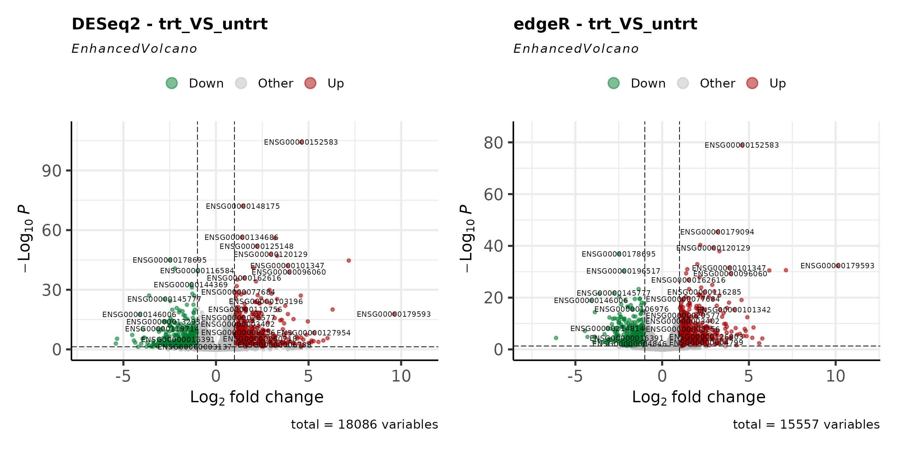

## MA Plots

MA plots display fold-change as a function of mean expression. They are
useful for assessing whether low-expression genes show inflated
fold-changes and how each method handles shrinkage.

``` r
ma_deseq <- get_ma_plot(vista_deseq, sample_comparison = comp1) +
  ggtitle(paste("DESeq2 -", comp1))

ma_edger <- get_ma_plot(vista_edger, sample_comparison = comp1) +
  ggtitle(paste("edgeR -", comp1))

ma_deseq + ma_edger
```

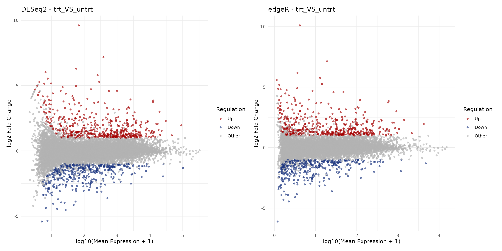

## Fold-Change Concordance

### Log2 fold-change scatter plot

A direct comparison of fold-change estimates between methods reveals
their overall concordance. Genes on the diagonal have identical
estimates; deviations indicate method-specific differences.

``` r
# Extract DE results for the first comparison
de_deseq <- as.data.frame(comparisons(vista_deseq)[[comp1]])
de_edger <- as.data.frame(comparisons(vista_edger)[[comp1]])

# Merge on gene_id
merged <- merge(
  de_deseq[, c("gene_id", "log2fc", "padj", "regulation")],
  de_edger[, c("gene_id", "log2fc", "padj", "regulation")],
  by = "gene_id",
  suffixes = c("_deseq2", "_edger")
)

# Concordance category
merged$concordance <- case_when(
  merged$regulation_deseq2 == "Up" & merged$regulation_edger == "Up"     ~ "Both Up",
  merged$regulation_deseq2 == "Down" & merged$regulation_edger == "Down" ~ "Both Down",
  merged$regulation_deseq2 == "Other" & merged$regulation_edger == "Other" ~ "Not DE",
  TRUE ~ "Discordant"
)

conc_colors <- c(
  "Both Up"    = "#D73027",
  "Both Down"  = "#4575B4",
  "Discordant" = "#FFC107",
  "Not DE"     = "grey80"
)

# Correlation
r_val <- cor(merged$log2fc_deseq2, merged$log2fc_edger,
             use = "complete.obs", method = "pearson")

ggplot(merged, aes(x = log2fc_deseq2, y = log2fc_edger, color = concordance)) +
  geom_point(alpha = 0.4, size = 0.8) +
  geom_abline(slope = 1, intercept = 0, linetype = "dashed", color = "black") +
  scale_color_manual(values = conc_colors) +
  annotate("text", x = -Inf, y = Inf, hjust = -0.1, vjust = 1.3,
           label = paste0("Pearson r = ", round(r_val, 3)),
           fontface = "italic", size = 4) +
  labs(
    x = "log2 Fold Change (DESeq2)",
    y = "log2 Fold Change (edgeR)",
    color = "Concordance",
    title = paste("Fold-Change Agreement:", comp1)
  ) +
  theme_minimal(base_size = 16) +
  theme(legend.position = "bottom")
```

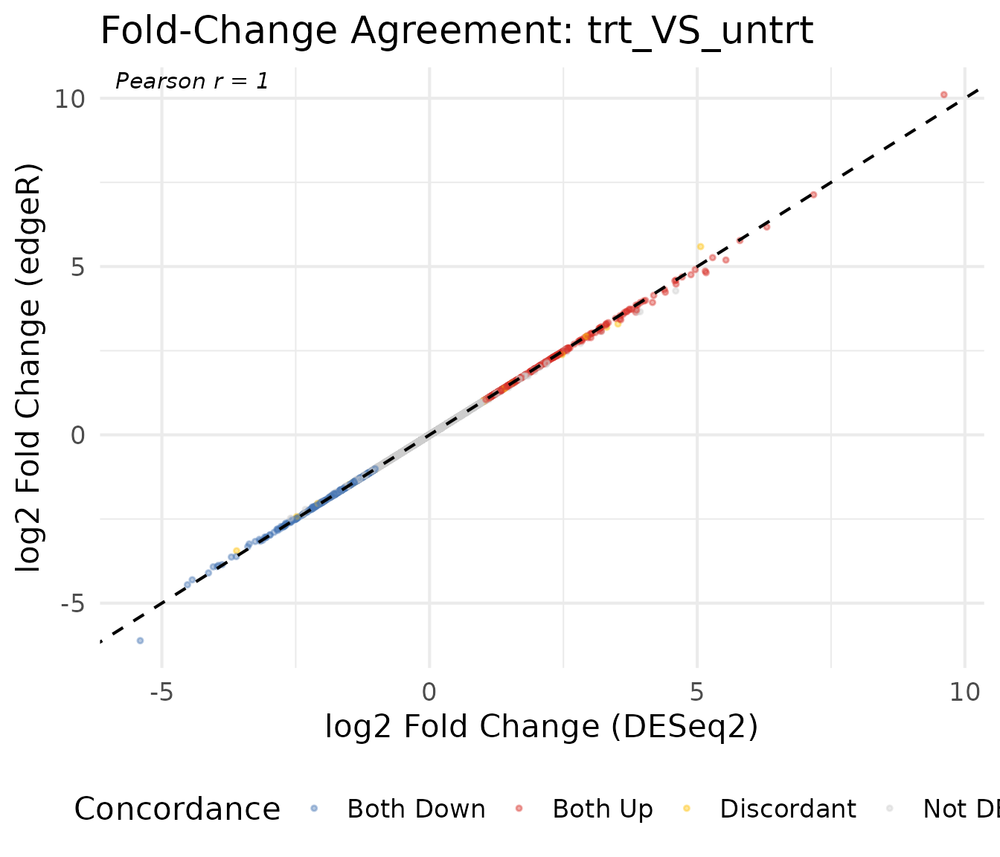

### Concordance summary table

``` r
conc_table <- merged %>%
  count(concordance) %>%
  mutate(pct = round(n / sum(n) * 100, 1)) %>%
  arrange(desc(n))

knitr::kable(conc_table, col.names = c("Category", "Genes", "Percent"),
             caption = "Concordance between DESeq2 and edgeR calls")
```

| Category   | Genes | Percent |
|:-----------|------:|--------:|
| Not DE     | 14726 |    94.7 |
| Both Up    |   438 |     2.8 |
| Both Down  |   354 |     2.3 |
| Discordant |    39 |     0.3 |

Concordance between DESeq2 and edgeR calls

## P-value Comparison

### P-value scatter plot

Comparing adjusted p-values (on the -log10 scale) shows whether both
methods agree on which genes are most significant.

``` r
merged$neg_log10_padj_deseq2 <- -log10(merged$padj_deseq2 + 1e-300)
merged$neg_log10_padj_edger  <- -log10(merged$padj_edger + 1e-300)

ggplot(merged, aes(x = neg_log10_padj_deseq2, y = neg_log10_padj_edger,
                   color = concordance)) +
  geom_point(alpha = 0.3, size = 0.8) +
  geom_abline(slope = 1, intercept = 0, linetype = "dashed", color = "black") +
  scale_color_manual(values = conc_colors) +
  labs(
    x = "-log10(padj) DESeq2",
    y = "-log10(padj) edgeR",
    color = "Concordance",
    title = paste("Adjusted P-value Agreement:", comp1)
  ) +
  theme_minimal(base_size = 16) +
  theme(legend.position = "bottom")
```

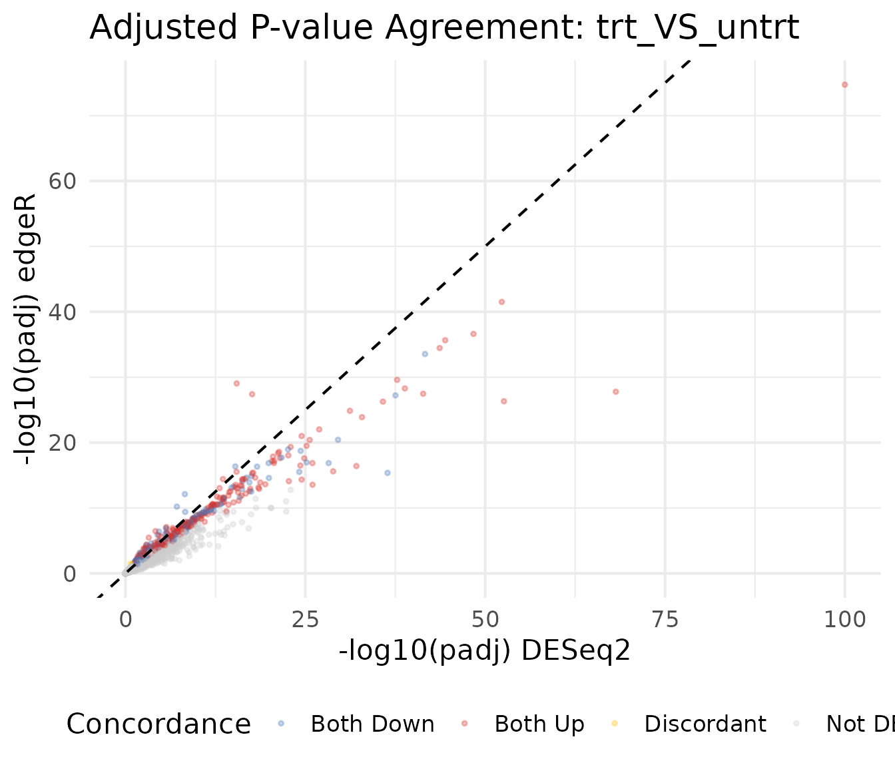

### P-value distribution

The distribution of raw p-values provides a diagnostic for each method.
A well-calibrated test produces a uniform distribution under the null,
with a spike near zero for truly DE genes.

``` r
pval_df <- rbind(
  data.frame(pvalue = de_deseq$pvalue, Method = "DESeq2"),
  data.frame(pvalue = de_edger$pvalue, Method = "edgeR")
)

ggplot(pval_df, aes(x = pvalue, fill = Method)) +
  geom_histogram(bins = 50, alpha = 0.7, position = "identity") +
  facet_wrap(~Method) +
  scale_fill_manual(values = c("DESeq2" = "#1B9E77", "edgeR" = "#D95F02")) +
  labs(
    x = "Raw P-value",
    y = "Count",
    title = "P-value Distribution by Method"
  ) +
  theme_minimal(base_size = 16) +
  theme(legend.position = "none")
```

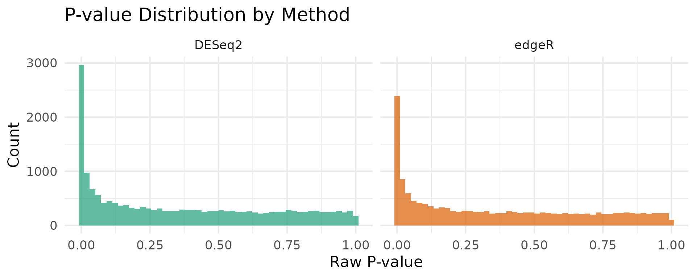

## Venn Diagram of DEGs

VISTA provides
[`get_deg_venn_diagram()`](../reference/get_deg_venn_diagram.md) for
comparing DEG overlap across comparisons within a single object. For
cross-method comparison (DESeq2 vs edgeR), we use
[`get_genes_by_regulation()`](../reference/get_genes_by_regulation.md)
to extract gene lists from each VISTA object, then pass them to
`ggvenn`.

### Upregulated genes

``` r
# Extract upregulated gene sets using VISTA's accessor
up_deseq <- get_genes_by_regulation(
  vista_deseq, sample_comparisons = comp1, regulation = "Up"
)[[1]]

up_edger <- get_genes_by_regulation(
  vista_edger, sample_comparisons = comp1, regulation = "Up"
)[[1]]

venn_up <- list(DESeq2 = up_deseq, edgeR = up_edger)
ggvenn::ggvenn(venn_up, fill_color = c("#1B9E77", "#D95F02")) +
  ggtitle(paste("Upregulated Genes:", comp1))
```


### Downregulated genes

``` r
down_deseq <- get_genes_by_regulation(
  vista_deseq, sample_comparisons = comp1, regulation = "Down"
)[[1]]

down_edger <- get_genes_by_regulation(
  vista_edger, sample_comparisons = comp1, regulation = "Down"
)[[1]]

venn_down <- list(DESeq2 = down_deseq, edgeR = down_edger)
ggvenn::ggvenn(venn_down, fill_color = c("#1B9E77", "#D95F02")) +
  ggtitle(paste("Downregulated Genes:", comp1))
```


### All DEGs (Up + Down)

``` r
all_deseq <- union(up_deseq, down_deseq)
all_edger <- union(up_edger, down_edger)
venn_all  <- list(DESeq2 = all_deseq, edgeR = all_edger)

ggvenn::ggvenn(venn_all, fill_color = c("#1B9E77", "#D95F02")) +
  ggtitle(paste("All DEGs:", comp1))
```

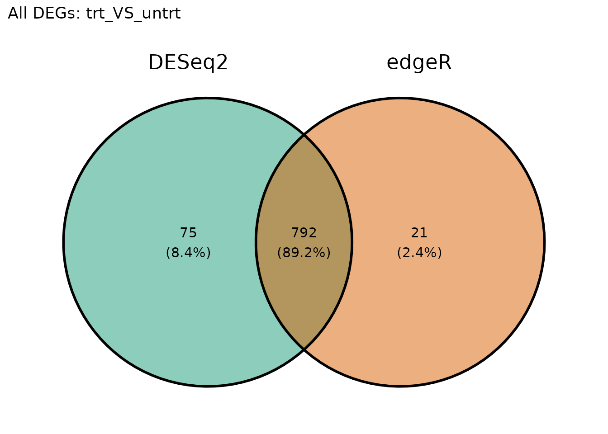

## Normalization Comparison

DESeq2 uses median-of-ratios normalization while edgeR uses TMM (trimmed
mean of M-values). Comparing the resulting normalized count
distributions helps assess whether normalization choices drive
downstream differences.

``` r
nc_deseq <- norm_counts(vista_deseq)
nc_edger <- norm_counts(vista_edger)

# Use common genes
common_genes <- intersect(rownames(nc_deseq), rownames(nc_edger))
sample_cols  <- intersect(colnames(nc_deseq), colnames(nc_edger))

norm_df <- rbind(
  data.frame(
    log2_count = as.vector(log2(nc_deseq[common_genes, sample_cols] + 1)),
    Method = "DESeq2"
  ),
  data.frame(
    log2_count = as.vector(log2(nc_edger[common_genes, sample_cols] + 1)),
    Method = "edgeR"
  )
)

ggplot(norm_df, aes(x = log2_count, fill = Method)) +
  geom_density(alpha = 0.5) +
  scale_fill_manual(values = c("DESeq2" = "#1B9E77", "edgeR" = "#D95F02")) +
  labs(
    x = "log2(Normalized Count + 1)",
    y = "Density",
    title = "Normalized Count Distribution"
  ) +
  theme_minimal(base_size = 16)
```

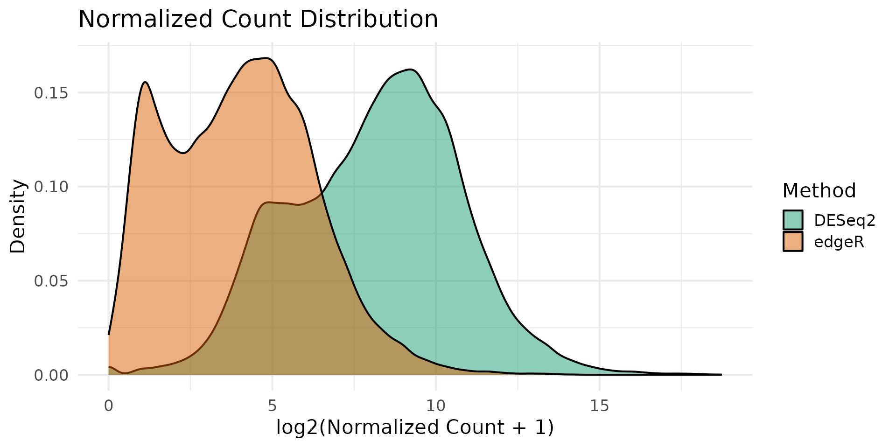

### Sample-level comparison

``` r
# Compare normalized counts for each sample
sample_norm_df <- data.frame(
  DESeq2 = as.vector(log2(nc_deseq[common_genes, sample_cols] + 1)),
  edgeR  = as.vector(log2(nc_edger[common_genes, sample_cols] + 1)),
  Sample = rep(sample_cols, each = length(common_genes))
)

ggplot(sample_norm_df, aes(x = DESeq2, y = edgeR)) +
  geom_point(alpha = 0.05, size = 0.3) +
  geom_abline(slope = 1, intercept = 0, linetype = "dashed", color = "red") +
  facet_wrap(~Sample, ncol = 3) +
  labs(
    x = "log2(DESeq2 Normalized + 1)",
    y = "log2(edgeR Normalized + 1)",
    title = "Per-Sample Normalized Counts"
  ) +
  theme_minimal(base_size = 16)
```

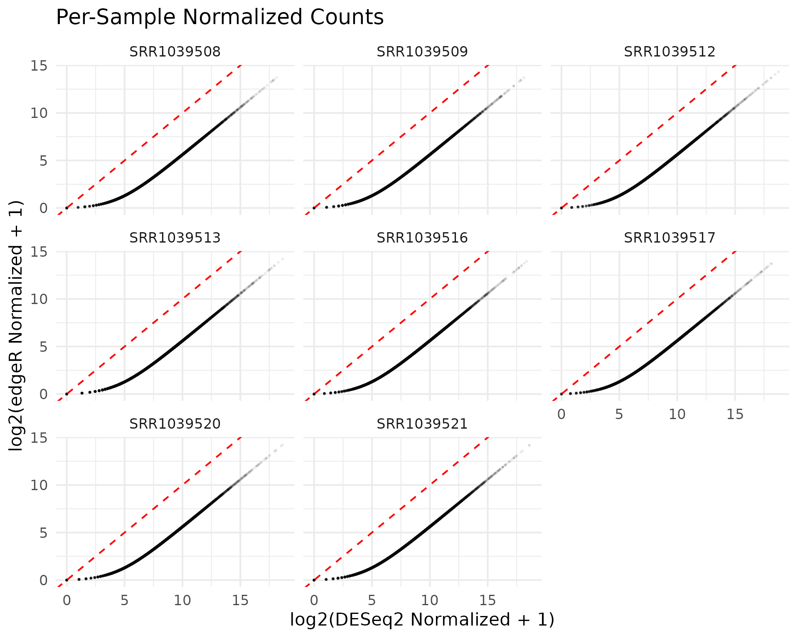

## PCA Comparison

Principal component analysis reveals whether the two normalization
strategies preserve the same sample-level structure.

``` r
pca_deseq <- get_pca_plot(vista_deseq) +
  ggtitle("PCA: DESeq2 Normalization")

pca_edger <- get_pca_plot(vista_edger) +
  ggtitle("PCA: edgeR Normalization")

pca_deseq + pca_edger
```

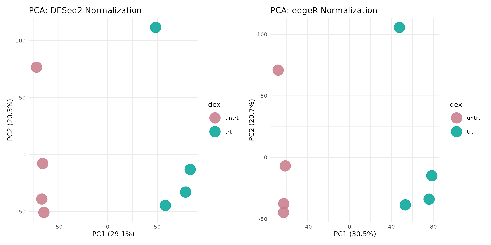

## Expression of Discordant Genes

Genes called as DEG by one method but not the other are of particular
interest. Visualizing their expression patterns helps assess whether
method-specific calls are biologically meaningful.

``` r
deseq_only <- setdiff(all_deseq, all_edger)
edger_only <- setdiff(all_edger, all_deseq)

cat("DEGs unique to DESeq2:", length(deseq_only), "\n")
#> DEGs unique to DESeq2: 75
cat("DEGs unique to edgeR:", length(edger_only), "\n")
#> DEGs unique to edgeR: 21
cat("DEGs shared:", length(intersect(all_deseq, all_edger)), "\n")
#> DEGs shared: 792
```

### Expression of DESeq2-only genes

``` r
if (length(deseq_only) >= 3) {
  # Show top genes by fold change
  deseq_only_de <- de_deseq[de_deseq$gene_id %in% deseq_only, ]
  top_deseq_only <- head(
    deseq_only_de[order(-abs(deseq_only_de$log2fc)), "gene_id"],
    6
  )
  get_expression_boxplot(vista_deseq, genes = top_deseq_only) +
    ggtitle("Top DESeq2-Only DEGs (by |log2FC|)")
}
```

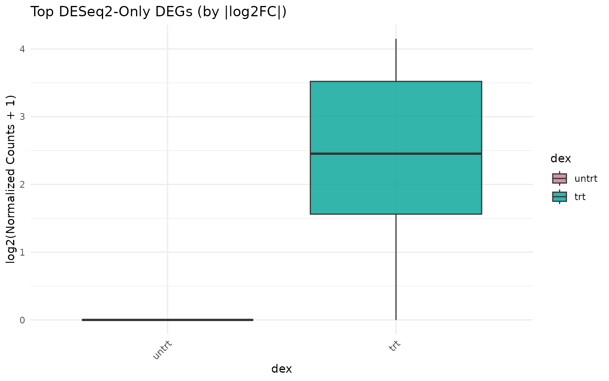

### Expression of edgeR-only genes

``` r
if (length(edger_only) >= 3) {
  edger_only_de <- de_edger[de_edger$gene_id %in% edger_only, ]
  top_edger_only <- head(
    edger_only_de[order(-abs(edger_only_de$log2fc)), "gene_id"],
    6
  )
  get_expression_boxplot(vista_edger, genes = top_edger_only) +
    ggtitle("Top edgeR-Only DEGs (by |log2FC|)")
}
```

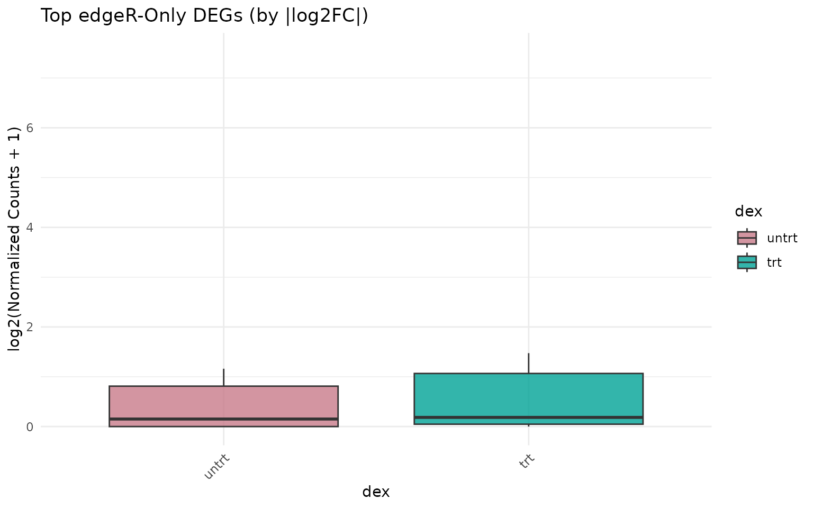

## Sensitivity Analysis: Effect of Cutoffs

Different significance and fold-change thresholds can shift the balance
between methods. Here we sweep across a range of cutoffs.

``` r
sweep_cutoffs <- function(de_deseq, de_edger, fc_vals, pval_cut = 0.05) {
  results <- lapply(fc_vals, function(fc) {
    n_deseq <- sum(
      abs(de_deseq$log2fc) >= fc & de_deseq$padj < pval_cut,
      na.rm = TRUE
    )
    n_edger <- sum(
      abs(de_edger$log2fc) >= fc & de_edger$padj < pval_cut,
      na.rm = TRUE
    )
    data.frame(
      log2fc_cutoff = fc,
      DESeq2 = n_deseq,
      edgeR  = n_edger
    )
  })
  do.call(rbind, results)
}

fc_vals <- seq(0.5, 3, by = 0.25)
sweep_df <- sweep_cutoffs(de_deseq, de_edger, fc_vals)

sweep_long <- tidyr::pivot_longer(
  sweep_df,
  cols = c("DESeq2", "edgeR"),
  names_to = "Method",
  values_to = "n_DEGs"
)

ggplot(sweep_long, aes(x = log2fc_cutoff, y = n_DEGs, color = Method)) +
  geom_line(linewidth = 1) +
  geom_point(size = 2) +
  scale_color_manual(values = c("DESeq2" = "#1B9E77", "edgeR" = "#D95F02")) +
  labs(
    x = "|log2FC| Cutoff",
    y = "Number of DEGs",
    title = "DEG Sensitivity to Fold-Change Threshold",
    subtitle = paste("Adjusted p-value <", 0.05)
  ) +
  theme_minimal(base_size = 16)
```

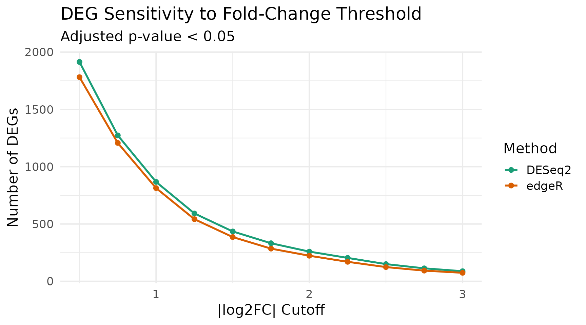

## Correlation Heatmaps

Sample-sample correlation heatmaps can reveal whether both normalization
approaches preserve the same correlation structure.

``` r
corr_deseq <- get_corr_heatmap(vista_deseq) +
  ggtitle("DESeq2: Sample Correlation")

corr_edger <- get_corr_heatmap(vista_edger) +
  ggtitle("edgeR: Sample Correlation")

corr_deseq + corr_edger
```

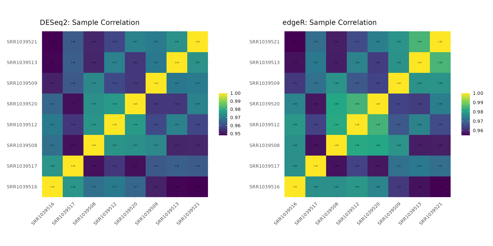

## Summary and Recommendations

``` r
overlap    <- length(intersect(all_deseq, all_edger))
union_size <- length(union(all_deseq, all_edger))
jaccard    <- round(overlap / union_size, 3)

cat("━━━ Method Comparison Summary ━━━\n")
#> ━━━ Method Comparison Summary ━━━
cat("Comparison:", comp1, "\n\n")
#> Comparison: trt_VS_untrt
cat("DESeq2 DEGs:", length(all_deseq), "\n")
#> DESeq2 DEGs: 867
cat("edgeR DEGs:", length(all_edger), "\n")
#> edgeR DEGs: 813
cat("Shared DEGs:", overlap, "\n")
#> Shared DEGs: 792
cat("DESeq2-only:", length(deseq_only), "\n")
#> DESeq2-only: 75
cat("edgeR-only:", length(edger_only), "\n")
#> edgeR-only: 21
cat("Jaccard index:", jaccard, "\n")
#> Jaccard index: 0.892
cat("Fold-change Pearson r:", round(r_val, 3), "\n")
#> Fold-change Pearson r: 1
```

### Key takeaways

1.  **Fold-change estimates are highly correlated** between DESeq2 and
    edgeR, as both methods model similar biological effects.

2.  **Significance calls differ at the margins**. Genes near the
    decision boundary (p-value or fold-change cutoff) are more likely to
    be called by one method but not the other.

3.  **Core DEG sets overlap substantially**. Genes with large
    fold-changes and low p-values are consistently identified by both
    methods.

4.  **Method-specific DEGs tend to have borderline statistics**.
    Inspecting discordant genes (unique to one method) often reveals
    marginal significance in the other method as well.

5.  **For robust results**, consider requiring DEGs to be called by both
    methods, or use the intersection as a high-confidence set and the
    union as a discovery set.

## Session Info

``` r
sessionInfo()
#> R version 4.5.2 (2025-10-31)
#> Platform: x86_64-pc-linux-gnu
#> Running under: Ubuntu 24.04.3 LTS
#> 
#> Matrix products: default
#> BLAS:   /usr/lib/x86_64-linux-gnu/openblas-pthread/libblas.so.3 
#> LAPACK: /usr/lib/x86_64-linux-gnu/openblas-pthread/libopenblasp-r0.3.26.so;  LAPACK version 3.12.0
#> 
#> locale:
#>  [1] LC_CTYPE=C.UTF-8       LC_NUMERIC=C           LC_TIME=C.UTF-8       
#>  [4] LC_COLLATE=C.UTF-8     LC_MONETARY=C.UTF-8    LC_MESSAGES=C.UTF-8   
#>  [7] LC_PAPER=C.UTF-8       LC_NAME=C              LC_ADDRESS=C          
#> [10] LC_TELEPHONE=C         LC_MEASUREMENT=C.UTF-8 LC_IDENTIFICATION=C   
#> 
#> time zone: UTC
#> tzcode source: system (glibc)
#> 
#> attached base packages:
#> [1] stats     graphics  grDevices datasets  utils     methods   base     
#> 
#> other attached packages:
#> [1] patchwork_1.3.2  dplyr_1.2.0      ggplot2_4.0.2    VISTA_0.99.0    
#> [5] BiocStyle_2.38.0
#> 
#> loaded via a namespace (and not attached):
#>   [1] splines_4.5.2               ggplotify_0.1.3            
#>   [3] tibble_3.3.1                R.oo_1.27.1                
#>   [5] polyclip_1.10-7             lifecycle_1.0.5            
#>   [7] rstatix_0.7.3               edgeR_4.8.2                
#>   [9] lattice_0.22-7              MASS_7.3-65                
#>  [11] backports_1.5.0             magrittr_2.0.4             
#>  [13] limma_3.66.0                sass_0.4.10                
#>  [15] rmarkdown_2.30              jquerylib_0.1.4            
#>  [17] yaml_2.3.12                 otel_0.2.0                 
#>  [19] ggtangle_0.1.1              EnhancedVolcano_1.28.2     
#>  [21] ggvenn_0.1.19               cowplot_1.2.0              
#>  [23] DBI_1.2.3                   RColorBrewer_1.1-3         
#>  [25] abind_1.4-8                 GenomicRanges_1.62.1       
#>  [27] purrr_1.2.1                 R.utils_2.13.0             
#>  [29] BiocGenerics_0.56.0         msigdbr_25.1.1             
#>  [31] yulab.utils_0.2.4           tweenr_2.0.3               
#>  [33] rappdirs_0.3.4              gdtools_0.5.0              
#>  [35] IRanges_2.44.0              S4Vectors_0.48.0           
#>  [37] enrichplot_1.30.4           ggrepel_0.9.6              
#>  [39] tidytree_0.4.7              pkgdown_2.2.0              
#>  [41] codetools_0.2-20            DelayedArray_0.36.0        
#>  [43] DOSE_4.4.0                  ggforce_0.5.0              
#>  [45] tidyselect_1.2.1            aplot_0.2.9                
#>  [47] farver_2.1.2                matrixStats_1.5.0          
#>  [49] stats4_4.5.2                Seqinfo_1.0.0              
#>  [51] jsonlite_2.0.0              Formula_1.2-5              
#>  [53] systemfonts_1.3.1           tools_4.5.2                
#>  [55] ggnewscale_0.5.2            treeio_1.34.0              
#>  [57] ragg_1.5.0                  Rcpp_1.1.1                 
#>  [59] glue_1.8.0                  SparseArray_1.10.8         
#>  [61] xfun_0.56                   DESeq2_1.50.2              
#>  [63] qvalue_2.42.0               MatrixGenerics_1.22.0      
#>  [65] withr_3.0.2                 BiocManager_1.30.27        
#>  [67] fastmap_1.2.0               GGally_2.4.0               
#>  [69] digest_0.6.39               R6_2.6.1                   
#>  [71] gridGraphics_0.5-1          textshaping_1.0.4          
#>  [73] colorspace_2.1-2            GO.db_3.22.0               
#>  [75] RSQLite_2.4.6               R.methodsS3_1.8.2          
#>  [77] utf8_1.2.6                  tidyr_1.3.2                
#>  [79] generics_0.1.4              fontLiberation_0.1.0       
#>  [81] renv_1.1.4                  data.table_1.18.2.1        
#>  [83] httr_1.4.8                  htmlwidgets_1.6.4          
#>  [85] S4Arrays_1.10.1             scatterpie_0.2.6           
#>  [87] ggstats_0.12.0              pkgconfig_2.0.3            
#>  [89] gtable_0.3.6                blob_1.3.0                 
#>  [91] S7_0.2.1                    XVector_0.50.0             
#>  [93] clusterProfiler_4.18.4      htmltools_0.5.9            
#>  [95] fontBitstreamVera_0.1.1     carData_3.0-6              
#>  [97] bookdown_0.46               fgsea_1.36.2               
#>  [99] scales_1.4.0                Biobase_2.70.0             
#> [101] png_0.1-8                   ggfun_0.2.0                
#> [103] knitr_1.51                  reshape2_1.4.5             
#> [105] nlme_3.1-168                curl_7.0.0                 
#> [107] cachem_1.1.0                stringr_1.6.0              
#> [109] parallel_4.5.2              AnnotationDbi_1.72.0       
#> [111] desc_1.4.3                  pillar_1.11.1              
#> [113] grid_4.5.2                  vctrs_0.7.1                
#> [115] ggpubr_0.6.2                car_3.1-5                  
#> [117] tidydr_0.0.6                cluster_2.1.8.1            
#> [119] evaluate_1.0.5              cli_3.6.5                  
#> [121] locfit_1.5-9.12             compiler_4.5.2             
#> [123] rlang_1.1.7                 crayon_1.5.3               
#> [125] ggsignif_0.6.4              labeling_0.4.3             
#> [127] plyr_1.8.9                  fs_1.6.6                   
#> [129] ggiraph_0.9.5               stringi_1.8.7              
#> [131] viridisLite_0.4.3           BiocParallel_1.44.0        
#> [133] assertthat_0.2.1            babelgene_22.9             
#> [135] Biostrings_2.78.0           lazyeval_0.2.2             
#> [137] GOSemSim_2.36.0             fontquiver_0.2.1           
#> [139] Matrix_1.7-4                bit64_4.6.0-1              
#> [141] KEGGREST_1.50.0             statmod_1.5.1              
#> [143] SummarizedExperiment_1.40.0 igraph_2.2.2               
#> [145] broom_1.0.12                memoise_2.0.1              
#> [147] bslib_0.10.0                ggtree_4.0.4               
#> [149] fastmatch_1.1-8             bit_4.6.0                  
#> [151] ape_5.8-1                   gson_0.1.0
```
