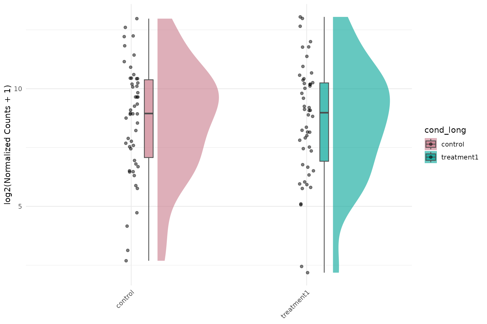
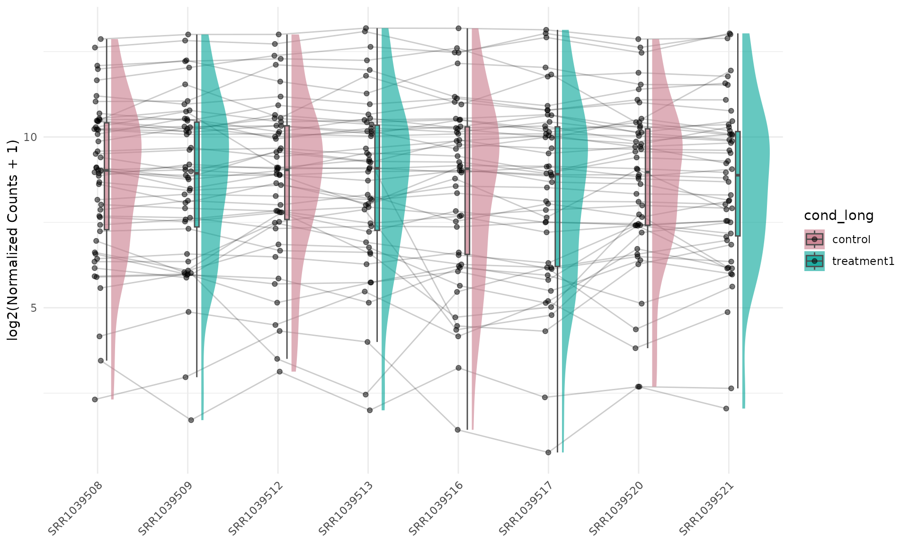
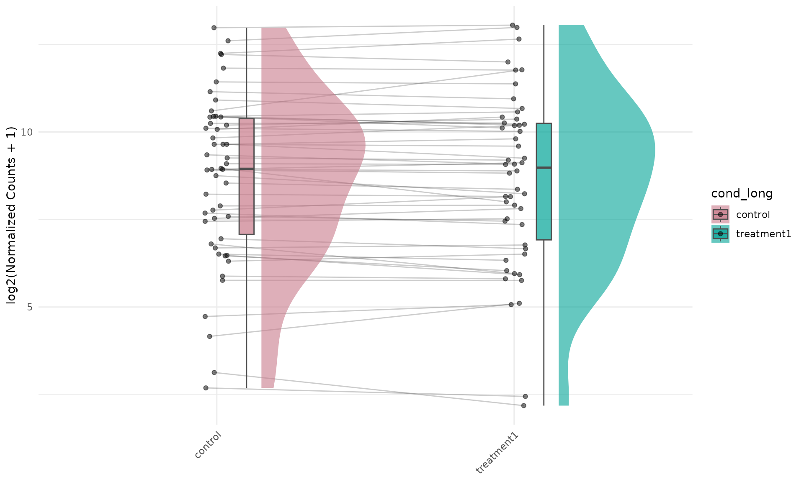
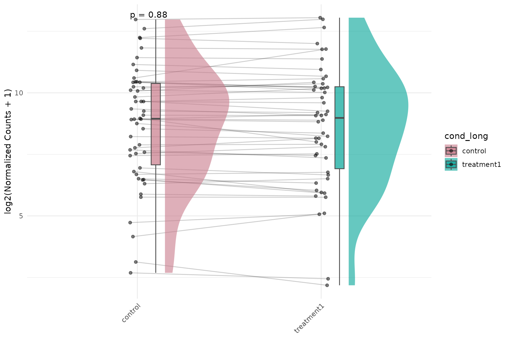
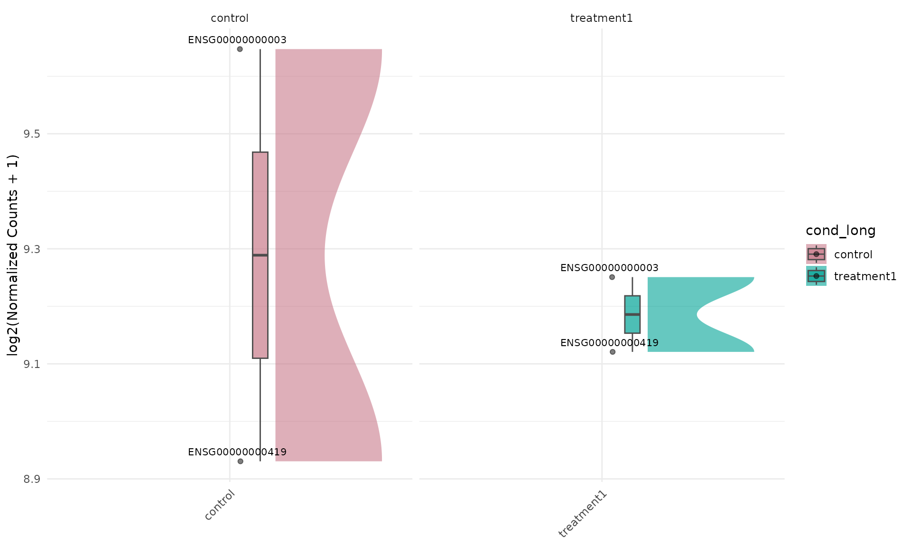
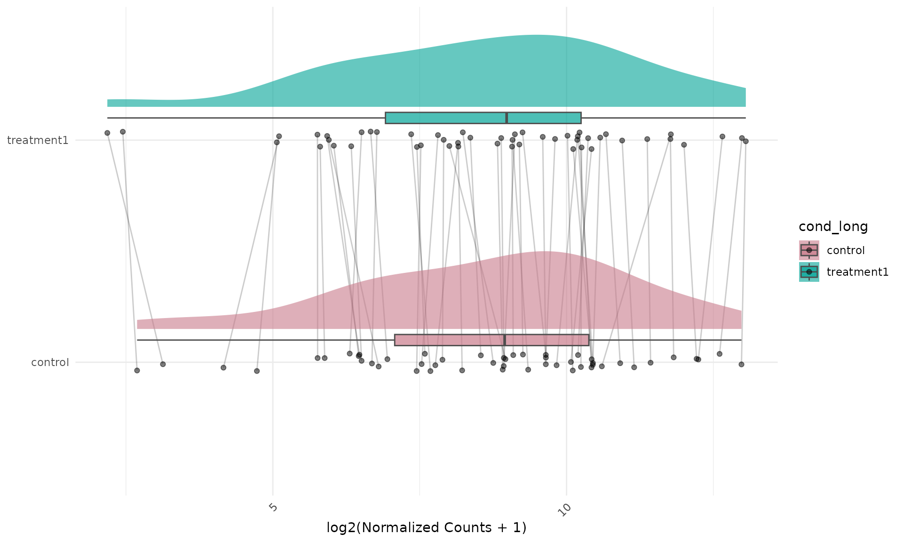
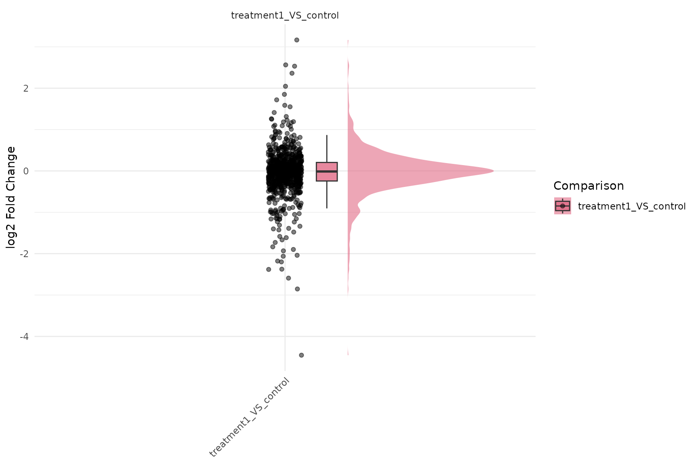
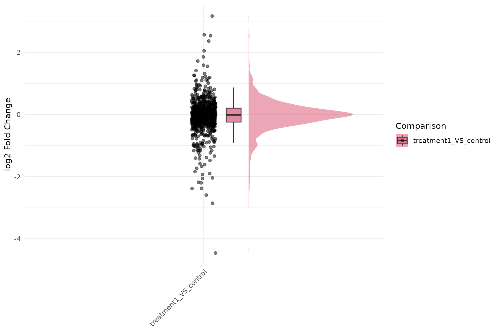
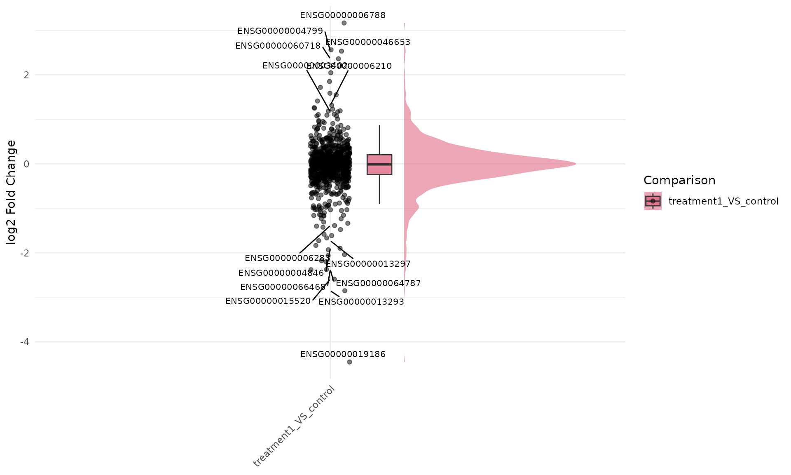

# Raincloud Plots in VISTA

## Overview

Raincloud plots combine three visual layers:

1.  distribution shape (half-violin),
2.  robust summary (boxplot), and
3.  individual observations (jittered points).

This vignette shows raincloud plotting for both expression and
fold-change data in VISTA, including line-connection control with
`id.long.var` and optional statistical annotations.

## Create a VISTA object

``` r
library(VISTA)
library(ggplot2)

data("count_data", package = "VISTA")
data("sample_metadata", package = "VISTA")

# Keep runtime modest for vignette rendering
count_small <- count_data[1:1000, ]

vista <- create_vista(
  counts = count_small,
  sample_info = sample_metadata,
  column_geneid = "gene_id",
  group_column = "cond_long",
  group_numerator = "treatment1",
  group_denominator = "control",
  method = "deseq2",
  min_counts = 10,
  min_replicates = 1
)

comp_names <- names(comparisons(vista))
top_up <- get_genes_by_regulation(
  vista,
  sample_comparisons = comp_names[1],
  regulation = "Up"
)
n_select_genes = 50
selected_genes <- stats::na.omit(utils::head(top_up$gene_id, n_select_genes))
if (!length(selected_genes)) {
  selected_genes <- rownames(vista)[1:n_select_genes]
}
```

``` r
cat("Package 'ggrain' is not installed; raincloud examples are skipped.\n")
```

## Expression Raincloud

### Basic expression raincloud

``` r
get_expression_raincloud(
  vista,
  genes = selected_genes,
  value_transform = "log2",
  summarise = TRUE,
  facet = FALSE
)
```



### `summarise = FALSE` vs `summarise = TRUE`

Use `summarise = FALSE` to show per-sample distributions, and
`summarise = TRUE` to aggregate replicate-level values by group.

``` r
get_expression_raincloud(
  vista,
  genes = selected_genes,
  value_transform = "log2",
  summarise = FALSE,
  facet = FALSE,
  id.long.var = "gene"
)
```



``` r
get_expression_raincloud(
  vista,
  genes = selected_genes,
  value_transform = "log2",
  summarise = TRUE,
  facet = FALSE,
  id.long.var = "gene"
)
```



### Expression raincloud with lines and p-values

``` r
get_expression_raincloud(
  vista,
  genes = selected_genes,
  value_transform = "log2",
  summarise = TRUE,
  facet = FALSE,
  id.long.var = "gene",
  stats_group = TRUE,
  stats_method = "wilcox.test",
  p.label = "p.format"
)
```



### Label dots by gene ID (`facet = FALSE`)

``` r
get_expression_raincloud(
  vista,
  genes = selected_genes,
  value_transform = "log2",
  summarise = TRUE,
  facet = FALSE,
  label_points = TRUE,
  label_column = "gene",
  label_size = 3
)
```


If your object has symbol annotations in `rowData(vista)` (or you
provide `display_from`/`display_orgdb`), you can label directly in
symbol space:

``` r
get_expression_raincloud(
  vista,
  genes = c("NFKBIA", "KLF6", "PER1"),
  value_transform = "log2",
  summarise = TRUE,
  facet = FALSE,
  label_points = TRUE,
  display_id = "SYMBOL"
)
```

When `facet = TRUE`, labels can still be added, but readability usually
drops quickly as the number of genes/points increases. Keep the gene set
small.

``` r
get_expression_raincloud(
  vista,
  genes = selected_genes[1:2],
  value_transform = "log2",
  summarise = TRUE,
  facet = TRUE,
  label_points = TRUE,
  label_column = "gene",
  label_size = 2.8
)
```



### Flipped expression raincloud

Raincloud plots can be visually emphasized in a horizontal layout by
combining a left-side raincloud with
[`coord_flip()`](https://ggplot2.tidyverse.org/reference/coord_flip.html).

``` r
get_expression_raincloud(
  vista,
  genes = selected_genes,
  value_transform = "log2",
  summarise = TRUE,
  facet = FALSE,
  rain_side = "r",
  id.long.var = "gene"
) +
  ggplot2::coord_flip()
```



## Fold-Change Raincloud

### Basic fold-change raincloud

``` r
get_foldchange_raincloud(
  vista,
  sample_comparisons = comp_names,
  facet = TRUE
)
```



### Fold-change raincloud with gene trajectories and p-values

``` r
get_foldchange_raincloud(
  vista,
  sample_comparisons = comp_names,
  facet = FALSE,
  id.long.var = "gene_id",
  stats_group = TRUE,
  stats_method = "t.test"
)
```



### Label dots by gene ID for fold-change raincloud

``` r
get_foldchange_raincloud(
  vista,
  sample_comparisons = comp_names,
  facet = FALSE,
  label_points = TRUE,
  label_column = "gene_id",
  label_size = 2.8
)
```



``` r
get_foldchange_raincloud(
  vista,
  genes = c("NFKBIA", "KLF6", "PER1"),
  sample_comparisons = comp_names,
  facet = FALSE,
  label_points = TRUE,
  display_id = "SYMBOL"
)
```

### Flipped fold-change raincloud

``` r
get_foldchange_raincloud(
  vista,
  sample_comparisons = comp_names,
  facet = FALSE,
  rain_side = "r",
  id.long.var = "gene_id"
) +
  ggplot2::coord_flip()
```


## Why this is harder outside VISTA

Outside VISTA, producing equivalent raincloud plots is more involved
because you must manually:

1.  extract and harmonize DE tables per comparison,
2.  reshape to long format for plotting,
3.  track grouping and palette consistency,
4.  map repeated-measure identifiers for line connections, and
5.  add and control statistical annotations per plotting context.

A minimal non-VISTA workflow typically requires custom wrangling and
multiple plot-specific settings:

``` r
# 1) Build long expression/fold-change tables manually
# 2) Join sample metadata and comparison metadata
# 3) Validate IDs for repeated measures (id.long.var)
# 4) Create raincloud layers and palette mapping
# 5) Add statistical comparisons and label formatting
# 6) Repeat the process for each analysis object/comparison set
```

In VISTA, these steps are encapsulated in
[`get_expression_raincloud()`](../reference/get_expression_raincloud.md)
and
[`get_foldchange_raincloud()`](../reference/get_foldchange_raincloud.md)
while staying consistent with the rest of the plotting API.

### Session information

``` r
sessionInfo()
#> R version 4.5.2 (2025-10-31)
#> Platform: x86_64-pc-linux-gnu
#> Running under: Ubuntu 24.04.3 LTS
#> 
#> Matrix products: default
#> BLAS:   /usr/lib/x86_64-linux-gnu/openblas-pthread/libblas.so.3 
#> LAPACK: /usr/lib/x86_64-linux-gnu/openblas-pthread/libopenblasp-r0.3.26.so;  LAPACK version 3.12.0
#> 
#> locale:
#>  [1] LC_CTYPE=C.UTF-8       LC_NUMERIC=C           LC_TIME=C.UTF-8       
#>  [4] LC_COLLATE=C.UTF-8     LC_MONETARY=C.UTF-8    LC_MESSAGES=C.UTF-8   
#>  [7] LC_PAPER=C.UTF-8       LC_NAME=C              LC_ADDRESS=C          
#> [10] LC_TELEPHONE=C         LC_MEASUREMENT=C.UTF-8 LC_IDENTIFICATION=C   
#> 
#> time zone: UTC
#> tzcode source: system (glibc)
#> 
#> attached base packages:
#> [1] stats     graphics  grDevices datasets  utils     methods   base     
#> 
#> other attached packages:
#> [1] ggplot2_4.0.2    VISTA_0.99.0     BiocStyle_2.38.0
#> 
#> loaded via a namespace (and not attached):
#>   [1] RColorBrewer_1.1-3          ggrain_0.1.2               
#>   [3] jsonlite_2.0.0              tidydr_0.0.6               
#>   [5] magrittr_2.0.4              ggtangle_0.1.1             
#>   [7] farver_2.1.2                rmarkdown_2.30             
#>   [9] fs_1.6.6                    ragg_1.5.0                 
#>  [11] vctrs_0.7.1                 memoise_2.0.1              
#>  [13] ggtree_4.0.4                rstatix_0.7.3              
#>  [15] htmltools_0.5.9             S4Arrays_1.10.1            
#>  [17] polynom_1.4-1               curl_7.0.0                 
#>  [19] broom_1.0.12                Formula_1.2-5              
#>  [21] SparseArray_1.10.8          gridGraphics_0.5-1         
#>  [23] sass_0.4.10                 bslib_0.10.0               
#>  [25] htmlwidgets_1.6.4           desc_1.4.3                 
#>  [27] plyr_1.8.9                  cachem_1.1.0               
#>  [29] igraph_2.2.2                lifecycle_1.0.5            
#>  [31] pkgconfig_2.0.3             gson_0.1.0                 
#>  [33] Matrix_1.7-4                R6_2.6.1                   
#>  [35] fastmap_1.2.0               MatrixGenerics_1.22.0      
#>  [37] digest_0.6.39               aplot_0.2.9                
#>  [39] enrichplot_1.30.4           colorspace_2.1-2           
#>  [41] ggnewscale_0.5.2            GGally_2.4.0               
#>  [43] patchwork_1.3.2             AnnotationDbi_1.72.0       
#>  [45] S4Vectors_0.48.0            DESeq2_1.50.2              
#>  [47] textshaping_1.0.4           GenomicRanges_1.62.1       
#>  [49] RSQLite_2.4.6               ggpubr_0.6.3               
#>  [51] labeling_0.4.3              polyclip_1.10-7            
#>  [53] httr_1.4.8                  abind_1.4-8                
#>  [55] compiler_4.5.2              withr_3.0.2                
#>  [57] fontquiver_0.2.1            bit64_4.6.0-1              
#>  [59] backports_1.5.0             S7_0.2.1                   
#>  [61] BiocParallel_1.44.0         carData_3.0-6              
#>  [63] DBI_1.3.0                   ggstats_0.12.0             
#>  [65] ggforce_0.5.0               R.utils_2.13.0             
#>  [67] ggsignif_0.6.4              MASS_7.3-65                
#>  [69] rappdirs_0.3.4              DelayedArray_0.36.0        
#>  [71] ggpp_0.6.0                  tools_4.5.2                
#>  [73] otel_0.2.0                  scatterpie_0.2.6           
#>  [75] ape_5.8-1                   msigdbr_25.1.1             
#>  [77] R.oo_1.27.1                 glue_1.8.0                 
#>  [79] nlme_3.1-168                GOSemSim_2.36.0            
#>  [81] grid_4.5.2                  cluster_2.1.8.1            
#>  [83] reshape2_1.4.5              fgsea_1.36.2               
#>  [85] generics_0.1.4              gtable_0.3.6               
#>  [87] R.methodsS3_1.8.2           tidyr_1.3.2                
#>  [89] data.table_1.18.2.1         car_3.1-5                  
#>  [91] XVector_0.50.0              BiocGenerics_0.56.0        
#>  [93] ggrepel_0.9.7               pillar_1.11.1              
#>  [95] stringr_1.6.0               limma_3.66.0               
#>  [97] yulab.utils_0.2.4           babelgene_22.9             
#>  [99] splines_4.5.2               tweenr_2.0.3               
#> [101] dplyr_1.2.0                 treeio_1.34.0              
#> [103] lattice_0.22-7              renv_1.1.4                 
#> [105] bit_4.6.0                   tidyselect_1.2.1           
#> [107] fontLiberation_0.1.0        GO.db_3.22.0               
#> [109] locfit_1.5-9.12             Biostrings_2.78.0          
#> [111] knitr_1.51                  fontBitstreamVera_0.1.1    
#> [113] bookdown_0.46               IRanges_2.44.0             
#> [115] Seqinfo_1.0.0               edgeR_4.8.2                
#> [117] SummarizedExperiment_1.40.0 stats4_4.5.2               
#> [119] xfun_0.56                   Biobase_2.70.0             
#> [121] statmod_1.5.1               matrixStats_1.5.0          
#> [123] stringi_1.8.7               lazyeval_0.2.2             
#> [125] ggfun_0.2.0                 yaml_2.3.12                
#> [127] evaluate_1.0.5              codetools_0.2-20           
#> [129] gdtools_0.5.0               tibble_3.3.1               
#> [131] qvalue_2.42.0               BiocManager_1.30.27        
#> [133] ggplotify_0.1.3             cli_3.6.5                  
#> [135] systemfonts_1.3.1           jquerylib_0.1.4            
#> [137] Rcpp_1.1.1                  png_0.1-8                  
#> [139] parallel_4.5.2              pkgdown_2.2.0              
#> [141] assertthat_0.2.1            blob_1.3.0                 
#> [143] clusterProfiler_4.18.4      DOSE_4.4.0                 
#> [145] tidytree_0.4.7              ggiraph_0.9.6              
#> [147] scales_1.4.0                purrr_1.2.1                
#> [149] crayon_1.5.3                rlang_1.1.7                
#> [151] cowplot_1.2.0               fastmatch_1.1-8            
#> [153] KEGGREST_1.50.0
```
