# Enrichment Chord Diagrams with VISTA

## The Problem

Functional enrichment analysis (MSigDB, GO, KEGG) returns a table of
significant pathways. A standard dot plot or bar plot answers *“what
pathways are enriched?”* – but it hides two critical questions:

1.  **Which genes drive multiple enriched pathways?** A handful of “hub
    genes” often appear in 3–5 enriched terms simultaneously. These
    genes are disproportionately important for interpreting your
    results, yet they are invisible in a standard enrichment dot plot.

2.  **How redundant are my top pathways?** If your top 8 pathways all
    share the same 15 genes, they are not 8 independent biological
    signals – they are one signal reported 8 times. A dot plot cannot
    reveal this; a chord diagram can.

### Why a chord diagram?

Enrichment results have a **many-to-many** structure: genes belong to
multiple pathways, and pathways share genes. This is relational data –
the natural visualization is a chord diagram where: - **Sectors**
represent pathways (on one side) and genes (on the other) - **Chords**
connect each gene to the pathways it belongs to - **Chord colour**
encodes fold-change direction or magnitude

This is fundamentally different from genome-positional plots (where a
circular layout is cosmetic) because the **connections themselves are
the data**.

### What you will learn

- How to create a basic enrichment chord diagram with
  [`get_enrichment_chord()`](../../reference/get_enrichment_chord.md)
- How to colour chords by pathway membership, regulation direction, or
  continuous fold-change
- How to isolate **hub genes** – genes shared across multiple pathways
- How to control the visual output for publication-ready figures

## Setup

``` r
library(VISTA)
library(ggplot2)
library(dplyr)
```

## Prepare Data

We use the **airway** dataset (Himes et al. 2014) – RNA-seq from human
airway smooth muscle cells treated with dexamethasone. The same dataset
is used in the main VISTA workflow vignette.

``` r
library(airway)
library(org.Hs.eg.db)

data("airway", package = "airway")

# Extract counts and sample info
counts_matrix <- SummarizedExperiment::assay(airway, "counts")
sample_metadata <- as.data.frame(SummarizedExperiment::colData(airway))
sample_metadata$treatment <- ifelse(
  sample_metadata$dex == "trt", "Dexamethasone", "Untreated"
)

count_data <- as.data.frame(counts_matrix) %>% tibble::as_tibble()
count_data$gene_id <- rownames(counts_matrix)
count_data <- count_data[, c("gene_id", colnames(counts_matrix))]

sample_info <- sample_metadata %>%
  tibble::as_tibble() %>%
  dplyr::rename("sample_names" = "Run") %>%
  dplyr::mutate(sample_names = as.character(sample_names))
```

### Create VISTA object

``` r
vista <- create_vista(
  counts       = count_data,
  sample_info  = sample_info,
  column_geneid = "gene_id",
  group_column     = "treatment",
  group_numerator  = "Dexamethasone",
  group_denominator = "Untreated",
  method       = "deseq2",
  min_counts   = 10,
  min_replicates = 2,
  log2fc_cutoff = 1.0,
  pval_cutoff   = 0.05,
  p_value_type  = "padj"
)

vista <- set_rowdata(
  vista,
  orgdb   = org.Hs.eg.db,
  columns = c("SYMBOL", "GENENAME", "ENTREZID"),
  keytype = "ENSEMBL"
)

vista
#> class: VISTA 
#> dim: 17199 8 
#> metadata(12): de_results de_summary ... design comparison
#> assays(1): norm_counts
#> rownames(17199): ENSG00000000003 ENSG00000000419 ... ENSG00000273487
#>   ENSG00000273488
#> rowData names(4): baseMean SYMBOL GENENAME ENTREZID
#> colnames(8): SRR1039508 SRR1039509 ... SRR1039520 SRR1039521
#> colData names(11): SampleName cell ... sizeFactor sample_names
```

### Run enrichment

We need one enrichment result as input. For this vignette, a single
MSigDB Hallmark run on the combined Up+Down gene set is enough to
demonstrate the full chord workflow while keeping render time lower.

``` r
comp_name <- names(comparisons(vista))[1]

# Hallmark gene sets (broad biological themes)
msig_hallmark <- get_msigdb_enrichment(
  vista,
  sample_comparison = comp_name,
  regulation  = "Both",
  msigdb_category = "H",
  species     = "Homo sapiens",
  from_type   = "ENSEMBL"
)
```

Preview what standard enrichment looks like:

``` r
if (!is.null(msig_hallmark$enrich) && nrow(msig_hallmark$enrich@result) > 0) {
  head(msig_hallmark$enrich@result[, c("Description", "p.adjust", "Count")])
}
#>                                                                           Description
#> HALLMARK_TNFA_SIGNALING_VIA_NFKB                     HALLMARK_TNFA_SIGNALING_VIA_NFKB
#> HALLMARK_EPITHELIAL_MESENCHYMAL_TRANSITION HALLMARK_EPITHELIAL_MESENCHYMAL_TRANSITION
#> HALLMARK_P53_PATHWAY                                             HALLMARK_P53_PATHWAY
#> HALLMARK_UV_RESPONSE_DN                                       HALLMARK_UV_RESPONSE_DN
#> HALLMARK_HYPOXIA                                                     HALLMARK_HYPOXIA
#> HALLMARK_APOPTOSIS                                                 HALLMARK_APOPTOSIS
#>                                                p.adjust Count
#> HALLMARK_TNFA_SIGNALING_VIA_NFKB           5.930643e-14    41
#> HALLMARK_EPITHELIAL_MESENCHYMAL_TRANSITION 9.092248e-08    31
#> HALLMARK_P53_PATHWAY                       9.092248e-08    31
#> HALLMARK_UV_RESPONSE_DN                    1.871169e-04    20
#> HALLMARK_HYPOXIA                           7.702140e-04    23
#> HALLMARK_APOPTOSIS                         1.870028e-03    19
```

This table tells us *what* is enriched. But it does not tell us whether
these pathways share the same genes or are independently driven. That is
the problem the chord diagram solves.

## Basic Chord Diagram

### Pathway-coloured (no VISTA object needed)

The simplest form: just pass an enrichment result. Each chord is
coloured by its source pathway, making it easy to trace which genes
belong to which term.

``` r
if (!is.null(msig_hallmark$enrich) && nrow(msig_hallmark$enrich@result) > 0) {
  get_enrichment_chord(
    msig_hallmark,
    top_n    = 6,
    color_by = "pathway",
    title    = "Hallmark Enrichment (Up+Down genes, top 6 pathways)"
  )
}
```

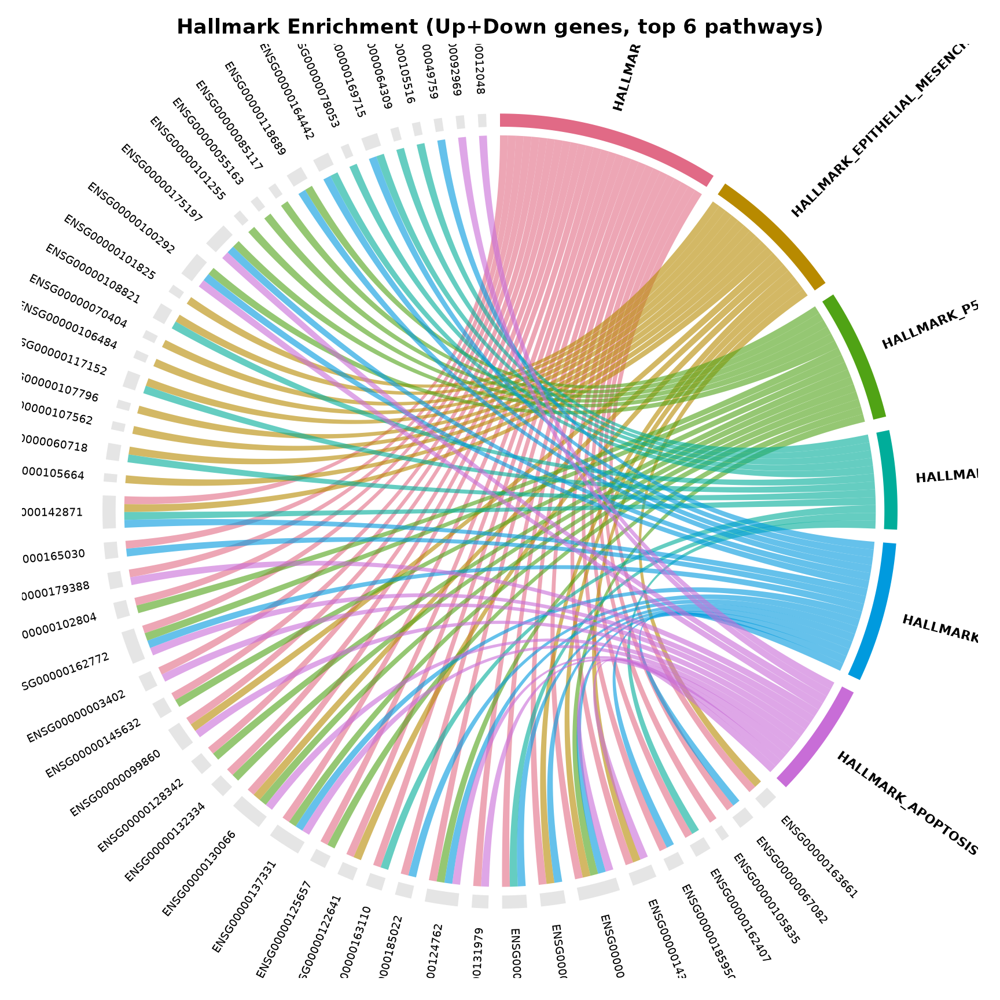

**Reading the plot:**

- Bold-labelled sectors on the left/top are **pathways**
- Smaller-labelled sectors on the right/bottom are **genes**
- Each chord connects a gene to a pathway it belongs to
- Genes with chords reaching **multiple** pathway sectors are hub genes
- Wider pathway sectors contain more genes

### Understanding the output

[`get_enrichment_chord()`](../../reference/get_enrichment_chord.md)
returns data invisibly so you can inspect the results programmatically:

``` r
if (!is.null(msig_hallmark$enrich) && nrow(msig_hallmark$enrich@result) > 0) {
  result <- get_enrichment_chord(
    msig_hallmark,
    top_n    = 6,
    color_by = "pathway"
  )

  # Gene-pathway membership table
  head(result$gene_data, 10)

  # Hub genes (appearing in 2+ pathways)
  cat("\nHub genes:", paste(head(result$hub_genes, 15), collapse = ", "), "\n")
  cat("Total hub genes:", length(result$hub_genes), "\n")
}
```

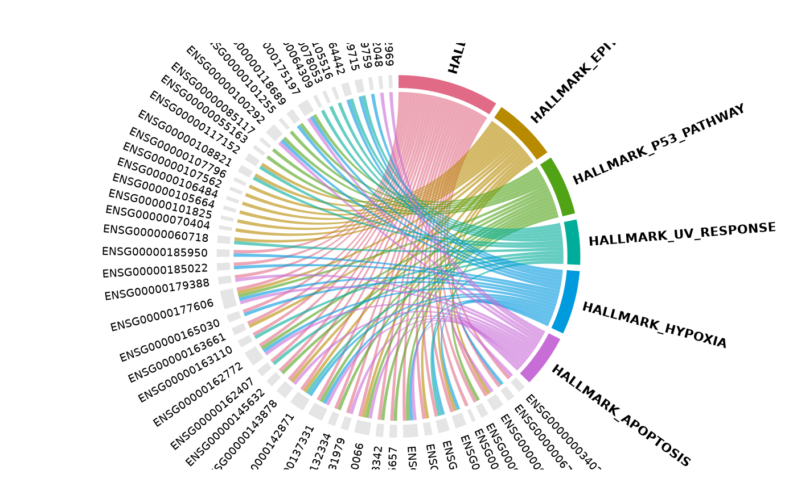

    #> 
    #> Hub genes: ENSG00000003402, ENSG00000060718, ENSG00000067082, ENSG00000099860, ENSG00000100292, ENSG00000102804, ENSG00000108821, ENSG00000112715, ENSG00000117152, ENSG00000118689, ENSG00000120129, ENSG00000122641, ENSG00000124762, ENSG00000125657, ENSG00000128342 
    #> Total hub genes: 34

## Fold-Change Colouring

The real analytical power comes when chords encode fold-change from your
DE results. This requires passing the VISTA object and comparison name.

### Continuous fold-change gradient

``` r
if (!is.null(msig_hallmark$enrich) && nrow(msig_hallmark$enrich@result) > 0) {
  get_enrichment_chord(
    msig_hallmark,
    vista  = vista,
    sample_comparison = comp_name,
    top_n      = 6,
    color_by   = "foldchange",
    display_id = "SYMBOL",
    title      = "Chord coloured by log2 fold-change"
  )
}
```

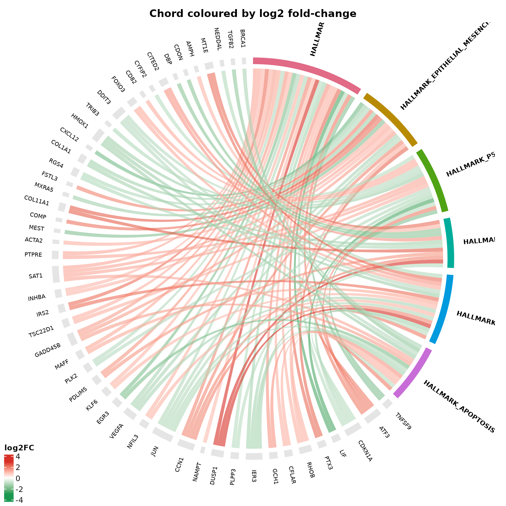

**What to look for:**

- **Red chords** indicate strongly upregulated genes
- **Blue/white chords** indicate weakly changed or downregulated genes
- The gradient legend (bottom-left) shows the fold-change scale

### Regulation-based colouring

A categorical alternative – chords coloured as Up (red), Down (green),
or Other (grey):

``` r
if (!is.null(msig_hallmark$enrich) && nrow(msig_hallmark$enrich@result) > 0) {
  get_enrichment_chord(
    msig_hallmark,
    vista  = vista,
    sample_comparison = comp_name,
    top_n      = 6,
    color_by   = "regulation",
    display_id = "SYMBOL",
    title      = "Combined enrichment (regulation colouring)"
  )
}
```

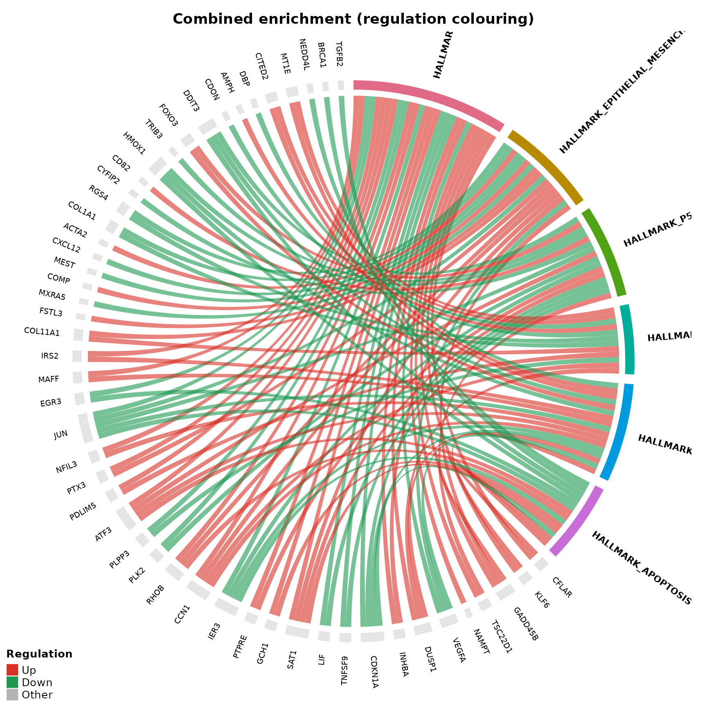

### Sort gene sectors by fold-change

You can order the gene side of the chord by fold-change to make the
strongest drivers appear first.

``` r
if (!is.null(msig_hallmark$enrich) && nrow(msig_hallmark$enrich@result) > 0) {
  get_enrichment_chord(
    msig_hallmark,
    vista     = vista,
    sample_comparison    = comp_name,
    top_n         = 6,
    color_by      = "foldchange",
    gene_order_by = "abs_foldchange", # or "foldchange"
    display_id    = "SYMBOL",
    title         = "Gene sectors sorted by |log2FC|"
  )
}
```

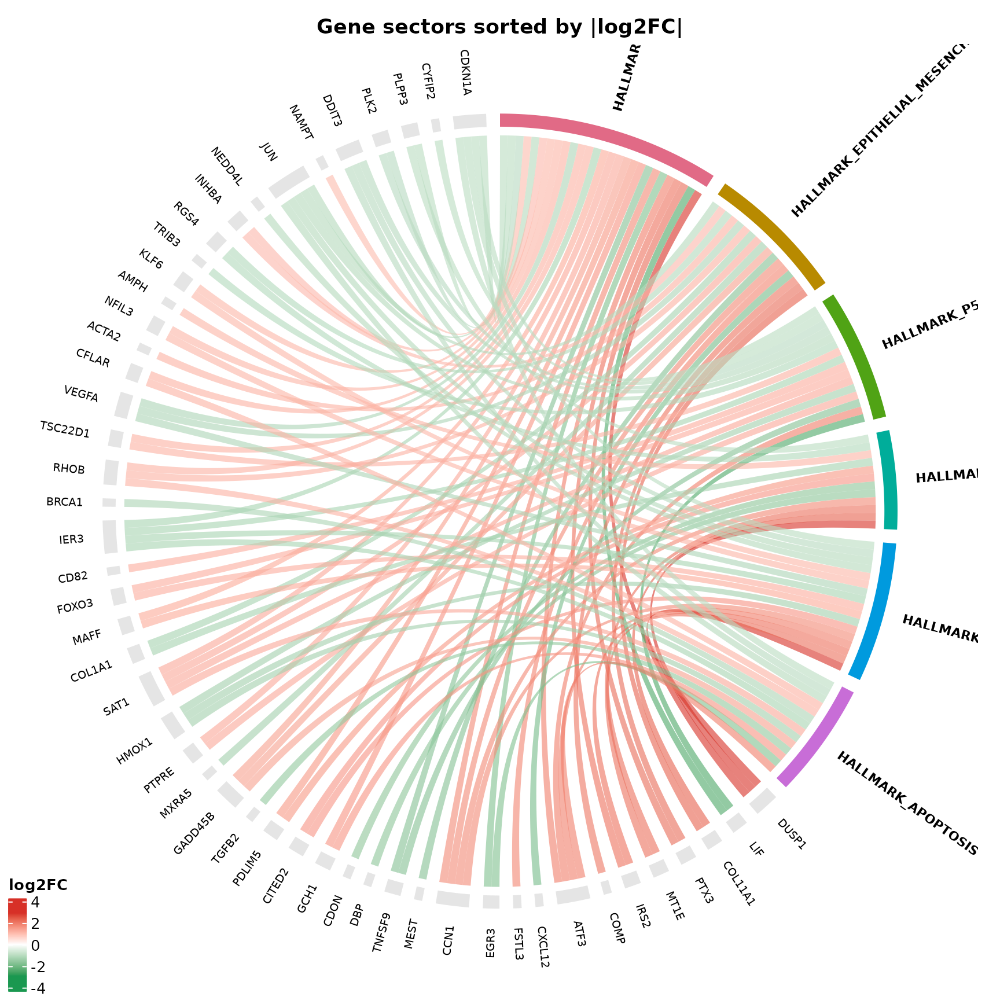

This is particularly useful for enrichments run with
`regulation = "Both"`, where a pathway may contain a mix of up and
downregulated genes.

### Combined Up + Down genes (fold-change coloured + FC-sorted)

This example uses the same combined enrichment, colours chords by
fold-change, and orders gene sectors by fold-change.

``` r
if (!is.null(msig_hallmark$enrich) && nrow(msig_hallmark$enrich@result) > 0) {
  get_enrichment_chord(
    msig_hallmark,
    vista     = vista,
    sample_comparison    = comp_name,
    top_n         = 6,
    color_by      = "foldchange",
    gene_order_by = "foldchange",
    display_id    = "SYMBOL",
    title         = "Up + Down enrichment: fold-change coloured and FC-sorted genes"
  )
}
```

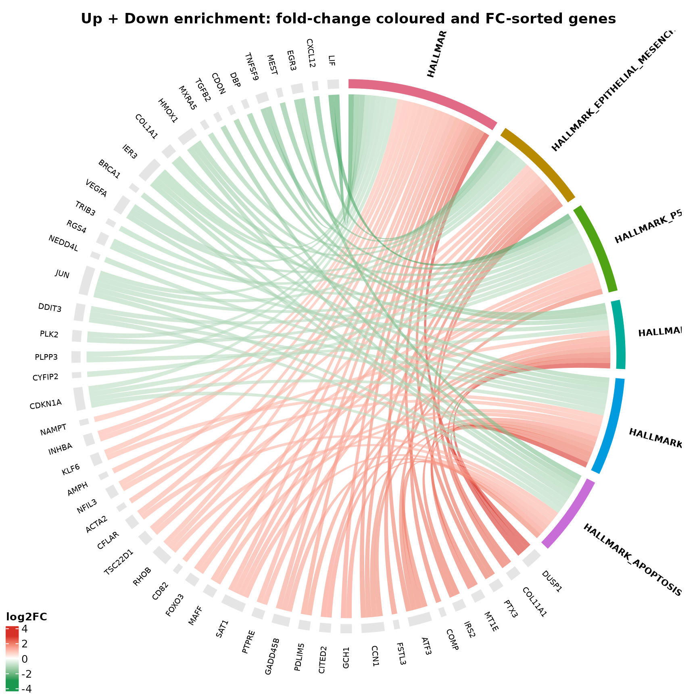

## Hub Gene Analysis

### Filtering to shared genes

The `min_pathways` parameter is the key analytical control. Setting it
to `2` removes all genes that appear in only one pathway, revealing only
the **hub genes** that bridge multiple enriched terms.

``` r
if (!is.null(msig_hallmark$enrich) && nrow(msig_hallmark$enrich@result) > 0) {
  hub_result <- get_enrichment_chord(
    msig_hallmark,
    vista    = vista,
    sample_comparison   = comp_name,
    top_n        = 8,
    min_pathways = 2,
    color_by     = "foldchange",
    display_id   = "SYMBOL",
    title        = "Hub genes only (shared across 2+ pathways)"
  )

  cat("Hub genes found:", length(hub_result$hub_genes), "\n")
  cat("Genes:", paste(head(hub_result$hub_genes, 20), collapse = ", "), "\n")
}
```

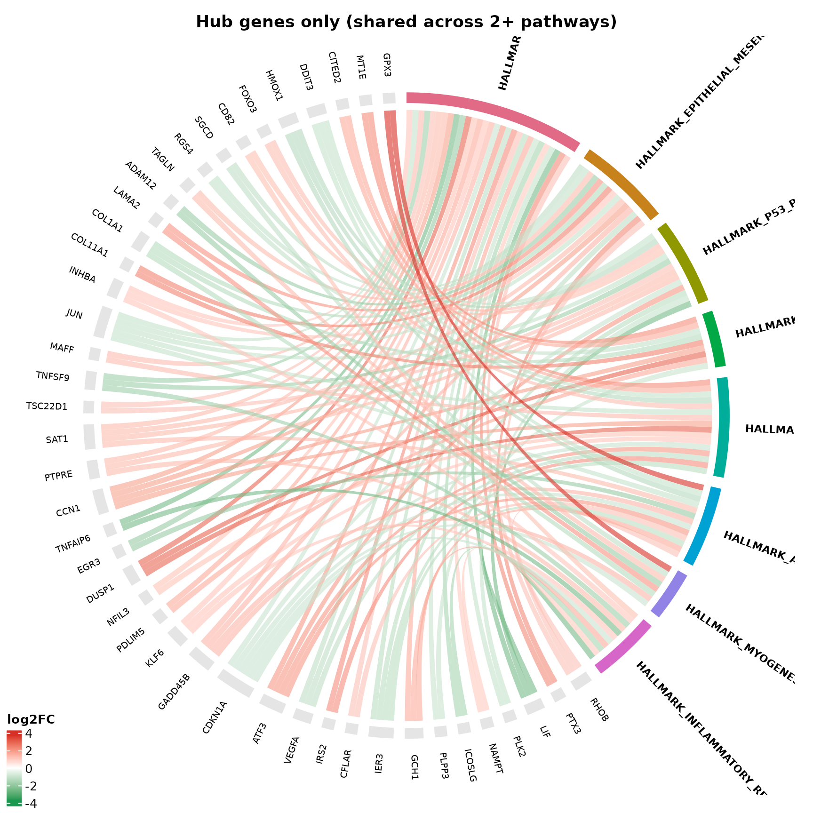

    #> Hub genes found: 43 
    #> Genes: ENSG00000003402, ENSG00000060718, ENSG00000067082, ENSG00000085117, ENSG00000099860, ENSG00000100292, ENSG00000102804, ENSG00000105835, ENSG00000108821, ENSG00000112715, ENSG00000117152, ENSG00000118689, ENSG00000120129, ENSG00000122641, ENSG00000123610, ENSG00000124762, ENSG00000125657, ENSG00000128342, ENSG00000130066, ENSG00000131979

**Interpretation:**

- Every gene shown has chords reaching at least 2 pathway sectors
- These genes are disproportionately responsible for the enrichment
  signal
- If the same 10 genes drive all 8 pathways, the enrichment is one
  signal, not eight

### Increasing the threshold

For denser enrichments, you can raise the threshold further:

``` r
if (!is.null(msig_hallmark$enrich) && nrow(msig_hallmark$enrich@result) > 0) {
  hub_strict <- get_enrichment_chord(
    msig_hallmark,
    vista    = vista,
    sample_comparison   = comp_name,
    top_n        = 8,
    min_pathways = 3,
    max_genes    = 30,
    color_by     = "regulation",
    display_id   = "SYMBOL",
    title        = "Combined Hallmark: genes in 3+ pathways"
  )

  if (length(hub_strict$hub_genes)) {
    cat("Top hub genes:", paste(head(hub_strict$hub_genes, 15), collapse = ", "), "\n")
  }
}
```

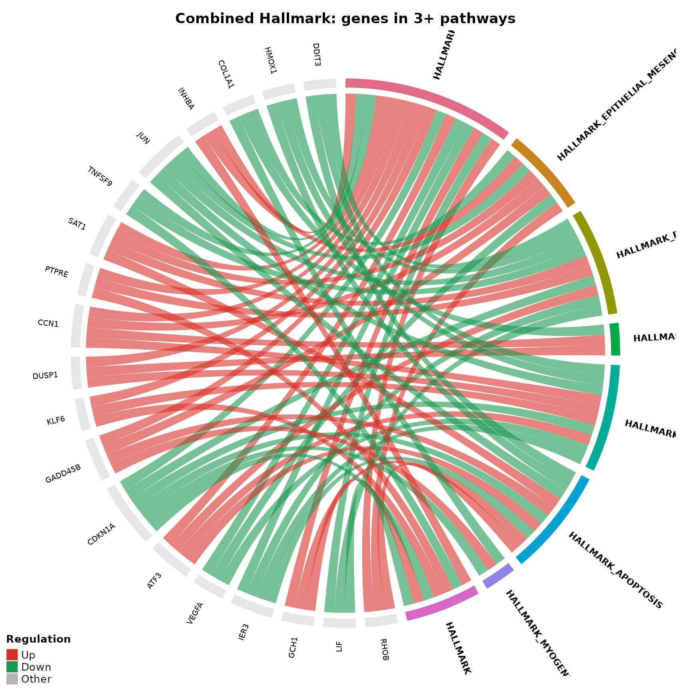

    #> Top hub genes: ENSG00000003402, ENSG00000060718, ENSG00000067082, ENSG00000085117, ENSG00000099860, ENSG00000100292, ENSG00000102804, ENSG00000105835, ENSG00000108821, ENSG00000112715, ENSG00000117152, ENSG00000118689, ENSG00000120129, ENSG00000122641, ENSG00000123610

## Visual Customisation

### Custom pathway colours

Pass a named colour vector to override the default HCL palette:

``` r
if (!is.null(msig_hallmark$enrich) && nrow(msig_hallmark$enrich@result) > 0) {
  # Get the top pathway names first
  top_pathways <- head(msig_hallmark$enrich@result$Description, 5)

  # Define custom colors
  custom_cols <- c(
    "#264653", "#2A9D8F", "#E9C46A", "#F4A261", "#E76F51"
  )
  names(custom_cols) <- top_pathways

  get_enrichment_chord(
    msig_hallmark,
    top_n          = 5,
    color_by       = "pathway",
    pathway_colors = custom_cols,
    title          = "Custom pathway colours"
  )
}
```

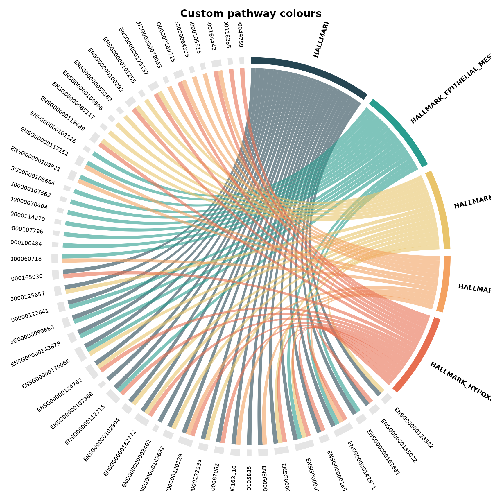

### Adjusting layout

Fine-tune gap size, label size, and transparency:

``` r
if (!is.null(msig_hallmark$enrich) && nrow(msig_hallmark$enrich@result) > 0) {
  get_enrichment_chord(
    msig_hallmark,
    top_n        = 5,
    color_by     = "pathway",
    gap_degree   = 4,          # wider gaps between sectors
    label_cex    = 0.6,        # smaller labels
    transparency = 0.2,        # more opaque chords
    title        = "Adjusted layout"
  )
}
```

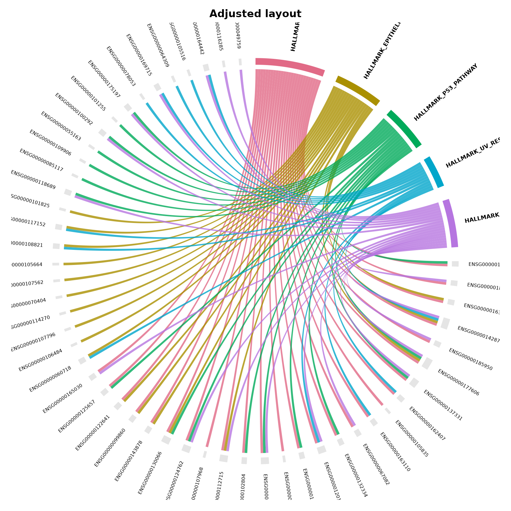

### Selecting specific pathways

Instead of top N by p-value, pick pathways by name:

``` r
if (!is.null(msig_hallmark$enrich) && nrow(msig_hallmark$enrich@result) > 0) {
  available <- msig_hallmark$enrich@result$Description
  # Pick specific pathways of interest (if available)
  pick <- intersect(
    c("HALLMARK_P53_PATHWAY",
      "HALLMARK_TNFA_SIGNALING_VIA_NFKB",
      "HALLMARK_HYPOXIA",
      "HALLMARK_APOPTOSIS"),
    available
  )

  if (length(pick) >= 2) {
    get_enrichment_chord(
      msig_hallmark,
      pathways   = pick,
      vista  = vista,
      sample_comparison = comp_name,
      color_by   = "foldchange",
      display_id = "SYMBOL",
      title      = "Selected pathways of interest"
    )
  }
}
```

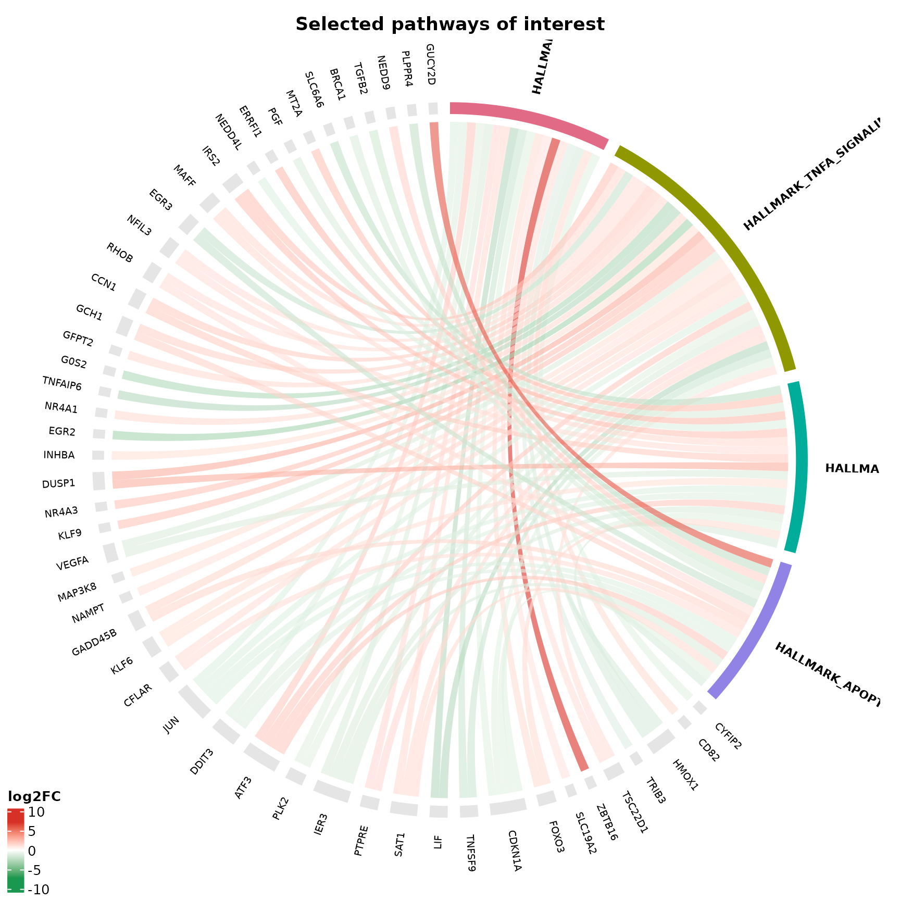

## Comparison with Standard Visualisations

To appreciate what the chord diagram adds, compare it with the existing
VISTA enrichment views on the same data:

### Dot plot: *what* is enriched

``` r
if (!is.null(msig_hallmark$enrich) && nrow(msig_hallmark$enrich@result) > 0) {
  get_enrichment_plot(msig_hallmark$enrich, top_n = 8)
}
```

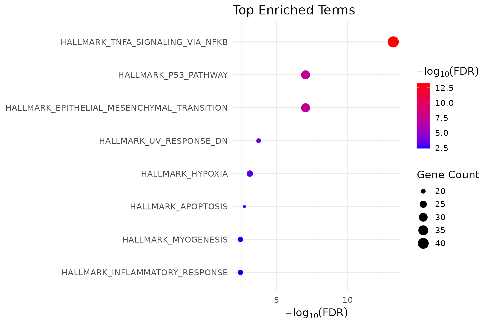

The dot plot answers: *which pathways are significant?* It shows
p-values and gene counts but does not reveal which specific genes are
shared.

### Pathway heatmap: *expression* of pathway genes

``` r
if (!is.null(msig_hallmark$enrich) && nrow(msig_hallmark$enrich@result) > 0) {
  get_pathway_heatmap(
    x      = vista,
    enrichment = msig_hallmark$enrich,
    sample_group = c("Untreated", "Dexamethasone"),
    top_n      = 3,
    gene_mode  = "union",
    max_genes  = 40,
    value_transform    = "zscore",
    display_id         = "SYMBOL",
    annotate_columns   = TRUE,
    summarise_replicates = FALSE,
    show_row_names     = TRUE
  )
}
```

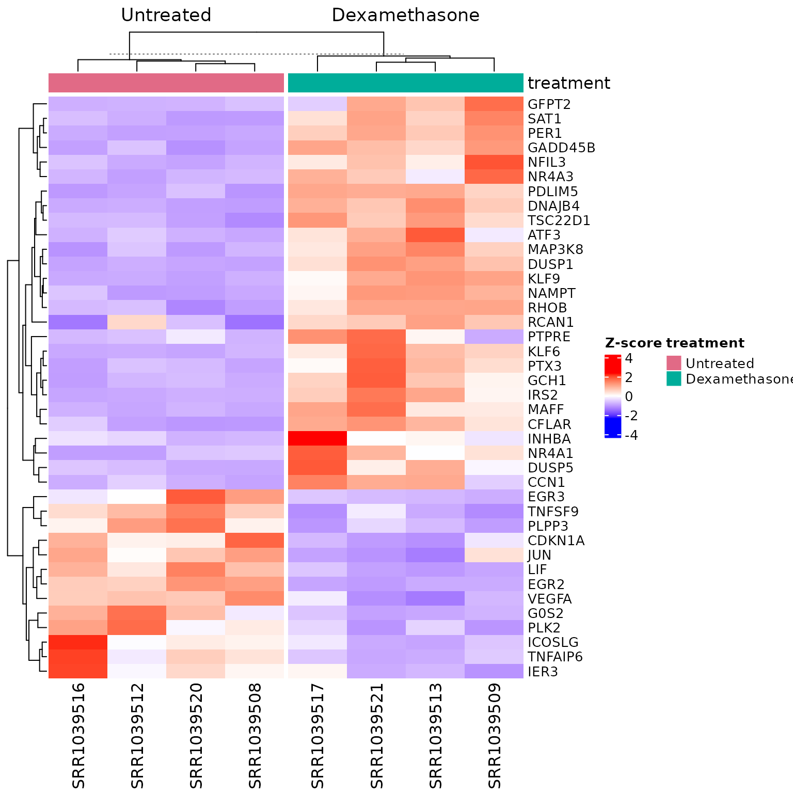

The heatmap answers: *how do pathway genes behave across samples?* It
shows expression patterns but does not reveal gene sharing across
pathways.

### Chord diagram: *topology* of gene–pathway relationships

``` r
if (!is.null(msig_hallmark$enrich) && nrow(msig_hallmark$enrich@result) > 0) {
  get_enrichment_chord(
    msig_hallmark,
    vista    = vista,
    sample_comparison   = comp_name,
    top_n        = 8,
    min_pathways = 2,
    color_by     = "foldchange",
    display_id   = "SYMBOL",
    title        = "Hub genes bridging enriched pathways"
  )
}
```

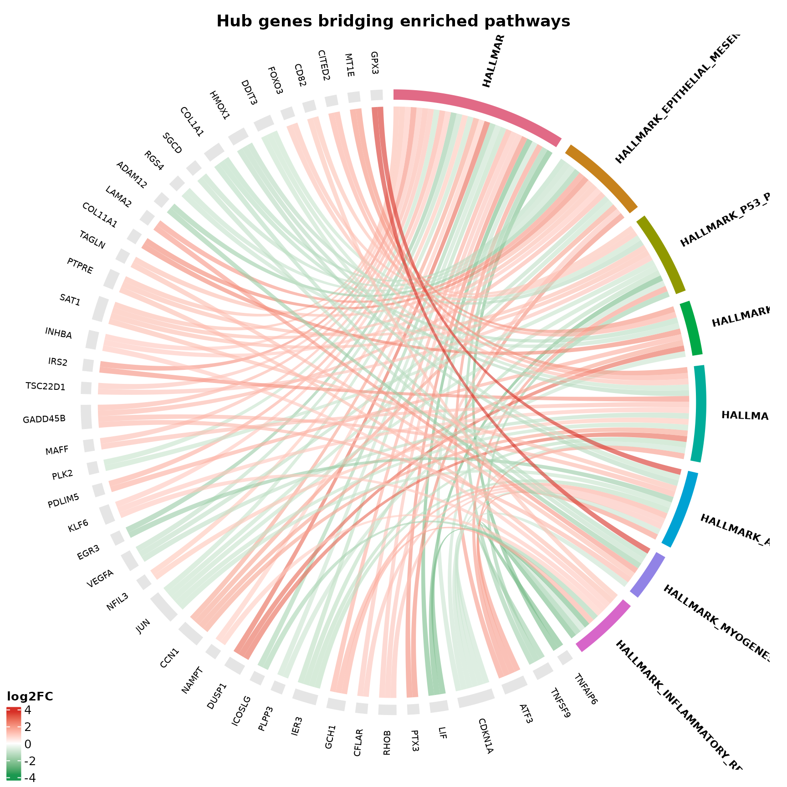

The chord diagram answers: *which genes bridge which pathways, and are
they going up or down?*

| View                   | Question it answers                         | Key insight                        |
|------------------------|---------------------------------------------|------------------------------------|
| `get_enrichment_plot`  | What pathways are significant?              | Statistical significance and size  |
| `get_pathway_heatmap`  | How do pathway genes behave across samples? | Expression patterns and clustering |
| `get_enrichment_chord` | Which genes connect which pathways?         | Hub genes and pathway redundancy   |

These three views are **complementary**, not competing. Together they
form a complete picture of functional enrichment.

## Practical Guidelines

### When to use chord diagrams

- After running enrichment to understand **redundancy** in your top
  terms
- When you need to identify **hub genes** for follow-up validation
  (qPCR, western blot)
- When presenting to collaborators who need a visual map of gene–pathway
  relationships

### When NOT to use chord diagrams

- With \> 10 pathways and \> 50 genes (becomes unreadable – use
  `max_genes` cap)
- As a replacement for dot plots (you still need the dot plot for
  significance)
- For genome-positional data (use
  [`get_foldchange_chromosome_plot()`](../../reference/get_foldchange_chromosome_plot.md)
  instead)

### Recommended defaults for common scenarios

| Scenario                 | `top_n` | `min_pathways` | `color_by`     |
|--------------------------|---------|----------------|----------------|
| First exploration        | 6       | 1              | `"pathway"`    |
| Identify hub genes       | 8       | 2              | `"foldchange"` |
| Publication figure       | 5–6     | 2              | `"foldchange"` |
| Present to collaborators | 4–5     | 1              | `"regulation"` |
| Denser pathway sets      | 6       | 3              | `"regulation"` |

## Session Information

``` r
sessionInfo()
#> R version 4.5.3 (2026-03-11)
#> Platform: x86_64-pc-linux-gnu
#> Running under: Ubuntu 24.04.4 LTS
#> 
#> Matrix products: default
#> BLAS:   /usr/lib/x86_64-linux-gnu/openblas-pthread/libblas.so.3 
#> LAPACK: /usr/lib/x86_64-linux-gnu/openblas-pthread/libopenblasp-r0.3.26.so;  LAPACK version 3.12.0
#> 
#> locale:
#>  [1] LC_CTYPE=C.UTF-8       LC_NUMERIC=C           LC_TIME=C.UTF-8       
#>  [4] LC_COLLATE=C.UTF-8     LC_MONETARY=C.UTF-8    LC_MESSAGES=C.UTF-8   
#>  [7] LC_PAPER=C.UTF-8       LC_NAME=C              LC_ADDRESS=C          
#> [10] LC_TELEPHONE=C         LC_MEASUREMENT=C.UTF-8 LC_IDENTIFICATION=C   
#> 
#> time zone: UTC
#> tzcode source: system (glibc)
#> 
#> attached base packages:
#> [1] stats4    stats     graphics  grDevices utils     datasets  methods  
#> [8] base     
#> 
#> other attached packages:
#>  [1] org.Hs.eg.db_3.22.0         AnnotationDbi_1.72.0       
#>  [3] airway_1.30.0               SummarizedExperiment_1.40.0
#>  [5] Biobase_2.70.0              GenomicRanges_1.62.1       
#>  [7] Seqinfo_1.0.0               IRanges_2.44.0             
#>  [9] S4Vectors_0.48.1            BiocGenerics_0.56.0        
#> [11] generics_0.1.4              MatrixGenerics_1.22.0      
#> [13] matrixStats_1.5.0           dplyr_1.2.1                
#> [15] ggplot2_4.0.2               VISTA_0.99.4               
#> [17] BiocStyle_2.38.0           
#> 
#> loaded via a namespace (and not attached):
#>   [1] splines_4.5.3           ggplotify_0.1.3         tibble_3.3.1           
#>   [4] R.oo_1.27.1             polyclip_1.10-7         lifecycle_1.0.5        
#>   [7] rstatix_0.7.3           edgeR_4.8.2             doParallel_1.0.17      
#>  [10] lattice_0.22-9          MASS_7.3-65             backports_1.5.1        
#>  [13] magrittr_2.0.5          limma_3.66.0            sass_0.4.10            
#>  [16] rmarkdown_2.31          jquerylib_0.1.4         yaml_2.3.12            
#>  [19] otel_0.2.0              ggtangle_0.1.1          cowplot_1.2.0          
#>  [22] DBI_1.3.0               RColorBrewer_1.1-3      abind_1.4-8            
#>  [25] purrr_1.2.1             R.utils_2.13.0          msigdbr_26.1.0         
#>  [28] yulab.utils_0.2.4       tweenr_2.0.3            rappdirs_0.3.4         
#>  [31] gdtools_0.5.0           circlize_0.4.18         enrichplot_1.30.5      
#>  [34] ggrepel_0.9.8           tidytree_0.4.7          pkgdown_2.2.0          
#>  [37] codetools_0.2-20        DelayedArray_0.36.1     DOSE_4.4.0             
#>  [40] ggforce_0.5.0           tidyselect_1.2.1        shape_1.4.6.1          
#>  [43] aplot_0.2.9             farver_2.1.2            jsonlite_2.0.0         
#>  [46] GetoptLong_1.1.0        Formula_1.2-5           iterators_1.0.14       
#>  [49] systemfonts_1.3.2       foreach_1.5.2           tools_4.5.3            
#>  [52] ggnewscale_0.5.2        treeio_1.34.0           ragg_1.5.2             
#>  [55] Rcpp_1.1.1              glue_1.8.0              SparseArray_1.10.10    
#>  [58] xfun_0.57               DESeq2_1.50.2           qvalue_2.42.0          
#>  [61] withr_3.0.2             BiocManager_1.30.27     fastmap_1.2.0          
#>  [64] GGally_2.4.0            digest_0.6.39           R6_2.6.1               
#>  [67] gridGraphics_0.5-1      textshaping_1.0.5       colorspace_2.1-2       
#>  [70] GO.db_3.22.0            RSQLite_2.4.6           R.methodsS3_1.8.2      
#>  [73] tidyr_1.3.2             fontLiberation_0.1.0    data.table_1.18.2.1    
#>  [76] httr_1.4.8              htmlwidgets_1.6.4       S4Arrays_1.10.1        
#>  [79] scatterpie_0.2.6        ggstats_0.13.0          pkgconfig_2.0.3        
#>  [82] gtable_0.3.6            blob_1.3.0              ComplexHeatmap_2.26.1  
#>  [85] S7_0.2.1                XVector_0.50.0          clusterProfiler_4.18.4 
#>  [88] htmltools_0.5.9         fontBitstreamVera_0.1.1 carData_3.0-6          
#>  [91] bookdown_0.46           fgsea_1.36.2            clue_0.3-68            
#>  [94] scales_1.4.0            png_0.1-9               ggfun_0.2.0            
#>  [97] knitr_1.51              reshape2_1.4.5          rjson_0.2.23           
#> [100] nlme_3.1-168            curl_7.0.0              cachem_1.1.0           
#> [103] GlobalOptions_0.1.3     stringr_1.6.0           parallel_4.5.3         
#> [106] desc_1.4.3              pillar_1.11.1           grid_4.5.3             
#> [109] vctrs_0.7.2             ggpubr_0.6.3            car_3.1-5              
#> [112] tidydr_0.0.6            cluster_2.1.8.2         evaluate_1.0.5         
#> [115] cli_3.6.5               locfit_1.5-9.12         compiler_4.5.3         
#> [118] rlang_1.1.7             crayon_1.5.3            ggsignif_0.6.4         
#> [121] labeling_0.4.3          forcats_1.0.1           plyr_1.8.9             
#> [124] fs_2.0.1                ggiraph_0.9.6           stringi_1.8.7          
#> [127] BiocParallel_1.44.0     assertthat_0.2.1        babelgene_22.9         
#> [130] Biostrings_2.78.0       lazyeval_0.2.3          GOSemSim_2.36.0        
#> [133] fontquiver_0.2.1        Matrix_1.7-4            patchwork_1.3.2        
#> [136] bit64_4.6.0-1           KEGGREST_1.50.0         statmod_1.5.1          
#> [139] igraph_2.2.2            broom_1.0.12            memoise_2.0.1          
#> [142] bslib_0.10.0            ggtree_4.0.5            fastmatch_1.1-8        
#> [145] bit_4.6.0               ape_5.8-1               gson_0.1.0
```

## References

- Himes BE et al. (2014). “RNA-Seq transcriptome profiling identifies
  CRISPLD2 as a glucocorticoid responsive gene that modulates cytokine
  function in airway smooth muscle cells.” *PLoS One* 9(6): e99625.
- Gu Z et al. (2014). “circlize implements and enhances circular
  visualization in R.” *Bioinformatics*, 30(19), 2811–2812.
- Wu T et al. (2021). “clusterProfiler 4.0: A universal enrichment tool
  for interpreting omics data.” *The Innovation*, 2(3), 100141.
- Subramanian A et al. (2005). “Gene set enrichment analysis: a
  knowledge-based approach for interpreting genome-wide expression
  profiles.” *PNAS*, 102(43), 15545–15550.
