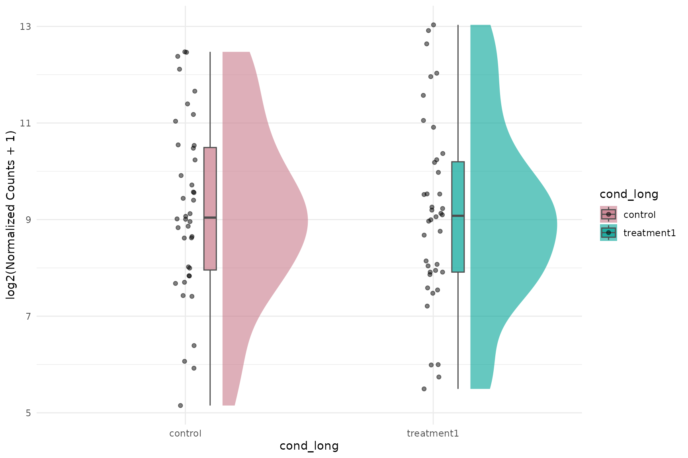
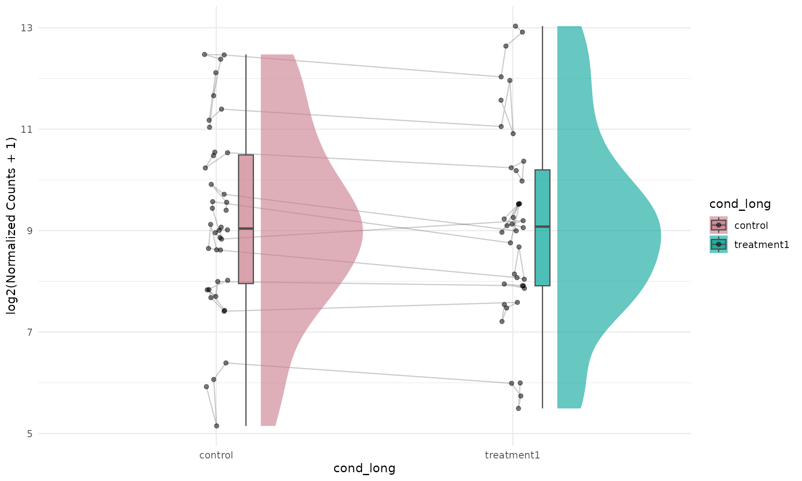
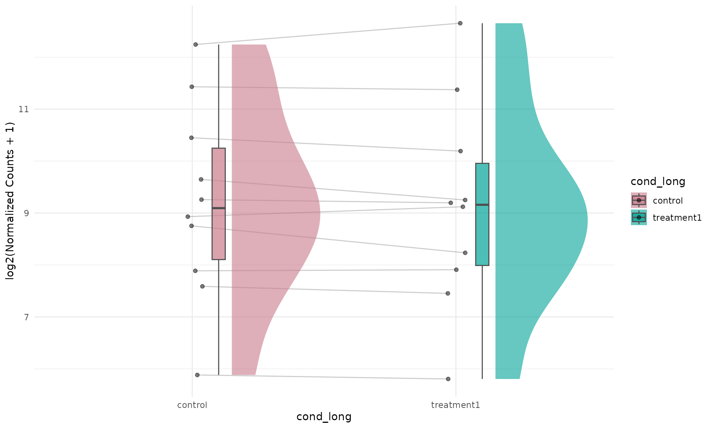
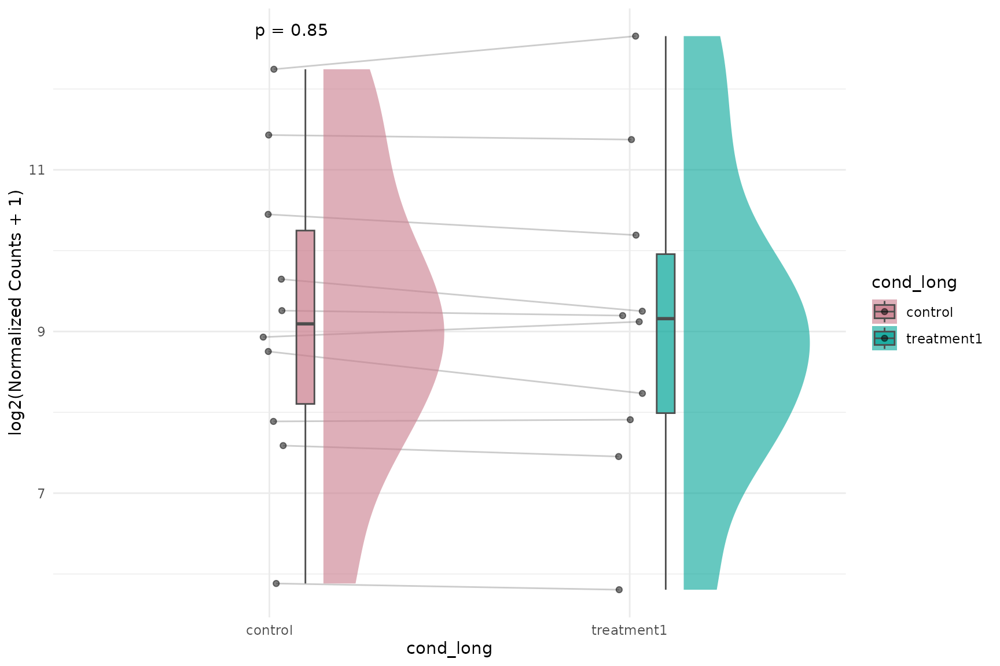
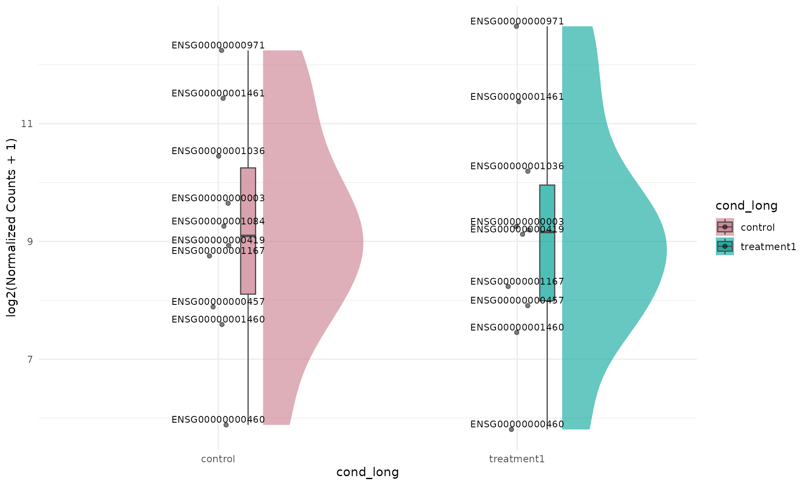
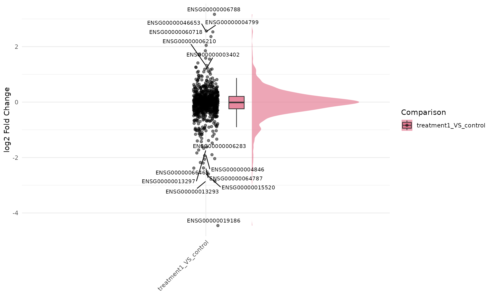
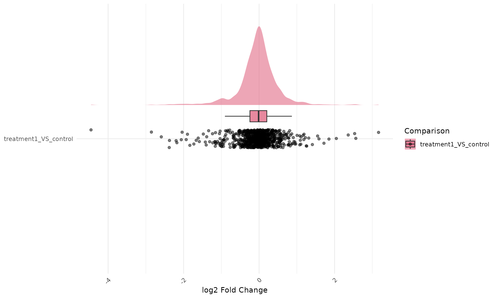

# Raincloud Plots in VISTA

## Overview

Raincloud plots combine three visual layers:

1.  distribution shape (half-violin),
2.  robust summary (boxplot), and
3.  individual observations (jittered points).

This vignette shows raincloud plotting for both expression and
fold-change data in VISTA, including line-connection control with
`id.long.var` and optional statistical annotations.

## Create a VISTA object

``` r

library(VISTA)
library(ggplot2)

data("count_data", package = "VISTA")
data("sample_metadata", package = "VISTA")

# Keep runtime modest for vignette rendering
count_small <- count_data[1:1000, ]

vista <- create_vista(
  counts = count_small,
  sample_info = sample_metadata,
  column_geneid = "gene_id",
  group_column = "cond_long",
  group_numerator = "treatment1",
  group_denominator = "control",
  method = "deseq2",
  min_counts = 10,
  min_replicates = 1
)

comp_names <- names(comparisons(vista))
top_up <- get_genes_by_regulation(
  vista,
  sample_comparisons = comp_names[1],
  regulation = "Up"
)
n_select_genes = 50
selected_genes <- stats::na.omit(utils::head(top_up$gene_id, n_select_genes))
if (!length(selected_genes)) {
  selected_genes <- rownames(vista)[1:n_select_genes]
}
```

## Expression Raincloud

### Basic expression raincloud (pooled gene-sample values)

``` r

get_expression_raincloud(
  vista,
  genes = selected_genes[1:10],
  value_transform = "log2",
  summarise = FALSE,
  facet_by = "none"
)
```



### `summarise = FALSE` vs `summarise = TRUE`

For expression rainclouds:

- `summarise = FALSE`: each point is a gene-sample value (pooled across
  selected genes).
- `summarise = TRUE`: each point is a gene-level group summary (one
  value per gene per group).

With `summarise = TRUE`, using `id.long.var = "gene"` is useful for
connecting each gene across groups.

``` r

get_expression_raincloud(
  vista,
  genes = selected_genes[1:10],
  value_transform = "log2",
  summarise = FALSE,
  facet_by = "none",
  id.long.var = "gene"
)
```



``` r

get_expression_raincloud(
  vista,
  genes = selected_genes[1:10],
  value_transform = "log2",
  summarise = TRUE,
  facet_by = "none",
  id.long.var = "gene"
)
```



### Expression raincloud with lines and p-values

``` r

get_expression_raincloud(
  vista,
  genes = selected_genes[1:10],
  value_transform = "log2",
  summarise = TRUE,
  facet_by = "none",
  id.long.var = "gene",
  stats_group = TRUE,
  stats_method = "wilcox.test",
  p.label = "p.format"
)
```



### Label dots by gene ID (`facet_by = "none"`)

``` r

get_expression_raincloud(
  vista,
  genes = selected_genes[1:10],
  value_transform = "log2",
  summarise = TRUE,
  facet_by = "none",
  label = TRUE,
  label_column = "gene",
  label_size = 3
)
```



If your object has symbol annotations in `rowData(vista)` (or you
provide `display_from`/`display_orgdb`), you can label directly in
symbol space:

``` r

get_expression_raincloud(
  vista,
  genes = c("NFKBIA", "KLF6", "PER1"),
  value_transform = "log2",
  summarise = TRUE,
  facet_by = "none",
  label = TRUE,
  display_id = "SYMBOL"
)
```

When `facet_by = "gene"`, prefer `summarise = FALSE` so each facet
retains replicate-level distribution. With `summarise = TRUE`, each
facet has only group-level summaries and the raincloud shape is usually
not informative.

``` r

get_expression_raincloud(
  vista,
  genes = selected_genes[1:2],
  value_transform = "log2",
  summarise = FALSE,
  facet_by = "gene",
  label = TRUE,
  label_column = "gene",
  label_size = 2.8
)
```


### Flipped expression raincloud

Raincloud plots can be visually emphasized in a horizontal layout by
combining a left-side raincloud with
[`coord_flip()`](https://ggplot2.tidyverse.org/reference/coord_flip.html).

``` r

get_expression_raincloud(
  vista,
  genes = selected_genes[1:10],
  value_transform = "log2",
  summarise = TRUE,
  facet_by = "none",
  rain_side = "r",
  id.long.var = "gene"
) +
  ggplot2::coord_flip()
```


## Fold-Change Raincloud

### Basic fold-change raincloud

``` r

get_foldchange_raincloud(
  vista,
  sample_comparisons = comp_names,
  facet_by = "auto"
)
```


### Fold-change raincloud with gene trajectories and p-values

``` r

get_foldchange_raincloud(
  vista,
  sample_comparisons = comp_names,
  facet_by = "none",
  id.long.var = "gene_id",
  stats_group = TRUE,
  stats_method = "t.test"
)
```


### Label dots by gene ID for fold-change raincloud

``` r

get_foldchange_raincloud(
  vista,
  sample_comparisons = comp_names,
  facet_by = "none",
  label = TRUE,
  label_column = "gene_id",
  label_size = 2.8
)
```



``` r

get_foldchange_raincloud(
  vista,
  genes = c("NFKBIA", "KLF6", "PER1"),
  sample_comparisons = comp_names,
  facet_by = "none",
  label = TRUE,
  display_id = "SYMBOL"
)
```

### Flipped fold-change raincloud

``` r

get_foldchange_raincloud(
  vista,
  sample_comparisons = comp_names,
  facet_by = "none",
  rain_side = "r",
  id.long.var = "gene_id"
) +
  ggplot2::coord_flip()
```



## Why this is harder outside VISTA

Outside VISTA, producing equivalent raincloud plots is more involved
because you must manually:

1.  extract and harmonize DE tables per comparison,
2.  reshape to long format for plotting,
3.  track grouping and palette consistency,
4.  map repeated-measure identifiers for line connections, and
5.  add and control statistical annotations per plotting context.

A minimal non-VISTA workflow typically requires custom wrangling and
multiple plot-specific settings:

``` r

# 1) Build long expression/fold-change tables manually
# 2) Join sample metadata and comparison metadata
# 3) Validate IDs for repeated measures (id.long.var)
# 4) Create raincloud layers and palette mapping
# 5) Add statistical comparisons and label formatting
# 6) Repeat the process for each analysis object/comparison set
```

In VISTA, these steps are encapsulated in
[`get_expression_raincloud()`](https://cparsania.github.io/VISTA/reference/get_expression_raincloud.md)
and
[`get_foldchange_raincloud()`](https://cparsania.github.io/VISTA/reference/get_foldchange_raincloud.md)
while staying consistent with the rest of the plotting API.

### Session information

``` r

sessionInfo()
#> R version 4.6.1 (2026-06-24)
#> Platform: x86_64-pc-linux-gnu
#> Running under: Ubuntu 24.04.4 LTS
#> 
#> Matrix products: default
#> BLAS:   /usr/lib/x86_64-linux-gnu/openblas-pthread/libblas.so.3 
#> LAPACK: /usr/lib/x86_64-linux-gnu/openblas-pthread/libopenblasp-r0.3.26.so;  LAPACK version 3.12.0
#> 
#> locale:
#>  [1] LC_CTYPE=C.UTF-8       LC_NUMERIC=C           LC_TIME=C.UTF-8       
#>  [4] LC_COLLATE=C.UTF-8     LC_MONETARY=C.UTF-8    LC_MESSAGES=C.UTF-8   
#>  [7] LC_PAPER=C.UTF-8       LC_NAME=C              LC_ADDRESS=C          
#> [10] LC_TELEPHONE=C         LC_MEASUREMENT=C.UTF-8 LC_IDENTIFICATION=C   
#> 
#> time zone: UTC
#> tzcode source: system (glibc)
#> 
#> attached base packages:
#> [1] stats     graphics  grDevices utils     datasets  methods   base     
#> 
#> other attached packages:
#> [1] ggplot2_4.0.3    VISTA_1.1.3      BiocStyle_2.40.0
#> 
#> loaded via a namespace (and not attached):
#>   [1] RColorBrewer_1.1-3          ggrain_0.1.2               
#>   [3] jsonlite_2.0.0              tidydr_0.0.6               
#>   [5] magrittr_2.0.5              ggtangle_0.1.2             
#>   [7] farver_2.1.2                rmarkdown_2.31             
#>   [9] fs_2.1.0                    ragg_1.5.2                 
#>  [11] vctrs_0.7.3                 memoise_2.0.1              
#>  [13] ggtree_4.2.0                rstatix_1.1.0              
#>  [15] htmltools_0.5.9             S4Arrays_1.12.0            
#>  [17] polynom_1.4-1               curl_7.1.0                 
#>  [19] broom_1.0.13                Formula_1.2-6              
#>  [21] SparseArray_1.12.2          gridGraphics_0.5-1         
#>  [23] sass_0.4.10                 bslib_0.12.0               
#>  [25] htmlwidgets_1.6.4           desc_1.4.3                 
#>  [27] plyr_1.8.9                  httr2_1.3.0                
#>  [29] cachem_1.1.0                igraph_2.3.3               
#>  [31] lifecycle_1.0.5             pkgconfig_2.0.3            
#>  [33] gson_0.2.1                  Matrix_1.7-5               
#>  [35] R6_2.6.1                    fastmap_1.2.0              
#>  [37] MatrixGenerics_1.24.0       digest_0.6.39              
#>  [39] aplot_0.3.1                 enrichplot_1.32.0          
#>  [41] colorspace_2.1-3            ggnewscale_0.5.2           
#>  [43] GGally_2.4.0                patchwork_1.3.2            
#>  [45] AnnotationDbi_1.74.0        S4Vectors_0.50.1           
#>  [47] aisdk_1.4.12                ps_1.9.3                   
#>  [49] DESeq2_1.52.0               textshaping_1.0.5          
#>  [51] GenomicRanges_1.64.0        RSQLite_3.53.3             
#>  [53] ggpubr_1.0.0                labeling_0.4.3             
#>  [55] polyclip_1.10-7             httr_1.4.8                 
#>  [57] abind_1.4-8                 compiler_4.6.1             
#>  [59] withr_3.0.3                 bit64_4.8.2                
#>  [61] fontquiver_0.2.1            backports_1.5.1            
#>  [63] S7_0.2.2                    BiocParallel_1.46.0        
#>  [65] carData_3.0-6               DBI_1.3.0                  
#>  [67] ggstats_0.13.0              ggforce_0.5.0              
#>  [69] ggsignif_0.6.4              MASS_7.3-65                
#>  [71] rappdirs_0.3.4              DelayedArray_0.38.2        
#>  [73] ggpp_0.6.1                  tools_4.6.1                
#>  [75] otel_0.2.0                  scatterpie_0.2.6           
#>  [77] ape_5.8-1                   msigdbr_26.1.0             
#>  [79] glue_1.8.1                  callr_3.8.0                
#>  [81] nlme_3.1-169                GOSemSim_2.38.3            
#>  [83] grid_4.6.1                  cluster_2.1.8.2            
#>  [85] reshape2_1.4.5              generics_0.1.4             
#>  [87] gtable_0.3.6                tidyr_1.3.2                
#>  [89] car_3.1-5                   XVector_0.52.0             
#>  [91] BiocGenerics_0.58.1         ggrepel_0.9.8              
#>  [93] pillar_1.11.1               stringr_1.6.0              
#>  [95] babelgene_22.9              limma_3.68.4               
#>  [97] yulab.utils_0.2.4           splines_4.6.1              
#>  [99] tweenr_2.0.3                dplyr_1.2.1                
#> [101] treeio_1.36.1               lattice_0.22-9             
#> [103] bit_4.6.0                   tidyselect_1.2.1           
#> [105] fontLiberation_0.1.0        GO.db_3.23.1               
#> [107] locfit_1.5-9.12             Biostrings_2.80.1          
#> [109] knitr_1.51                  fontBitstreamVera_0.1.1    
#> [111] bookdown_0.47               IRanges_2.46.0             
#> [113] Seqinfo_1.2.0               edgeR_4.10.1               
#> [115] SummarizedExperiment_1.42.0 stats4_4.6.1               
#> [117] xfun_0.60                   Biobase_2.72.0             
#> [119] statmod_1.5.2               matrixStats_1.5.0          
#> [121] stringi_1.8.9               lazyeval_0.2.3             
#> [123] ggfun_0.2.1                 yaml_2.3.12                
#> [125] evaluate_1.0.5              codetools_0.2-20           
#> [127] qvalue_2.44.0               gdtools_0.5.1              
#> [129] tibble_3.3.1                BiocManager_1.30.27        
#> [131] ggplotify_0.1.3             cli_3.6.6                  
#> [133] systemfonts_1.3.2           processx_3.9.0             
#> [135] jquerylib_0.1.4             Rcpp_1.1.2                 
#> [137] png_0.1-9                   parallel_4.6.1             
#> [139] assertthat_0.2.1            pkgdown_2.2.1              
#> [141] blob_1.3.0                  clusterProfiler_4.20.0     
#> [143] DOSE_4.6.0                  tidytree_0.4.8             
#> [145] ggiraph_0.9.6               enrichit_0.2.1             
#> [147] scales_1.4.0                purrr_1.2.2                
#> [149] crayon_1.5.3                rlang_1.3.0                
#> [151] KEGGREST_1.52.2
```
