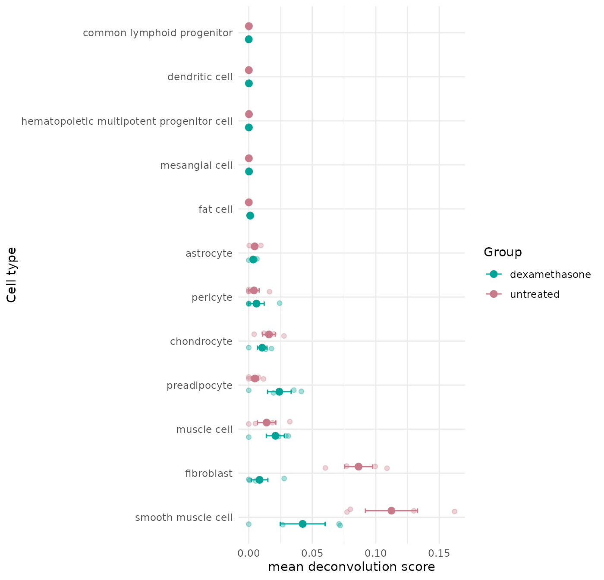
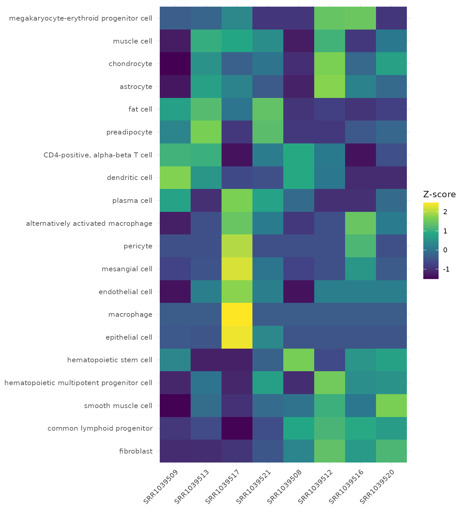

# Cell-Type Deconvolution with VISTA (airway)

## Overview

This vignette demonstrates how to run **cell-type deconvolution** with
VISTA using the Bioconductor `airway` dataset.

Workflow covered:

1.  Build a `VISTA` object from airway counts and metadata.
2.  Run
    [`run_cell_deconvolution()`](https://cparsania.github.io/VISTA/reference/run_cell_deconvolution.md)
    (xCell2 backend).
3.  Extract cell-fraction estimates with
    [`get_cell_fractions()`](https://cparsania.github.io/VISTA/reference/get_cell_fractions.md).
4.  Visualize sample-level composition with
    [`get_celltype_barplot()`](https://cparsania.github.io/VISTA/reference/get_celltype_barplot.md).
5.  Compare treatment groups with
    [`get_celltype_group_dotplot()`](https://cparsania.github.io/VISTA/reference/get_celltype_group_dotplot.md).
6.  Inspect cell-type/sample structure with
    [`get_celltype_heatmap()`](https://cparsania.github.io/VISTA/reference/get_celltype_heatmap.md).

## Load Packages

``` r

library(VISTA)
library(airway)
library(SummarizedExperiment)
library(dplyr)
library(tibble)
library(tidyr)
library(ggplot2)
library(org.Hs.eg.db)
```

## Prepare Airway Data

``` r

data("airway", package = "airway")

counts_matrix <- SummarizedExperiment::assay(airway, "counts")
sample_metadata <- as.data.frame(SummarizedExperiment::colData(airway))

# Keep sample IDs explicit for VISTA alignment.
sample_metadata$sample_names <- rownames(sample_metadata)
sample_metadata$cond_long <- ifelse(sample_metadata$dex == "trt", "dexamethasone", "untreated")

count_data <- as.data.frame(counts_matrix) %>%
  tibble::rownames_to_column("gene_id")

# Ensure column order follows sample_metadata.
count_data <- count_data[, c("gene_id", sample_metadata$sample_names)]

dim(count_data)
#> [1] 63677     9
sample_metadata[, c("sample_names", "cell", "dex", "cond_long")]
#>            sample_names    cell   dex     cond_long
#> SRR1039508   SRR1039508  N61311 untrt     untreated
#> SRR1039509   SRR1039509  N61311   trt dexamethasone
#> SRR1039512   SRR1039512 N052611 untrt     untreated
#> SRR1039513   SRR1039513 N052611   trt dexamethasone
#> SRR1039516   SRR1039516 N080611 untrt     untreated
#> SRR1039517   SRR1039517 N080611   trt dexamethasone
#> SRR1039520   SRR1039520 N061011 untrt     untreated
#> SRR1039521   SRR1039521 N061011   trt dexamethasone
```

## Create VISTA Object

``` r

vista_airway <- create_vista(
  counts = count_data,
  sample_info = sample_metadata,
  column_geneid = "gene_id",
  group_column = "cond_long",
  group_numerator = "dexamethasone",
  group_denominator = "untreated",
  covariates = "cell",
  method = "deseq2",
  min_counts = 10,
  min_replicates = 1
)

# Add gene annotations (used for downstream interpretation and fallback symbol mapping).
vista_airway <- set_rowdata(
  vista_airway,
  orgdb = org.Hs.eg.db,
  columns = c("SYMBOL", "GENENAME", "ENTREZID"),
  keytype = "ENSEMBL"
)

vista_airway
#> class: VISTA 
#> dim: 18086 8 
#> metadata(12): de_results de_summary ... design comparison
#> assays(2): norm_counts counts
#> rownames(18086): ENSG00000000003 ENSG00000000419 ... ENSG00000273487
#>   ENSG00000273488
#> rowData names(4): baseMean SYMBOL GENENAME ENTREZID
#> colnames(8): SRR1039508 SRR1039509 ... SRR1039520 SRR1039521
#> colData names(12): SampleName cell ... sizeFactor sample_names
#> -------- VISTA --------
#> group column: cond_long (untreated, dexamethasone)
#> comparisons: dexamethasone_VS_untreated
#> DE source: deseq2
#> cutoffs: |log2FC| >= 1, padj <= 0.05
#> raw counts: available via counts()
#> schema: 1.1.0
```

## Run Deconvolution

[`run_cell_deconvolution()`](https://cparsania.github.io/VISTA/reference/run_cell_deconvolution.md)
currently uses xCell2.  
If `xCell2` is unavailable, this vignette will skip deconvolution
sections.

``` r

cat("Package 'xCell2' is not installed; deconvolution steps are skipped.\n")
cat("Install it to run these sections:\n")
cat("  Install package 'xCell2' from Bioconductor.\n")
```

``` r

# First try default threshold, then relax minSharedGenes if needed.
deconv_try <- tryCatch(
  run_cell_deconvolution(
    x = vista_airway,
    method = "xCell2",
    gene_id_type = "ensembl"
  ),
  error = function(e) e
)

if (inherits(deconv_try, "error")) {
  msg <- conditionMessage(deconv_try)
  if (grepl("minSharedGenes", msg, fixed = TRUE)) {
    message("Retrying xCell2 deconvolution with minSharedGenes = 0.6")
    deconv_try <- tryCatch(
      run_cell_deconvolution(
        x = vista_airway,
        method = "xCell2",
        gene_id_type = "ensembl",
        minSharedGenes = 0.6
      ),
      error = function(e) e
    )
  }
}

if (inherits(deconv_try, "error")) {
  has_deconv <- FALSE
  message("Deconvolution could not be completed in this environment:\n", conditionMessage(deconv_try))
} else {
  vista_deconv <- deconv_try
  has_deconv <- TRUE
  vista_deconv
}
#> class: VISTA 
#> dim: 18086 8 
#> metadata(13): de_results de_summary ... comparison cell_fractions
#> assays(2): norm_counts counts
#> rownames(18086): ENSG00000000003 ENSG00000000419 ... ENSG00000273487
#>   ENSG00000273488
#> rowData names(4): baseMean SYMBOL GENENAME ENTREZID
#> colnames(8): SRR1039508 SRR1039509 ... SRR1039520 SRR1039521
#> colData names(12): SampleName cell ... sizeFactor sample_names
#> -------- VISTA --------
#> group column: cond_long (untreated, dexamethasone)
#> comparisons: dexamethasone_VS_untreated
#> DE source: deseq2
#> cutoffs: |log2FC| >= 1, padj <= 0.05
#> raw counts: available via counts()
#> schema: 1.1.0
```

``` r

cat("xCell2 is installed, but deconvolution did not complete for this dataset/reference combination.\n")
cat("Downstream deconvolution plots and tables are skipped.\n")
cat("Tip: try a lower minSharedGenes or provide a different xcell2_reference.\n")
```

## Inspect Cell Fractions

``` r

cell_fractions <- get_cell_fractions(vista_deconv)

dim(cell_fractions)
#> [1]  8 43
cell_fractions[1:min(4, nrow(cell_fractions)), 1:min(6, ncol(cell_fractions))]
#>              neutrophil     monocyte megakaryocyte-erythroid progenitor cell
#> SRR1039508 2.752619e-22 0.000000e+00                            0.000000e+00
#> SRR1039509 4.663189e-23 0.000000e+00                            1.275113e-05
#> SRR1039512 0.000000e+00 1.591268e-20                            5.104317e-05
#> SRR1039513 4.705297e-22 0.000000e+00                            1.531342e-05
#>            CD4-positive, alpha-beta T cell regulatory T cell
#> SRR1039508                    2.780816e-05                 0
#> SRR1039509                    2.989538e-05                 0
#> SRR1039512                    1.816742e-05                 0
#> SRR1039513                    2.925070e-05                 0
#>            central memory CD4-positive, alpha-beta T cell
#> SRR1039508                                   4.065957e-23
#> SRR1039509                                   4.855394e-31
#> SRR1039512                                   2.745121e-23
#> SRR1039513                                   0.000000e+00
```

## Plot Cell-Type Composition

``` r

get_celltype_barplot(
  x = vista_deconv,
  group_column = "cond_long",
  top_n = 12,
  collapse_other = TRUE,
  normalize = "sample",
  facet_by = "group",
  base_size = 11
)
```


## Group-Level Dot Plot

This plot summarizes deconvolution signal by treatment group while
keeping sample-level points visible.

``` r

get_celltype_group_dotplot(
  x = vista_deconv,
  group_column = "cond_long",
  top_n = 12,
  summary_fun = "mean",
  error = "se",
  add_points = TRUE,
  point_size = 2.5,
  base_size = 11
)
```



## Cell-Type Heatmap

The heatmap is useful to inspect sample-level deconvolution structure
and concordance within groups.

``` r

get_celltype_heatmap(
  x = vista_deconv,
  group_column = "cond_long",
  top_n = 20,
  transform = "zscore",
  cluster_rows = TRUE,
  cluster_columns = FALSE,
  label = FALSE,
  base_size = 10
)
```



## Notes on Interpretation

- xCell2 outputs are typically **enrichment-like abundance scores**
  rather than absolute percentages.
- Use group-level differences and consistency across replicates as the
  primary interpretation signal.
- Treat results as hypothesis-generating; validate with orthogonal
  assays when possible.

## Session Info

``` r

sessionInfo()
#> R version 4.6.1 (2026-06-24)
#> Platform: x86_64-pc-linux-gnu
#> Running under: Ubuntu 24.04.4 LTS
#> 
#> Matrix products: default
#> BLAS:   /usr/lib/x86_64-linux-gnu/openblas-pthread/libblas.so.3 
#> LAPACK: /usr/lib/x86_64-linux-gnu/openblas-pthread/libopenblasp-r0.3.26.so;  LAPACK version 3.12.0
#> 
#> locale:
#>  [1] LC_CTYPE=C.UTF-8       LC_NUMERIC=C           LC_TIME=C.UTF-8       
#>  [4] LC_COLLATE=C.UTF-8     LC_MONETARY=C.UTF-8    LC_MESSAGES=C.UTF-8   
#>  [7] LC_PAPER=C.UTF-8       LC_NAME=C              LC_ADDRESS=C          
#> [10] LC_TELEPHONE=C         LC_MEASUREMENT=C.UTF-8 LC_IDENTIFICATION=C   
#> 
#> time zone: UTC
#> tzcode source: system (glibc)
#> 
#> attached base packages:
#> [1] stats4    stats     graphics  grDevices utils     datasets  methods  
#> [8] base     
#> 
#> other attached packages:
#>  [1] org.Hs.eg.db_3.23.1         AnnotationDbi_1.74.0       
#>  [3] ggplot2_4.0.3               tidyr_1.3.2                
#>  [5] tibble_3.3.1                dplyr_1.2.1                
#>  [7] airway_1.32.0               SummarizedExperiment_1.42.0
#>  [9] Biobase_2.72.0              GenomicRanges_1.64.0       
#> [11] Seqinfo_1.2.0               IRanges_2.46.0             
#> [13] S4Vectors_0.50.1            BiocGenerics_0.58.1        
#> [15] generics_0.1.4              MatrixGenerics_1.24.0      
#> [17] matrixStats_1.5.0           VISTA_1.1.5                
#> [19] BiocStyle_2.40.0           
#> 
#> loaded via a namespace (and not attached):
#>   [1] splines_4.6.1               filelock_1.0.3             
#>   [3] ggplotify_0.1.3             polyclip_1.10-7            
#>   [5] graph_1.90.0                minpack.lm_1.2-4           
#>   [7] enrichit_0.2.1              XML_3.99-0.23              
#>   [9] lifecycle_1.0.5             httr2_1.3.0                
#>  [11] rstatix_1.1.0               edgeR_4.10.1               
#>  [13] processx_3.9.0              lattice_0.22-9             
#>  [15] MASS_7.3-65                 backports_1.5.1            
#>  [17] magrittr_2.0.5              limma_3.68.4               
#>  [19] sass_0.4.10                 rmarkdown_2.31             
#>  [21] jquerylib_0.1.4             yaml_2.3.12                
#>  [23] otel_0.2.0                  ggtangle_0.1.2             
#>  [25] DBI_1.3.0                   RColorBrewer_1.1-3         
#>  [27] abind_1.4-8                 quadprog_1.5-8             
#>  [29] purrr_1.2.2                 msigdbr_26.1.0             
#>  [31] pracma_2.4.6                yulab.utils_0.2.4          
#>  [33] tweenr_2.0.3                rappdirs_0.3.4             
#>  [35] aisdk_1.4.12                gdtools_0.5.1              
#>  [37] enrichplot_1.32.0           ggrepel_0.9.8              
#>  [39] tidytree_0.4.8              annotate_1.90.0            
#>  [41] pkgdown_2.2.1               codetools_0.2-20           
#>  [43] DelayedArray_0.38.2         DOSE_4.6.0                 
#>  [45] ggforce_0.5.0               tidyselect_1.2.1           
#>  [47] aplot_0.3.1                 farver_2.1.2               
#>  [49] BiocFileCache_3.2.0         jsonlite_2.0.0             
#>  [51] Formula_1.2-6               systemfonts_1.3.2          
#>  [53] progress_1.2.3              tools_4.6.1                
#>  [55] ggnewscale_0.5.2            treeio_1.36.1              
#>  [57] xCell2_1.4.0                ragg_1.5.2                 
#>  [59] Rcpp_1.1.2                  glue_1.8.1                 
#>  [61] SparseArray_1.12.2          xfun_0.60                  
#>  [63] DESeq2_1.52.0               qvalue_2.44.0              
#>  [65] withr_3.0.3                 BiocManager_1.30.27        
#>  [67] fastmap_1.2.0               GGally_2.4.0               
#>  [69] callr_3.8.0                 digest_0.6.39              
#>  [71] R6_2.6.1                    gridGraphics_0.5-1         
#>  [73] textshaping_1.0.5           colorspace_2.1-3           
#>  [75] GO.db_3.23.1                RSQLite_3.53.3             
#>  [77] fontLiberation_0.1.0        prettyunits_1.2.0          
#>  [79] httr_1.4.8                  htmlwidgets_1.6.4          
#>  [81] S4Arrays_1.12.0             ontologyIndex_2.12         
#>  [83] scatterpie_0.2.6            ggstats_0.13.0             
#>  [85] pkgconfig_2.0.3             gtable_0.3.6               
#>  [87] blob_1.3.0                  S7_0.2.2                   
#>  [89] SingleCellExperiment_1.34.0 XVector_0.52.0             
#>  [91] clusterProfiler_4.20.0      htmltools_0.5.9            
#>  [93] fontBitstreamVera_0.1.1     carData_3.0-6              
#>  [95] bookdown_0.47               zigg_0.0.2                 
#>  [97] GSEABase_1.74.0             scales_1.4.0               
#>  [99] png_0.1-9                   ggfun_0.2.1                
#> [101] knitr_1.51                  tzdb_0.5.0                 
#> [103] reshape2_1.4.5              nlme_3.1-169               
#> [105] curl_7.1.0                  cachem_1.1.0               
#> [107] stringr_1.6.0               BiocVersion_3.23.1         
#> [109] parallel_4.6.1              desc_1.4.3                 
#> [111] pillar_1.11.1               grid_4.6.1                 
#> [113] vctrs_0.7.3                 ggpubr_1.0.0               
#> [115] car_3.1-5                   tidydr_0.0.6               
#> [117] dbplyr_2.6.0                xtable_1.8-8               
#> [119] cluster_2.1.8.2             singscore_1.32.0           
#> [121] evaluate_1.0.5              readr_2.2.0                
#> [123] cli_3.6.6                   locfit_1.5-9.12            
#> [125] compiler_4.6.1              rlang_1.3.0                
#> [127] crayon_1.5.3                ggsignif_0.6.4             
#> [129] labeling_0.4.3              ps_1.9.3                   
#> [131] plyr_1.8.9                  fs_2.1.0                   
#> [133] ggiraph_0.9.6               stringi_1.8.9              
#> [135] viridisLite_0.4.3           BiocParallel_1.46.0        
#> [137] assertthat_0.2.1            babelgene_22.9             
#> [139] Biostrings_2.80.1           lazyeval_0.2.3             
#> [141] GOSemSim_2.38.3             fontquiver_0.2.1           
#> [143] Matrix_1.7-5                hms_1.1.4                  
#> [145] patchwork_1.3.2             bit64_4.8.2                
#> [147] KEGGREST_1.52.2             statmod_1.5.2              
#> [149] AnnotationHub_4.2.2         Rfast_2.1.5.2              
#> [151] igraph_2.3.3                broom_1.0.13               
#> [153] memoise_2.0.1               RcppParallel_6.2.0         
#> [155] bslib_0.12.0                ggtree_4.2.0               
#> [157] bit_4.6.0                   ape_5.8-1                  
#> [159] gson_0.2.1
```
